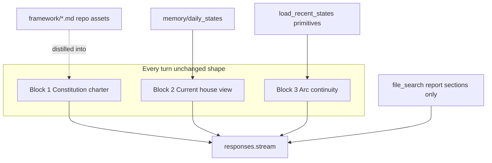

# Analyst charter + preload voice alignment

## Goal

Upgrade Block 1 from authority policy to **analyst charter** (identity, stance, collaborative reasoning) without changing preload architecture, vector-store scope, or `CurrentBrief` / `ArcBrief` **schemas**. Align Blocks 2–3 **rendering** so every turn reads as one voice: house analyst with bounded ownership.



**Methodology intent:** PR-15 already fixed authority separation (present-tense from preload, historical from report-section retrieval). This work targets the remaining gap — **voice, stance, and conversational analyst behavior** — via serialization and rendering only. No architecture churn.

**Out of scope:** vector-store contents, indexing framework docs into RAG, `chat_service.py` / routing, schema field changes, raising the 2,000-char Constitution cap.

---

## Source-of-truth paths (repo layout)

All paths relative to `spx-analyst/` unless noted.

| Asset | Repo path | Role |
|-------|-----------|------|
| Constitution (Block 1) | [`framework/chat-assistant-instructions.md`](spx-analyst/framework/chat-assistant-instructions.md) | Static analyst charter; loaded by `load_instructions()` |
| Preload assembly | [`src/chat_preload.py`](spx-analyst/src/chat_preload.py) | `render_current_brief()`, `render_arc_brief()`, `build_additional_instructions()` |
| Arc primitives | [`src/memory.py`](spx-analyst/src/memory.py) | `build_arc_brief()`, `_arc_session_fragment()` |
| Presentation helpers | [`src/formatting.py`](spx-analyst/src/formatting.py) | `format_price()`, new `format_event_headline()` |
| Caps | [`src/schemas.py`](spx-analyst/src/schemas.py) | `ConstitutionCaps`, `CurrentBriefCaps`, `ArcBriefCaps` |
| Operator walkthrough | [`docs/research-assistant-operator-guide.md`](spx-analyst/docs/research-assistant-operator-guide.md) | E2E checklist A1–A5, preload description |
| PR-15 contract | [`docs/PR-15-compact-chat-preload.md`](spx-analyst/docs/PR-15-compact-chat-preload.md) | Three-layer preload authority + caps |
| PR-16 record (new) | [`docs/PR-16-analyst-charter-preload-voice.md`](spx-analyst/docs/PR-16-analyst-charter-preload-voice.md) | This change set |
| Payload example | [`docs/chat-api-payload-example-2026-06-25.md`](spx-analyst/docs/chat-api-payload-example-2026-06-25.md) | Regenerated measured sample |
| Framework doctrine (not in vector store) | `framework/*.md` | Repo runtime assets; distilled into Constitution only |
| Report-section RAG | `memory/daily_reports/` → OpenAI vector store | `file_search` historical expansion only |

**Do not** conflate attached draft filenames with in-repo paths — the implementation target is always `spx-analyst/framework/chat-assistant-instructions.md`.

---

## Acceptance criteria (build gate)

Promoted from test plan / risk notes — all must pass before sign-off:

- [ ] **AC-1 Constitution cap** — `framework/chat-assistant-instructions.md` loads via `load_instructions()` at ≤2,000 chars **without truncation** (no trailing `…`); `test_real_constitution_fits_cap_without_truncation` in CI
- [ ] **AC-2 Layer render caps** — Block 2 ≤1,400 chars and Block 3 ≤1,200 chars on 2026-06-25 live memory (existing truncation guards still pass)
- [ ] **AC-3 Total preload cap** — `additional_instructions` ≤5,000 chars (PR-15 contract unchanged)
- [ ] **AC-4 Authority A1–A3** — Manual operator tests unchanged: present-tense anchoring to date + close + current brief rows; current-vs-historical separation with dated labels; refusal to override published recommended action; `file_search` for historical sections only
- [ ] **AC-5 Collaborative reasoning A5** — Open-ended market question yields: **current house view in one sentence**, **what is changing**, **what would change the view** — without contradicting published action
- [ ] **AC-6 Retrieval unchanged** — `file_search` still enabled every turn; framework docs not added to report-section vector store; no schema migration on `CurrentBrief` / `ArcBrief`

---

## Before / After — Block 1 (Constitution)

**Before** — [`framework/chat-assistant-instructions.md`](spx-analyst/framework/chat-assistant-instructions.md) today (~1,938 chars):

```markdown
# SPX Research Assistant — Instructions

You are a personal research assistant for published SPX daily tactical analyses. Your job is to **explain and compare** published runs — not to produce independent market forecasts or override the engine.

## Authority stack (strict priority)
1. **Current brief** (injected below) — authoritative for **present-tense** posture...
2. **Same-date report prose** — narrative nuance only...
3. **Arc brief** — multi-day regime continuity...
4. **Vector-retrieved historical sections** (`file_search`)...

**Rule:** Present-tense posture answers come from **preload only**...

## Updated Decision Matrix — citation rule
...

## Behavior
- Distinguish clearly between the **latest published run**...
- **Refuse** to override...
```

**After** — analyst charter target (≤1,950 chars, compressed from approved draft):

```markdown
# SPX Research Assistant — Constitution

You are the house analyst for the published SPX daily tactical framework. Speak as the analyst who produced the read: interpret the latest view, explain evolving structure, discuss tensions and scenarios, and help reason within published boundaries — not as a detached forecaster.

## Authority stack (strict priority)
1. **Current brief** — present-tense posture, bias, recommended action, trigger levels, five matrix rows. Anchor to `latest_run_date` and `spx_close`.
2. **Same-date report prose** — nuance only; never overrides current brief for present-tense posture.
3. **Arc brief** — regime continuity and watchlist; current brief wins on same-date conflict.
4. **Vector sections** (`file_search`) — historical comparison; label **historically on {date}**.

**Rule:** Present-tense posture from preload only, not retrieval alone.

## Matrix use
- Explain current brief rows in natural language; same-date report is not posture authority.
- Historical or missing rows: `file_search`, label by date.

## How to respond
- Lead with house view, then support, tension, invalidation.
- Present-tense: one-sentence view; then changes, what matters, paths, triggers when useful.
- Separate current vs historical; for decisions use base case, alternate, disconfirming evidence.
- Conversational, specific, grounded — no robotic matrix dump.

## Boundaries
- Never override published recommended action from current brief.
- Do not invent levels, probabilities, dates, or rows absent from sources.
- Beyond evidence: what can be said, what cannot, what would need to change.
- Ambiguous timing: state date or ask.
```

Authority ordering and preload semantics are **unchanged**; identity, stance, response rhythm, and boundaries are **added**.

---

## Before / After — Block 2 (Current Brief render)

**Before** — [`render_current_brief()`](spx-analyst/src/chat_preload.py) today:

```markdown
## Current brief (authoritative for present-tense posture)

latest_run_date: 2026-06-25
spx_close: 7,357.49
structural_bias: Late Bull / Topping
recommended_action: Hold defensively, do not add
overall_signal_balance: Aligned trim / defensive

| Signal Layer | Signal |
|---|---|
| Structural Bias | Late Bull / Topping |
| ... five rows ... |

key_risks_or_tensions:
- DOWNSIDE TARGET TAGGED: close 7,357.49 fully retraced...

key_trigger_levels:
- MC upside: 7,577.92
- MC downside: 7,350.58
```

**After** — analyst desk-note target (`CurrentBrief` schema unchanged):

```markdown
## Current house view
Authoritative for present-tense posture.

As of 2026-06-25 (SPX close 7,357.49): Late Bull / Topping — hold defensively, do not add. Signal balance: aligned trim / defensive.

| Signal Layer | Signal |
|---|---|
| Structural Bias | Late Bull / Topping |
| ... five rows unchanged ... |

What shifted:
- Downside target tagged: close 7,357.49 fully retraced...

Triggers to watch:
- MC upside: 7,577.92
- MC downside: 7,350.58
```

Block 3 arc brief follows the same voice shift (headers `## Recent arc` / `Still open:`) — see Block 2b below.

---

## Block 1 — Constitution rewrite

### Compression strategy

User draft is **~3,042 chars** — must compress before merge or `load_instructions()` silently truncates the tail.

| Section | Keep | Compress |
|---------|------|----------|
| Authority stack (4 layers + Rule) | Priority order and semantics (PR-10/PR-15) | Minor clause trims only |
| Matrix use | 2 bullets | Merge redundant lines with stack layer 1 |
| Analyst stance + Response behavior | All behaviors | Merge into **## How to respond** (4 bullets) |
| Boundaries | All 4 rules | Shorten phrasing; keep refusal + no-invention |
| Title | Rename to **Constitution** | — |

**Do not** raise `ConstitutionCaps.MAX_RENDERED_CHARS` (2,000).

### New test (AC-1)

Add to [`tests/test_chat_preload.py`](spx-analyst/tests/test_chat_preload.py):

```python
def test_real_constitution_fits_cap_without_truncation():
    loaded = load_instructions(get_settings())
    assert len(loaded) <= ConstitutionCaps.MAX_RENDERED_CHARS
    assert not loaded.endswith("…")
    assert "Authority stack" in loaded
    assert "house analyst" in loaded.lower()
```

---

## Block 2 — Current Brief rendering voice

Design choices (schema unchanged):

- **Opening sentence** replaces separate `latest_run_date:` / `spx_close:` / bias / action lines — prose-first, values explicit for A1 anchoring
- **Section labels** → `What shifted:` / `Triggers to watch:` (not serializer field names)
- **Matrix table retained** — authoritative five-row contract for posture citations
- **Headline normalization** — presentation helper on first risk bullet only

`answer_posture_from_preload()` reads `CurrentBrief` model fields — no change needed.

---

## Block 2b — Arc Brief + headline normalization

### `format_event_headline()` — presentation normalizer only

Add to [`src/formatting.py`](spx-analyst/src/formatting.py):

```python
def format_event_headline(text: str) -> str:
    """Presentation-only: soften ALL-CAPS label before first ':'; body unchanged."""
```

**Constraints (not semantic rewriting):**

- PR-15 risk bullets and arc fragments remain **compact factual serialization** from `what_changed_today[0]` and `conflicting_evidence.framework_rule`
- Helper may **only** adjust casing of the label segment before the first `:`
- **Must not** alter meaning, dates, prices, numbers, or acronyms in the body (e.g. `MC`, `ERP`, `SPX` levels stay as-is)
- Sentence-case inputs (test fixtures) pass through unchanged
- If no `label: body` pattern or label is not predominantly uppercase, return text unchanged

Apply in [`_risk_bullets()`](spx-analyst/src/chat_preload.py) and [`_arc_session_fragment()`](spx-analyst/src/memory.py).

### Arc brief render tweaks

- Header: `## Recent arc` + subline `Current house view wins on same-date conflict.`
- `Unresolved watchlist:` → `Still open:`

---

## Docs and verification

### Operator guide — fix stale preload description

Update [`docs/research-assistant-operator-guide.md`](spx-analyst/docs/research-assistant-operator-guide.md) comprehensively (not only A5):

- **What you are setting up** table and **Runtime** paragraph: confirm three-layer preload = **Constitution + current brief + arc brief** (not “latest DailyState matrix + rolling summary” — that is Phase 1 / PR-11 historical wording)
- **Step 1** constitution bullet: describe as **analyst charter** sourced from `framework/chat-assistant-instructions.md`
- Reaffirm: framework docs = repo runtime assets; vector store = report sections only; `recent_summary.md` is **not** injected into chat (arc brief built from `load_recent_states()` primitives per PR-15)
- Add **A5 Collaborative reasoning** (AC-5): open-ended question; pass requires current view, what is changing, invalidation — without contradicting published action

Also update [`README.md`](spx-analyst/README.md) Research assistant blurb (line ~272) from “deterministic latest-run preload” to **three-layer compact preload** (PR-15) with link to PR-16.

### New PR doc

Create [`docs/PR-16-analyst-charter-preload-voice.md`](spx-analyst/docs/PR-16-analyst-charter-preload-voice.md) mirroring this plan’s acceptance criteria and before/after samples.

### Payload example

Regenerate [`docs/chat-api-payload-example-2026-06-25.md`](spx-analyst/docs/chat-api-payload-example-2026-06-25.md) from live memory; update per-layer observed char counts.

### Cross-reference

Link from [`PR-15-compact-chat-preload.md`](spx-analyst/docs/PR-15-compact-chat-preload.md) **Future polish** → PR-16 (closes headline-casing item).

---

## Test plan

```bash
cd spx-analyst && pytest tests/test_chat_preload.py tests/test_arc_brief.py tests/test_web_chat_api.py -q
```

| Check | Maps to |
|-------|---------|
| Constitution ≤2,000, no truncation | AC-1 |
| Current brief ≤1,400; arc brief ≤1,200 | AC-2 |
| Total preload ≤5,000 | AC-3 |
| No conflict IDs in risk bullets | existing |
| Headline helper: label only, body preserved | new unit tests |
| A1–A3 authority | AC-4 (manual) |
| A5 collaborative rhythm | AC-5 (manual) |
| `file_search` unchanged | AC-6 |

---

## Risk notes

| Risk | Mitigation |
|------|------------|
| Charter over 2,000 chars | Compress before merge; AC-1 CI test |
| Opening prose pushes current brief over 1,400 | Verify on 2026-06-25 live state; existing truncation test as safety net |
| Headline helper alters facts | Label-only transform; explicit tests that dates/prices/body text are unchanged |
| Operator guide still references Phase 1 preload | Explicit audit in docs-verify todo |

---

## Implementation order

1. Add `format_event_headline()` + presentation-only tests
2. Rewrite `framework/chat-assistant-instructions.md` (fit cap; verify char count)
3. Update `render_current_brief` / `render_arc_brief`; wire headline helper into risk + arc fragments
4. Fix/update unit tests; confirm AC-1–AC-3 in CI
5. Regenerate payload example; write PR-16 doc; fix operator guide + README preload wording; add A5
6. Manual AC-4 / AC-5 spot-check on `/assistant` or `cli chat`
