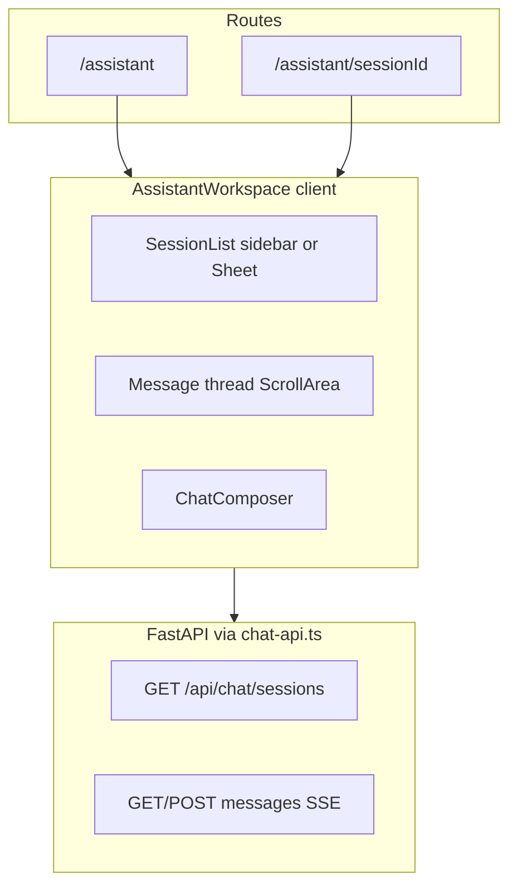

# Assistant UI/UX Beta Polish Plan

## Locked decisions (sharpen-plan)

| Decision | Choice | Rationale |
|----------|--------|-----------|
| Session creation | **First message only** | No orphan sessions; type-first composer; research tool not empty chat threads |
| Sidebar breakpoint | **`lg` (1024px+)** | design.md tablet rule; 768px chat pane too narrow with 288px sidebar |
| Legal/scope line | **Header caption only** | Visible without scroll; single source; no repetition near send button |
| Implementation | **Extract 5 subcomponents first** | Reviewable diffs; orchestration stays in workspace |
| Composer layout | **Inline row desktop, stack mobile** | Less vertical chrome; modern minimalist; thumb-friendly when stacked |
| Stop streaming | **Refetch then stub** | Honest state if OpenAI persisted partial; else show "Response stopped." |

**Operator checklist note:** P3 ("New conversation → sidebar shows session") becomes "first send creates session with auto-title" — update manual checklist in PR doc, not backend.

## Scope

**In scope:** `spx-analyst/web/` only — assistant routes and chat components. No backend/Python changes unless a tiny read-only prop is needed (e.g. latest run date from existing `/api/runs`).

**Out of scope (post-beta):** report-to-assistant deep links, citation UI, embedded report panel, session pagination, auth.

**Primary files today:**

| File | Role |
|------|------|
| [spx-analyst/web/components/chat/assistant-workspace.tsx](spx-analyst/web/components/chat/assistant-workspace.tsx) | Monolithic shell (~580 lines): sessions, messages, empty state, errors |
| [spx-analyst/web/components/chat/chat-composer.tsx](spx-analyst/web/components/chat/chat-composer.tsx) | Textarea + send/stop |
| [spx-analyst/web/components/chat/message-bubble.tsx](spx-analyst/web/components/chat/message-bubble.tsx) | User/assistant bubbles + copy |
| [spx-analyst/web/app/assistant/page.tsx](spx-analyst/web/app/assistant/page.tsx) | Client-only mount, no server context |
| [spx-analyst/web/app/assistant/layout.tsx](spx-analyst/web/app/assistant/layout.tsx) | `min-h-[calc(100vh-4rem)]` flex column |
| [design.md](design.md) | Publication-first design system (reference) |

---

## Part 1 — Current state review

### Architecture (functional)



**Working well:**
- SSE streaming with `AbortController` stop
- Optimistic user bubble on send
- Auto-scroll on new content
- Session CRUD (create, rename, delete + AlertDialog)
- Suggested prompts on empty state and new session
- Compact markdown via `ReportMarkdown variant="compact"`
- Mobile session list in left Sheet (`md:hidden` trigger)

**Functional gaps:**
- No server-side `BackendUnavailable` gate (reader pages have it; assistant fails silently until client fetch)
- Stop abort clears stream but does not refetch messages or explain outcome → dangling user message
- Errors render inside scroll area, not cleared on next send
- `handleNewSession` creates empty OpenAI sessions before first message → sidebar clutter
- Browser tab title uses UUID slice ([sessionId]/page.tsx](spx-analyst/web/app/assistant/[sessionId]/page.tsx))
- No visible scope line (what corpus / latest run date the assistant uses)

---

### Visual alignment vs [design.md](design.md)

| design.md intent | Current assistant | Gap |
|------------------|-------------------|-----|
| Publication-first, quiet authority | Utilitarian chat subheader (`border-b`, small gray title) | Missing serif page title like [Archive](spx-analyst/web/app/(reader)/archive/page.tsx) |
| Embedded research assistant, not AI gimmick | Generic two-pane chat layout | Acceptable for dedicated route; needs editorial empty state + context bar |
| Premium editorial chat input | Plain bordered textarea, send below | Should match input spec (44–48px min height, rounded-[10px], green focus ring — partially there) |
| Border-first, light shadows | Bubbles use `shadow-editorial-1` + green assistant border | Slightly heavy; could simplify to border-only like cards |
| Left-aligned editorial layouts | Centered empty state only | Thread is left-aligned — good |
| No purple AI gradients | Clean neutrals + market green | Aligned |
| Touch targets 44px | Session rename/delete `size-3.5` icons, hover-only | **Fails mobile** |
| Chat visually secondary | Full-page workspace | OK for `/assistant` nav item; keep calm density |

**Consistency with reader UI:**
- Reader uses `font-display` H1, `max-w-7xl` page shell, `rounded-[14px]` cards, `ink-*` tokens, `market-green` primary actions ([lead-story.tsx](spx-analyst/web/components/home/lead-story.tsx))
- Assistant subheader uses shadcn `Button size="sm"` (h-7) — smaller than design.md primary button (12px/18px padding, rounded-[10px])
- Message column `max-w-3xl` (~768px) vs report `max-w-[70ch]` — close enough; keep capped on wide screens

---

### Responsive review by breakpoint

#### Mobile (375–767px)

| Area | Behavior | Issues |
|------|----------|--------|
| Viewport | SiteHeader 64px + workspace toolbar ~48px + composer ~100px | ~200px chrome; thread area tight but usable |
| Sessions | Sheet from left, "Conversations" outline button | OK pattern (matches [site-header.tsx](spx-analyst/web/components/site-header.tsx)) |
| Toolbar | Truncated session title + "New conversation" | Cramped at 375px; title competes with primary button |
| Empty state | Centered text + pill chips + button | No H1; feels like placeholder vs Archive/About |
| Messages | `ml-4`/`mr-4` asymmetric bubbles | Readable; user bubble could be slightly tighter |
| Composer | Full-width, sticky bottom | Good thumb reach; no keyboard hint needed on mobile |
| Touch | Rename/delete/copy on `group-hover:opacity-100` | **Broken** — actions invisible without hover |
| Offline | Red box in thread after failed fetch | No dedicated blocked state |

#### Tablet (768–1023px)

| Area | Behavior | Issues |
|------|----------|--------|
| Layout | Sidebar appears at `md` (768px) — fixed `w-72` | design.md suggests collapsed rail on tablet; 768px chat pane can feel squeezed (~496px at 768 viewport minus padding) |
| Sessions | Permanent sidebar + thread | Consider `lg:` (1024px) for sidebar to match design.md desktop breakpoint |

#### Desktop (1024–1439px)

| Area | Behavior | Issues |
|------|----------|--------|
| Layout | 288px sidebar + flex-1 thread | Functional |
| Thread | `max-w-3xl` centered in paper-50 column | Good reading width |
| Empty / prompts | Same as mobile | Needs stronger editorial hero |

#### Wide (1440px+)

| Area | Behavior | Issues |
|------|----------|--------|
| Whitespace | Wide paper-50 margins | Align outer shell to `max-w-7xl mx-auto` like archive — avoids "floating chat in void" |

---

## Part 2 — Target experience

### Design north star (from design.md)

> "The eventual chatbot should feel like an embedded research assistant, not a floating gimmick."

For beta `/assistant`:

1. **Calm publication entry** — serif headline, one-line purpose, suggested questions as editorial chips (not SaaS onboarding).
2. **Transparent scope** — quiet caption: corpus through latest published run date + not investment advice (no "trust" language).
3. **Minimal chrome** — border-first surfaces, restrained green accent, no bubble theatrics.
4. **Type-first flow** — composer always visible; **session created on first send only** (no empty sessions from "New conversation").
5. **Mobile-safe actions** — session manage + copy always reachable on touch.
6. **Reliable feedback** — sticky error bar above composer; clear stop/offline states.

### Target layout (desktop)

```text
SiteHeader (existing)
└── max-w-7xl mx-auto flex min-h-0 flex-1
    ├── aside (lg+, w-64–72)     SessionList — surface-1, border-r
    └── main flex-1 flex flex-col min-w-0
        ├── AssistantHeader       font-display title + context caption
        ├── MessageThread         flex-1 overflow, max-w-[70ch] mx-auto
        └── ChatComposer          sticky footer + disclaimer line
```

### Target layout (mobile)

```text
SiteHeader
└── AssistantHeader (title + context + Sheet trigger for sessions)
└── MessageThread (full width)
└── ChatComposer (sticky, safe-area padding)
```

---

## Part 3 — Implementation plan

### Phase 0 — Component extraction (foundation)

Split [assistant-workspace.tsx](spx-analyst/web/components/chat/assistant-workspace.tsx) before visual changes to keep diffs reviewable:

| New file | Extract from workspace |
|----------|------------------------|
| `components/chat/assistant-header.tsx` | Toolbar row: mobile Sheet trigger, title, context line, new chat |
| `components/chat/assistant-empty-state.tsx` | EmptyState + PromptChips (dedupe) |
| `components/chat/session-list.tsx` | SessionList + SessionListItem |
| `components/chat/message-thread.tsx` | ScrollArea, skeleton, bubbles, streaming bubble, tail ref |
| `components/chat/assistant-error-banner.tsx` | Sticky error above composer |

`AssistantWorkspace` becomes orchestration only: data fetching, routing, send/stop handlers.

---

### Phase 1 — Shell and page context

**1.1 Server wrapper for latest run date**

Update [app/assistant/page.tsx](spx-analyst/web/app/assistant/page.tsx) and [app/assistant/[sessionId]/page.tsx](spx-analyst/web/app/assistant/[sessionId]/page.tsx):

```tsx
// Server component pattern (mirror archive page)
const runs = await listRuns(); // or reuse cached listRuns from layout via prop
<AssistantWorkspace latestRunDate={runs[0]?.date} backendOnline={true} />
```

On `listRuns()` failure, render `<BackendUnavailable />` instead of mounting workspace — matches reader pages.

**1.2 Outer shell alignment**

- Wrap workspace content in `mx-auto max-w-7xl w-full flex min-h-0 flex-1` (inside existing layout).
- Move sidebar breakpoint from `md:flex` → **`lg:flex`** (locked).
- Sidebar width: `w-64 lg:w-72`, background `bg-surface-1`, `border-r border-border-soft`.

**1.3 AssistantHeader**

Replace current gray subheader strip:

- **Title:** `font-display text-2xl sm:text-3xl font-semibold text-ink-900` — "Research assistant" (or "Assistant").
- **Context caption (only legal/scope location):** `text-sm text-ink-500` — e.g. "Answers use published reports through {latestRunDate}. Not personalized investment advice."
- **Actions:** "New conversation" navigates to `/assistant` (clears active session) — **does not call `createChatSession()`**. Session is created when user sends first message.
- Remove redundant "Select or start…" when empty; empty state carries onboarding.

---

### Phase 2 — Empty state and suggested prompts

Refactor [assistant-empty-state.tsx](spx-analyst/web/components/chat/assistant-empty-state.tsx):

**Copy structure (left-aligned on desktop, centered on mobile optional):**
- Eyebrow: `text-xs uppercase tracking-wide text-ink-500`
- H2: `font-display text-xl sm:text-2xl font-semibold text-ink-900`
- Body: `text-base text-ink-700 max-w-lg` — 2 sentences: ask about posture, compare dates, explain matrix rows
- Prompt chips: reuse pill style from current code (`rounded-full border border-border-soft`) — align with operator A1–A5 prompts:
  - "What is today's recommended action?"
  - "How does structural bias compare to last week?"
  - "What would change the house view?"

**Behavior:**
- Show empty state when `!sessionId` OR when session loaded with zero messages (keep prompt chips in thread for active empty session).
- Remove duplicate `PromptChips` vs `EmptyState` — single component with `variant: "landing" | "inline"`.

**Type-first composer (locked):**
- Always render `ChatComposer` at bottom, even when `!sessionId`.
- On submit without session: `createChatSession()` → `router.push` → `pendingPromptRef` → auto-send (existing pattern).
- **`handleNewSession`:** `router.push("/assistant")` only — no API call until first message.
- Remove standalone "Start conversation" button from empty state (composer + chips are sufficient).

---

### Phase 3 — Message thread polish

**3.1 MessageBubble** ([message-bubble.tsx](spx-analyst/web/components/chat/message-bubble.tsx))

| Change | Detail |
|--------|--------|
| Visual simplification | Drop `shadow-editorial-1` or keep only on assistant; prefer `border border-border-soft bg-surface-0` for both roles |
| User bubble | Subtle distinction: `bg-surface-1` vs assistant `bg-surface-0`; reduce horizontal offset (`sm:ml-6` not `ml-8`) |
| Labels | Keep "You" / "Assistant" caption at 12px uppercase — matches metadata pattern |
| Copy button | `opacity-100 sm:opacity-0 sm:group-hover:opacity-100` — always visible on touch |
| Streaming | When `id === "streaming"` and empty text: show 3-dot pulse (CSS only, no gradient) instead of static "Thinking…" |
| Timestamps | Optional `created_at` as caption if API provides it — low priority |

**3.2 Thread container** ([message-thread.tsx](spx-analyst/web/components/chat/message-thread.tsx))

- `max-w-[70ch] mx-auto px-4 py-6 sm:px-6` — match report reading measure.
- `gap-5` between messages (generous per design.md paragraph spacing).
- Move error **out** of thread into `AssistantErrorBanner`.

**3.3 Stop streaming UX (locked)**

In `sendMessage` / `handleStop`:
1. Abort fetch.
2. Refetch `getChatMessages(sessionId)` (OpenAI `store=True` may have persisted partial).
3. If refetch returns no new assistant message, append ephemeral assistant stub: "Response stopped." (client-only; retry refetch once if race with persistence).
4. Clear error on new send attempt.

---

### Phase 4 — Composer and footer

Update [chat-composer.tsx](spx-analyst/web/components/chat/chat-composer.tsx):

| Spec (design.md) | Implementation |
|------------------|----------------|
| Min height 44–48px | `min-h-11` textarea, `rounded-[10px]` |
| Green focus ring | Already present; verify `focus-visible:ring-market-green/20` |
| Primary send | Market green button, `rounded-[10px]`, icon + label on desktop |
| Stop | Outline secondary, not destructive |

**Layout (locked):**
- **Desktop (`sm+`):** single-row `[ textarea flex-1 ] [ Send/Stop ]` — send beside textarea.
- **Mobile:** stack textarea above button (`flex-col sm:flex-row`).

**Footer line (below form):**
- `text-xs text-ink-500 hidden sm:block` — "Enter to send · Shift+Enter for new line" only.
- **No duplicate disclaimer here** — scope line lives in header only.

**Disabled states:**
- When `!sessionId`: composer enabled (type-first); placeholder "Ask about posture, regime, or past reports…"
- When `backendOnline === false`: disabled + message

---

### Phase 5 — Session list and mobile Sheet

**5.1 SessionListItem touch fixes**

In [session-list.tsx](spx-analyst/web/components/chat/session-list.tsx):

- Rename/delete: always visible on `(hover:none)` / max-md; hover-reveal on desktop only:
  ```tsx
  className="opacity-100 lg:opacity-0 lg:group-hover:opacity-100"
  ```
- Hit area: `min-h-11 min-w-11` icon buttons (design.md 44px target).
- Selected session: keep `border-market-green bg-surface-0` — aligns with active accent rules.

**5.2 Sheet polish**

- Sheet width `w-[min(100vw,20rem)]` — keep.
- Add "New conversation" button inside Sheet header (mobile users shouldn't scroll toolbar).
- Close sheet on navigate — already via `onNavigate`.

**5.3 Rename UX**

- Enter saves, Escape cancels (keyboard).
- Auto-select input text on rename start.

---

### Phase 6 — Error, offline, and loading states

**6.1 Backend unavailable**

- Server: wrap assistant pages with try/catch `listRuns()` → `BackendUnavailable`.
- Client: if `listChatSessions()` fails on mount with network/5xx, show full-page blocked state (reuse [backend-unavailable.tsx](spx-analyst/web/components/backend-unavailable.tsx) with retry callback).

**6.2 AssistantErrorBanner**

- Sticky above composer: `border-t border-risk-red/30 bg-risk-red/5 px-4 py-2 text-sm text-risk-red`.
- Dismiss X; auto-clear on successful send.
- Distinguish stream errors vs session load errors.

**6.3 Loading**

- Session list skeleton — keep.
- Message skeleton — align with bubble border radius `rounded-[14px]`.
- Optional: disable composer while `loadingMessages` on session switch.

---

### Phase 7 — Metadata and accessibility

- **Document title:** Client effect sets `document.title` to `Assistant · {session.title} · SPX Analyst` when active; fallback generic.
- **aria:** Sheet trigger `aria-label="Open conversations"` — keep; add `aria-live="polite"` on streaming bubble region.
- **Focus management:** After new session created, focus composer textarea.
- **Reduced motion:** respect `prefers-reduced-motion` for scroll-into-view and typing indicator.

---

### Phase 8 — Verification

**Automated (unchanged backend):**
```bash
cd spx-analyst && pytest tests/test_web_api.py tests/test_web_chat_api.py -q
cd spx-analyst/web && npm run lint && npm run build
```

**Manual responsive checklist** (design.md breakpoints):

| Check | 375 | 768 | 1280 | 1440 |
|-------|-----|-----|------|------|
| Session rename/delete usable | ✓ | ✓ | ✓ | ✓ |
| Copy on assistant message | ✓ | ✓ | hover desktop | hover desktop |
| Composer thumb-friendly | ✓ | ✓ | ✓ | ✓ |
| Sidebar hidden / Sheet | Sheet | Sheet | sidebar | sidebar |
| Empty state readable | ✓ | ✓ | ✓ | ✓ |
| Context line visible | ✓ | ✓ | ✓ | ✓ |
| Stream + stop + refresh | ✓ | ✓ | ✓ | ✓ |
| API offline blocked state | ✓ | ✓ | ✓ | ✓ |

**Operator authority (from [research-assistant-operator-guide.md](spx-analyst/docs/research-assistant-operator-guide.md)):** Re-run A1–A5 from UI after polish — no functional regression.

**Visual regression:** Compare side-by-side with `/`, `/archive`, `/about` — tokens (`ink-*`, `surface-*`, `font-display`, `rounded-[14px]`, `market-green` buttons) should feel like one product.

---

## Part 4 — File change summary

| Action | Path |
|--------|------|
| Refactor / slim | `components/chat/assistant-workspace.tsx` |
| **New** | `components/chat/assistant-header.tsx` |
| **New** | `components/chat/assistant-empty-state.tsx` |
| **New** | `components/chat/session-list.tsx` |
| **New** | `components/chat/message-thread.tsx` |
| **New** | `components/chat/assistant-error-banner.tsx` |
| Edit | `components/chat/chat-composer.tsx` |
| Edit | `components/chat/message-bubble.tsx` |
| Edit | `app/assistant/page.tsx` |
| Edit | `app/assistant/[sessionId]/page.tsx` |
| PR doc | `docs/PR-18-assistant-ui-beta.md` (include updated P3 wording) |

**Estimated touch count:** ~8 files, no Python changes.

---

## Part 5 — Implementation order (recommended)

1. Phase 0 extraction (no visual change) — safe refactor
2. Phase 6 offline gate + error banner — reliability first
3. Phase 5 session touch fixes — quick mobile win
4. Phase 1 shell + header + breakpoint `lg`
5. Phase 2 empty state + type-first composer
6. Phase 3 message bubbles + stop behavior
7. Phase 4 composer layout
8. Phase 7 a11y/metadata
9. Phase 8 manual QA + optional PR doc

This order ships mobile fixes and reliability early, then layers editorial polish without blocking beta.
