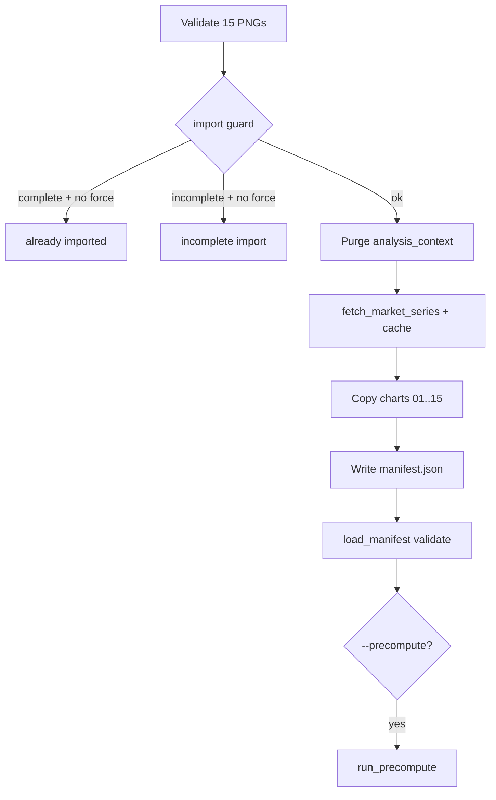

# Daily Run Import Script

**Status:** Shipped — see [PR-9](../spx-analyst/docs/PR-9-daily-run-import.md)

## Implementation summary

`import-run` ingests 15 PNGs from `Images/<date>/`, writes canonical charts + manifest under `data/runs/<date>/`, fetches yfinance close, and caches `market_history.json`.

```bash
python -m src.cli import-run --date 2026-06-24
python -m src.cli run --date 2026-06-24
```

## Deviations from original plan

| Original plan | Shipped behavior | Rationale |
|---------------|------------------|-----------|
| Write order: copy charts → fetch close → manifest | **fetch close → copy charts → manifest** | Network failure must not leave orphan canonical charts that block retry |
| Reject all non-PNG files in intake dir | **Ignore dotfiles** (`.DS_Store`) | macOS noise; still reject visible `.jpg`/`.heic` |
| Single "already imported" error | **Distinct incomplete-import message** | Charts without 15-chart manifest → `incomplete import detected … use --force` |
| Purge `analysis_context.json` on `--force` only | **Purge on every import** | Safer; any re-import invalidates Step 0 |
| Stale `market_history.json` on fetch failure + `--close` | **Delete cache on fetch failure** | Prevents precompute from using wrong-day data |

## Final pipeline



## Modules

- [`src/chart_pack.py`](../spx-analyst/src/chart_pack.py) — SSoT for 15-chart definitions
- [`src/import_run.py`](../spx-analyst/src/import_run.py) — import logic
- [`src/cli.py`](../spx-analyst/src/cli.py) — `import-run` command
- [`tests/test_import_run.py`](../spx-analyst/tests/test_import_run.py) — 11 tests

## Operator workflow

1. Screenshot 15 charts in fixed order → `Images/<date>/` (alphabetical filename order = chart order)
2. `python -m src.cli import-run --date <date>`
3. `python -m src.cli show-eps --date <date>` (if EPS row needed)
4. `python -m src.cli run --date <date>`

Optional: `--precompute` on step 2.
