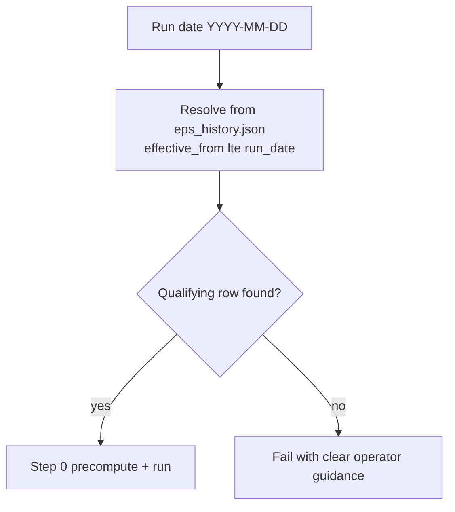

# EPS Master History (clean redesign)

## Problem

Forward/trailing EPS are **slow-moving master data**, but today they live in per-run [`data/runs/<date>/external_context.json`](spx-analyst/data/runs/2026-06-08/external_context.json) files. Operators must `setup-run` and manually copy the same values (e.g. `354` / `220`) into every day folder — repetitive work that does not belong in a daily workflow.

This redesign **eliminates per-run EPS files entirely**. One append-only master history file is the only source of truth.

## Goal

One file you **append to** when estimates change. For any `run_date`, the system picks the correct row automatically — latest row for today's run, older rows for historical backfills — with no daily manual input and no per-run EPS artifacts.



## Master file format

New file: [`data/master/eps_history.json`](spx-analyst/data/master/eps_history.json)

```json
{
  "entries": [
    {
      "effective_from": "2026-06-01",
      "forward_eps": 354,
      "trailing_eps": 220,
      "notes": "optional — source, revision reason"
    }
  ]
}
```

**Operator workflow:** when consensus changes, append a new entry with `effective_from` set to the date the new values apply (usually the day you update the file). Never edit old rows.

Seed the file with one entry matching current June values (`354` / `220`, `effective_from: 2026-06-01`).

## Resolution rules

**Single source:** [`data/master/eps_history.json`](spx-analyst/data/master/eps_history.json) (or path from `SPX_EPS_HISTORY_PATH`).

**Rule:** choose the latest entry where `effective_from <= run_date`.

**Date comparison:** `effective_from` is evaluated against the run's logical date string (`YYYY-MM-DD`), not file creation time or intraday timestamp.

**Sorting:** entries may be stored in any order in the file; the loader **sorts ascending by `effective_from`** before resolution. Operators are not required to maintain sort order manually.

**If no qualifying row exists:** EPS resolution fails. Production analysis paths must not silently continue without EPS — the framework requires valuation and ERP on every run.

## Failure policy

| Command / path | Behavior when EPS cannot be resolved |
|----------------|--------------------------------------|
| `show-eps --date` | Reports result to stdout; **exit 0** when EPS resolves, **exit 1** when unresolved (missing file, empty history, or no qualifying row) |
| `setup-run` | Warns that EPS is unresolved and the run is not ready; does not write any EPS file |
| `setup-run --precompute` | **Fails** with message pointing to `data/master/eps_history.json` |
| `run` | **Fails** before precompute |
| `migrate-perplexity` | **Fails** with clear message (same resolver as live runs). A separately named historical backfill mode with ad-hoc EPS is out of scope for this PR. |

Rationale: valuation and ERP are required on every run; missing EPS is an operator configuration error, not a soft warning.

## Code changes

### 1. Schema — [`src/schemas.py`](spx-analyst/src/schemas.py)

**Remove** `ExternalContext` (it was tied to the per-run file artifact).

**Add history models:**

```python
class EpsHistoryEntry(BaseModel):
    effective_from: str       # YYYY-MM-DD, validated ISO date
    forward_eps: float        # required
    trailing_eps: float       # required
    notes: str | None = None

class EpsHistory(BaseModel):
    entries: list[EpsHistoryEntry]  # min_length=1 when file exists
```

**Validation on load:**
- `effective_from` must be a valid ISO date (`YYYY-MM-DD`)
- Duplicate `effective_from` values are **rejected** (`InputError`)
- Both `forward_eps` and `trailing_eps` are **required** on every entry (no partial rows)

**Add in-memory runtime type** (passed through precompute, valuation, prompts — not persisted as a run-dir file):

```python
class ResolvedEps(BaseModel):
    forward_eps: float
    trailing_eps: float
    effective_from: str
    source: Literal["master"] = "master"
```

Rename note: `ExternalContext` is removed rather than kept as an alias. `ResolvedEps` is the **EPS carrier only** — the in-memory type passed through precompute, valuation, and prompts. This rename does **not** apply to broader session/context types (e.g. `SessionContext`, `AnalysisContext`, manifest handling) except where a field previously held EPS data (`SessionContext.resolved_eps`). ~8 call sites (`valuation.py`, `precompute.py`, `prompts.py`, `analysis_engine.py`, `migrate_perplexity.py`, tests).

### 2. Config — [`src/config.py`](spx-analyst/src/config.py)

```python
eps_history_path_raw: str = Field(
    default="data/master/eps_history.json",
    alias="SPX_EPS_HISTORY_PATH",
)

@property
def eps_history_path(self) -> Path:
    return _resolve(self.eps_history_path_raw)
```

### 3. EPS service — replace [`src/external_data.py`](spx-analyst/src/external_data.py)

**Delete** `src/external_data.py` and its per-run file I/O (`load_external_context`, `blank_context`, blank template writes).

**Add** [`src/eps_history.py`](spx-analyst/src/eps_history.py):

```python
@dataclass
class EpsResolution:
    eps: ResolvedEps | None
    source: Literal["master", "missing"]
    effective_from: str | None
    forward_eps: float | None
    trailing_eps: float | None
    warnings: list[str]

def load_eps_history(settings) -> EpsHistory
def resolve_eps_for_date(run_date: str, history: EpsHistory) -> EpsHistoryEntry | None
def get_eps_for_run(run_date: str, *, settings) -> EpsResolution
```

`resolve_eps_for_date`:
1. Sort `history.entries` by `effective_from` ascending
2. Filter where `effective_from <= run_date`
3. Return the last match, or `None`

`get_eps_for_run`:
- Load history file; if missing or empty → `source="missing"`, `eps=None`
- Resolve entry; if none → `source="missing"`, `eps=None`, warning with run date and path to master file
- On success → populate `ResolvedEps` and resolution fields

**No run directory parameter.** No file writes.

### 4. Remove per-run EPS artifact — [`src/files.py`](spx-analyst/src/files.py) and call sites

- **Remove** `EXTERNAL_CONTEXT_FILENAME = "external_context.json"`
- **Remove** all reads/writes of `data/runs/<date>/external_context.json` from:
  - [`src/cli.py`](spx-analyst/src/cli.py) — `setup-run` no longer scaffolds or mentions per-run EPS
  - [`src/analysis_engine.py`](spx-analyst/src/analysis_engine.py) — `get_eps_for_run(date)` instead of `load_external_context(date, run_dir)`
  - [`src/migrate_perplexity.py`](spx-analyst/src/migrate_perplexity.py) — same resolver; remove `blank_context`, direct `ext_path` reads, template writes
  - [`tests/conftest.py`](spx-analyst/tests/conftest.py) — remove `external_context.json` from `make_run_dir` fixture; add `master_eps_history` fixture pointing at temp history file

Existing `data/runs/*/external_context.json` files on disk become **orphaned** — the codebase ignores them. Optional cleanup: delete them in a follow-up or as part of PR housekeeping (not read by any code path).

### 5. Pipeline wiring

| Module | Change |
|--------|--------|
| [`src/precompute.py`](spx-analyst/src/precompute.py) | `external: ExternalContext` → `eps: ResolvedEps` |
| [`src/valuation.py`](spx-analyst/src/valuation.py) | `compute_valuation_context(market, eps: ResolvedEps, ...)` |
| [`src/prompts.py`](spx-analyst/src/prompts.py) | `external_context` param → `resolved_eps: ResolvedEps`; update `_external_block` header to "EPS inputs (from master history)" |
| [`src/analysis_engine.py`](spx-analyst/src/analysis_engine.py) | Call `get_eps_for_run`; fail fast if `eps is None`; pass `ResolvedEps` downstream |

### 6. CLI — [`src/cli.py`](spx-analyst/src/cli.py)

**Remove:**
- Any `external_context.json` scaffolding in `setup-run`
- Messages telling users to edit per-run EPS files

**`setup-run`:**
- Scaffold charts/manifest only
- Call `get_eps_for_run(date)`; if unresolved, **warn** ("EPS not resolved — add entry to data/master/eps_history.json before run")
- If resolved, echo `forward_eps`, `trailing_eps`, `effective_from`

**`setup-run --precompute`:**
- **Fail** if `get_eps_for_run` returns `eps is None`

**`run`:**
- **Fail** if EPS cannot be resolved (before precompute)

**New `show-eps`:**
```bash
python -m src.cli show-eps --date 2026-06-08
# exit 0 — EPS for 2026-06-08: forward=354 trailing=220 (effective_from=2026-06-01)

python -m src.cli show-eps --date 2026-05-01
# exit 1 — No qualifying EPS entry for 2026-05-01 (earliest entry: 2026-06-01)
```

### 7. Provenance logging — [`src/analysis_engine.py`](spx-analyst/src/analysis_engine.py), [`src/migrate_perplexity.py`](spx-analyst/src/migrate_perplexity.py)

Add to `run_log` on successful runs:

```json
"eps_resolution": {
  "source": "master",
  "effective_from": "2026-06-01",
  "forward_eps": 354,
  "trailing_eps": 220
}
```

This is the **only** persisted record of which EPS pair was used for a completed run. No per-run EPS file.

**Reproducibility note:** audit a past run via `output/<date>/run_log.json` → `eps_resolution`. Re-running that same date in the future resolves EPS fresh from `data/master/eps_history.json` — it will match the original run only if the master history still contains the corresponding historical row(s). Operators doing historical backfills must seed entries with `effective_from <=` each session date before running.

### 8. Migrate perplexity — [`src/migrate_perplexity.py`](spx-analyst/src/migrate_perplexity.py)

- `_prepare_session_precompute`: call `get_eps_for_run(session.date)`; **fail** if unresolved
- `load_session_context`: attach `ResolvedEps` from `get_eps_for_run` (not from run-dir file)
- `SessionContext.external_context` field → rename to `resolved_eps: ResolvedEps | None`
- Update prompt assembly to serialize `ResolvedEps` instead of per-run JSON file contents
- Error text: `"Add EPS entry to data/master/eps_history.json with effective_from <= {date}"`

### 9. Prompt wording — [`src/prompts.py`](spx-analyst/src/prompts.py)

Change `_external_block` from `"manual EPS inputs"` to reflect master-resolved inputs, e.g.:

```text
## EPS inputs (resolved from master history)
```

Include `effective_from` in the JSON payload shown to the model. `analysis_context.valuation` remains the numeric authority for ERP, P/E, etc.

### 10. Tests — new [`tests/test_eps_history.py`](spx-analyst/tests/test_eps_history.py)

| Case | Expected |
|------|----------|
| One entry; run date on/after `effective_from` | Resolves correctly |
| Run date **before** first entry | `eps is None`, `source="missing"` |
| Two entries; date between them | Older (lower `effective_from`) entry |
| Two entries; date after latest | Latest entry |
| Entries stored unsorted in file | Loader sorts; same result as sorted file |
| Duplicate `effective_from` | `InputError` on load |
| Missing master file | `source="missing"` |
| `setup-run --precompute` with no resolvable EPS | CLI exit 1 |
| `run` with no resolvable EPS | Fails before precompute |

**Remove** from test suite:
- Run-dir `external_context.json` fixture writes in [`tests/conftest.py`](spx-analyst/tests/conftest.py)
- Any override / blank-template / snapshot tests

Update integration tests ([`test_precompute_integration.py`](spx-analyst/tests/test_precompute_integration.py), [`test_engine.py`](spx-analyst/tests/test_engine.py), [`test_migrate_perplexity.py`](spx-analyst/tests/test_migrate_perplexity.py)) to use `master_eps_history` fixture.

### 11. Docs

- New [`docs/PR-5-eps-master-history.md`](spx-analyst/docs/PR-5-eps-master-history.md) — resolution rules, failure policy, operator runbook
- Update [`README.md`](spx-analyst/README.md) — remove all `external_context.json` references; document master-only workflow
- Update [`.env.example`](spx-analyst/.env.example) — `SPX_EPS_HISTORY_PATH`; remove per-run EPS comment
- Update [`docs/PR-1-spx-daily-framework-migration.md`](spx-analyst/docs/PR-1-spx-daily-framework-migration.md) artifact table — remove `external_context.json` row (or mark removed)
- Update [`docs/PR-3.1-perplexity-backfill.md`](spx-analyst/docs/PR-3.1-perplexity-backfill.md) Step 1 — seed master file only

## What stays unchanged

- [`valuation.py`](spx-analyst/src/valuation.py) math — same formulas; input is `ResolvedEps` instead of `ExternalContext`
- `analysis_context.json` structure and authority — precomputed valuation remains sole numeric truth in prompts
- Run directory layout for charts, manifest, `analysis_context.json`, `market_history.json`
- Prompt structure — EPS still appears in a small inputs block; `analysis_context` remains authoritative for numerics

## Operator runbook (post-implementation)

**When estimates change:**
```bash
# Append to data/master/eps_history.json
{ "effective_from": "2026-06-15", "forward_eps": 358, "trailing_eps": 222 }
```

**Inspect resolution for a date:**
```bash
python -m src.cli show-eps --date 2026-06-08
```

**Daily (no EPS files to touch):**
```bash
python -m src.cli setup-run --date 2026-06-21
python -m src.cli run --date 2026-06-21
```

**Historical backfill:** ensure master history has an entry with `effective_from <=` each session date before running `migrate-perplexity`.

## Out of scope (defer)

- Auto-fetching EPS from an API
- Staleness warnings (e.g. "master not updated in 30 days")
- CLI `add-eps` command to append entries (manual JSON edit is sufficient)
- Separate `migrate-perplexity` mode with ad-hoc per-session EPS bypass

## Acceptance criteria

- No code path reads or writes `data/runs/<date>/external_context.json`.
- EPS resolution is deterministic from `data/master/eps_history.json` only.
- `run`, `setup-run --precompute`, and `migrate-perplexity` fail clearly when EPS cannot be resolved.
- `run_log.eps_resolution` records the exact resolved EPS pair and `effective_from`.
- Docs and CLI messages reference only the master history workflow.
- `ExternalContext` and `load_external_context` are removed from the codebase.

## Verification

```bash
cd spx-analyst
pytest tests/test_eps_history.py -v
pytest
python -m src.cli show-eps --date 2026-06-08
python -m src.cli setup-run --date 2026-06-21        # warns or confirms EPS
python -m src.cli setup-run --date 2026-06-21 --precompute  # fails if no EPS entry
python -m src.cli run --date 2026-06-21              # fails if no EPS entry
```
