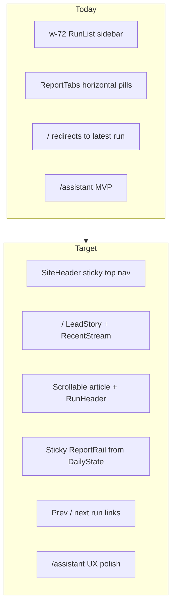

# Frontend refactor and upgrade plan

**Builds on:** [design.md](design.md), [.cursor/plans/publication_archive_ui_1eac8c18.plan.md](.cursor/plans/publication_archive_ui_1eac8c18.plan.md), [PR-12](spx-analyst/docs/PR-12-research-assistant-phase3.md) (assistant MVP)

**Record as:** `spx-analyst/docs/PR-17-publication-viewer-refactor.md` when complete

**Scope choices (confirmed):**
- **Navigation:** Full publication IA — remove persistent run sidebar; sticky top nav + homepage/archive as primary entry
- **Assistant:** Polish `/assistant` only — no embedded report panel, no “Ask about this report” context bridge, no citation UI (SSE payload is `{ text }` only today in [chat_api.py](spx-analyst/src/web/chat_api.py))

**Sharpen decisions (confirmed):**

| Decision | Choice | Rationale |
|----------|--------|-----------|
| Header vs rail split | **Hero header + rail owns structured data** | Reading column stays narrative-focused; rail is the single source for facts/signals/matrix/MC — no duplication |
| Reading layout | **`max-w-[70ch]` prose cap; rail fills remainder** | Matches design.md reading comfort; wide screens add margin/rail width, not wider body text |
| Shell placement | **`SiteHeader` in root `app/layout.tsx` + `React.cache(listRuns)`** | One shell for reader + assistant; dedupes API calls per request |
| Assistant mobile | **Session list in Sheet below `md`** | Same sidebar problem as reader; full-width message pane on phone |
| Delivery | **Single PR-17** | ~15–25 files, one review pass |

---

## Current vs target



**Already built but unwired:** [run-header.tsx](spx-analyst/web/components/run-header.tsx), [signal-grid.tsx](spx-analyst/web/components/signal-grid.tsx), [decision-matrix.tsx](spx-analyst/web/components/decision-matrix.tsx), [lead-story.tsx](spx-analyst/web/components/home/lead-story.tsx), [recent-stream.tsx](spx-analyst/web/components/home/recent-stream.tsx), [archive-grid.tsx](spx-analyst/web/components/archive/archive-grid.tsx), editorial tokens in [globals.css](spx-analyst/web/app/globals.css).

**Refactor:** [run-header.tsx](spx-analyst/web/components/run-header.tsx) — slim to hero-only (remove fact tiles + `SignalGrid`; those move to rail).

**Remove after article path works:** [report-tabs.tsx](spx-analyst/web/components/report-tabs.tsx), [run-list.tsx](spx-analyst/web/components/run-list.tsx), [assistant-link.tsx](spx-analyst/web/components/chat/assistant-link.tsx) (folded into `SiteHeader`).

---

## Non-negotiable constraints

1. **Memory-only authority** — UI reads `GET /api/runs` and `GET /api/runs/{date}` only; no frontend recomputation of analytical outputs.
2. **Structured UI from JSON** — rail modules and `RunHeader` use `DailyState` / `RunSummary`; `parseHeader()` supplements display-only fields (day change %) only.
3. **Matrix from state** — Decision Matrix section renders [DecisionMatrix](spx-analyst/web/components/decision-matrix.tsx) from `daily_state.decision_matrix`; markdown table is fallback only.
4. **No backend changes** — `pytest tests/test_web_api.py` and `tests/test_web_chat_api.py` must pass unchanged.
5. **Cross-run comparability** — fixed chip order, fixed rail module order, consistent numeric formatting per publication plan.

---

## Phase 0 — Prerequisite gate

Before UI work, verify `memory/` has **≥2 valid state+report pairs** (current schema with rows-format `decision_matrix`, `structural_bias`).

```bash
cd spx-analyst && source .venv/bin/activate
pytest tests/test_web_api.py -q
# Manual: uvicorn + npm run dev; confirm /api/runs returns ≥2 entries
```

---

## Phase 1 — App shell and top navigation

**Goal:** Replace sidebar-first layout with publication shell shared across reader and assistant routes.

### API dedup: `React.cache(listRuns)`

Wrap `listRuns()` in [lib/api.ts](spx-analyst/web/lib/api.ts) with `import { cache } from "react"` so root layout, homepage, and run page share one fetch per server request.

### New: `components/site-header.tsx`

- Sticky header (~64px): blur + `shadow-editorial-2`, `bg-paper-50/95`
- Left: wordmark link → `/`
- Nav links: **Archive** (`/archive`), **Latest** (`/runs/{newest}`), **About** (`/about`), **Assistant** (`/assistant`)
- Receives `runs: RunSummary[]` and `backendError: boolean` from root layout (no fetch inside header)
- Highlight active route via client sub-component with `usePathname()`
- Retire [assistant-link.tsx](spx-analyst/web/components/chat/assistant-link.tsx) — Assistant becomes a nav item

### Hoist shell to root layout

| File | Change |
|------|--------|
| [app/layout.tsx](spx-analyst/web/app/layout.tsx) | Fetch `listRuns()` (cached); render `SiteHeader` + `{children}` |
| [app/(reader)/layout.tsx](spx-analyst/web/app/(reader)/layout.tsx) | Remove sidebar + `RunList`; pass-through `<main>` only (or delete layout if empty) |
| [app/assistant/layout.tsx](spx-analyst/web/app/assistant/layout.tsx) | Remove duplicate mini-header; pass-through flex column for workspace |

### Responsive (header)

- Mobile: collapse nav into shadcn **Sheet** (add `components/ui/sheet.tsx` via shadcn CLI) triggered by menu icon (`lucide-react` Menu)
- Touch targets ≥44px per design.md

---

## Phase 2 — Homepage and archive

**Goal:** `/` is the editorial front door; `/archive` is discoverable from top nav.

### Refactor [app/(reader)/page.tsx](spx-analyst/web/app/(reader)/page.tsx)

- **Stop** redirecting to `/runs/{latest}`
- Render [LeadStory](spx-analyst/web/components/home/lead-story.tsx) for `runs[0]`
- Render [RecentStream](spx-analyst/web/components/home/recent-stream.tsx) for `runs.slice(1)`
- Keep existing empty-state copy when `runs.length === 0`
- Container: `max-w-7xl mx-auto px-4 py-10` with single-column mobile stack

### Archive [app/(reader)/archive/page.tsx](spx-analyst/web/app/(reader)/archive/page.tsx)

- Already implemented — verify nav link works and grid matches design (3/2/1 col via existing [ArchiveGrid](spx-analyst/web/components/archive/archive-grid.tsx))

---

## Phase 3 — Report page: scrollable article

**Goal:** Replace tabbed reading with long-form article layout.

### Refactor [app/(reader)/runs/[date]/page.tsx](spx-analyst/web/app/(reader)/runs/[date]/page.tsx)

- Fetch both `getRun(date)` and `listRuns()` (for prev/next)
- Pass `run`, `runs`, and `date` into new article shell

### Slim [run-header.tsx](spx-analyst/web/components/run-header.tsx) (hero only)

Remove from header (move to rail): fact tile grid, `SignalGrid`, `primary_tension` body (keep action text in banner).

**Header retains (mobile above-fold):**
- Date, instrument (from `parseHeader`)
- Title (“SPX Daily Tactical Analysis”)
- SPX close + day change (state + `parseHeader`)
- Recommended action banner (action text only — no `primary_tension` paragraph)

Extract `TruncatedFact` to `components/report/truncated-fact.tsx` for reuse in rail `TodaysStateModule`.

### New report components (`components/report/`)

| File | Responsibility |
|------|----------------|
| `report-article.tsx` | Flex/grid orchestrator: article column (`max-w-[70ch]`) + rail column (fills remainder) |
| `section-block.tsx` | One `##` section: serif `h2` + body renderer |
| `run-nav.tsx` | Prev / next date links + “Back to archive” |

### Refactor [report-view.tsx](spx-analyst/web/components/report-view.tsx)

Replace `ReportTabs` with stacked sections:

```
SiteHeader (root layout)
└── report-article (max-w-7xl outer container)
    ├── flex row on lg+
    │   ├── article column (max-w-[70ch], flex-1)
    │   │   ├── RunHeader (hero only)
    │   │   ├── RunNav
    │   │   └── viewerSections → SectionBlock
    │   └── rail column (min-w-[280px] max-w-[360px], sticky)
    │       └── ReportRail
    └── mobile: article stack, then rail stack below
```

**Section rendering rules** ([section-block.tsx](spx-analyst/web/components/report/section-block.tsx)):

- Default: `ReportMarkdown` for section body
- Decision matrix (`isDecisionMatrixSection`): `DecisionMatrix` from `dailyState.decision_matrix`, fallback to markdown
- Evidence (`isEvidenceSection`): caution-tinted card (reuse styling from current [report-tabs.tsx](spx-analyst/web/components/report-tabs.tsx) evidence branch)
- Use `viewerSections()` from [lib/report.ts](spx-analyst/web/lib/report.ts) to skip preamble duplicated in `RunHeader`

### Delete `report-tabs.tsx`

After article path verified; keep `sectionTabLabel()` in `lib/report.ts` for optional Tier 2 TOC.

---

## Phase 4 — Right rail modules

**Goal:** Sticky companion context from `DailyState` only — fixed module order on every run.

### New: `components/report/report-rail.tsx` + modules

| Module | Fields (authoritative) |
|--------|------------------------|
| `TodaysStateModule` | `structural_bias`, `trend_regime`, `valuation_bucket`, `primary_tension` |
| `SignalSnapshotModule` | Mount existing [SignalGrid](spx-analyst/web/components/signal-grid.tsx) — sole signal display (moved from header) |
| `MatrixSnapshotModule` | `decision_matrix.rows` — highlight Recommended Action row |
| `MonteCarloSummaryModule` | `monte_carlo.*` targets, probs, threshold |

- Desktop (`lg+`): `position: sticky; top: calc(headerHeight + 1rem)`
- Mobile (`< lg`): rail stacks **below** article in same fixed order
- Reuse `TruncatedFact` (extracted from slimmed `RunHeader`) for long strings in `TodaysStateModule`
- Reuse `TONE_SURFACE` / `toneFor()` from [lib/report.ts](spx-analyst/web/lib/report.ts)

**No duplication rule:** each `DailyState` field appears in exactly one surface — header (hero/action) or rail (everything else), never both.

---

## Phase 5 — Responsive pass

Per [design.md §8](design.md):

| Breakpoint | Behavior |
|------------|----------|
| `< 768px` | Single column article; rail below; header nav in Sheet |
| `768–1023px` | Article full width; rail below |
| `1024px+` | Side-by-side flex: article `max-w-[70ch]`, rail sticky in remaining width |
| `1440px+` | Extra outer margin; prose cap unchanged at 70ch |

- Remove all fixed `w-72` sidebars
- Verify title, date, recommended action visible above fold on mobile (in `RunHeader`)
- Tables: horizontal scroll fallback (already in `ReportMarkdown`)

---

## Phase 6 — Assistant polish (`/assistant` only)

**Goal:** Improve ergonomics without changing API contracts or adding report integration.

### Mobile session navigation

- Below `md`: hide fixed `w-72` session sidebar; open session list via Sheet (reuse `components/ui/sheet.tsx` from Phase 1)
- Full-width message pane + composer on mobile
- “Conversations” button in workspace toolbar opens Sheet

### Refactor [assistant-workspace.tsx](spx-analyst/web/components/chat/assistant-workspace.tsx)

| Improvement | Implementation |
|-------------|----------------|
| Auto-scroll | `useRef` on message list tail; scroll into view on new messages + streaming chunks |
| Composer keyboard | Enter → send; Shift+Enter → newline; optional auto-resize textarea |
| Cancel streaming | `AbortController` passed into `streamChatMessage()` in [chat-api.ts](spx-analyst/web/lib/chat-api.ts); “Stop” button while streaming (client-side abort; server may finish in background) |
| Session rename | **Manual edit only** via `renameChatSession()` — backend already auto-titles from first message ([chat_service.py](spx-analyst/src/chat_service.py) `_auto_title`); add inline edit or pencil icon on session row |
| Suggested prompts | Empty state chips: “What is today’s recommended action?”, “Summarize recent arc”, “Compare VIX regime to prior week” |
| Delete confirmation | Add shadcn `AlertDialog`; replace `window.confirm` |
| Copy message | Ghost icon on assistant bubbles copies markdown to clipboard |
| Loading states | Skeleton rows for session list and message load |
| Icons | `lucide-react` for send, stop, delete, copy, menu |
| Header dedup | Remove workspace duplicate “Research assistant” page title block — `SiteHeader` already labels the route |

### Extract (optional, keep small)

- `components/chat/chat-composer.tsx` — textarea + submit/stop
- `components/chat/message-bubble.tsx` — move from inline in workspace

### [report-markdown.tsx](spx-analyst/web/components/report-markdown.tsx)

Add `variant?: "article" | "compact"` prop:
- `article` (default): current 19px body for report sections
- `compact`: `text-sm` for assistant bubbles

**Explicitly out of scope:** citation chips, report date preload, embedded panel, Vercel AI SDK migration.

---

## Phase 7 — Shared polish and cleanup

- Replace inline hex tab styles (removed with `report-tabs`) — ensure no remaining hardcoded `#0e6b57` in components
- [backend-unavailable.tsx](spx-analyst/web/components/backend-unavailable.tsx): add retry button + copyable `uvicorn` command
- Align `AssistantWorkspace` outer header copy with publication tone (reduce duplicate “Research assistant” labels after unified `SiteHeader`)
- Audit unused exports after sidebar removal

---

## Phase 8 — Verification and documentation

### Automated

```bash
cd spx-analyst && pytest tests/test_web_api.py tests/test_web_chat_api.py -q
cd spx-analyst/web && npm run lint && npm run build
```

### Manual checklist

- [ ] `/` shows lead story + recent stream (not redirect)
- [ ] `/archive` reachable from top nav; cards link to runs
- [ ] `/runs/{date}` scrollable article with `RunHeader`, sections in order, matrix from JSON
- [ ] Rail modules match field-authority map; stack below article on mobile
- [ ] Prev/next navigation across dates
- [ ] `/assistant` streaming, auto-scroll, Enter-to-send, stop, manual rename, suggested prompts, mobile session Sheet
- [ ] API down → graceful empty/error states on homepage and header
- [ ] Responsive pass: 375, 768, 1280, 1440px

### Documentation

Update [spx-analyst/README.md](spx-analyst/README.md) Phase 2 viewer section:
- New route map and navigation model
- Field-authority rule (no prose-driven structured UI)
- Dev seeding + troubleshooting

---

## Delivery

**Single PR-17** — publication viewer (Phases 1–5) + assistant polish (Phase 6) + docs in one reviewable diff (~15–25 files).

---

## Sharpen stress-test notes

Issues surfaced during `/sharpen-plan` and how they were resolved:

| Risk | Resolution |
|------|------------|
| Header + rail duplicated facts, tension, and signals | **Hero/rail split** — each field has one home |
| Strict 7/5 grid widened rail past design intent | **70ch prose cap** — rail absorbs extra viewport width |
| `listRuns()` called from layout + homepage + run page | **`React.cache()`** in root layout |
| Assistant `w-72` sidebar breaks on mobile | **Session Sheet** in Phase 6 |
| Session rename vs backend `_auto_title` | **Manual rename only** — do not duplicate auto-title on frontend |
| `AbortController` stop button | Client aborts fetch; note in plan that server may finish stream in background |
| Dead code after sidebar removal | Delete `run-list.tsx`, `assistant-link.tsx`, `report-tabs.tsx` |

**Still deferred (Tier 2):** section hash deep links, dark mode toggle, archive filtering, citation UI.

---

Defer to keep this refactor focused:

- Dark mode toggle (`next-themes` + existing `.dark` tokens)
- In-page section TOC (sticky anchors from `splitSections`)
- Archive client-side filtering (bias, action, date range)
- Mobile archive drawer (alternative to full `/archive` page)
- Richer rail: `what_changed_today`, `open_questions`, `conflicting_evidence`
- Citation UI (requires backend SSE metadata for retrieved sections)
- Embedded assistant panel on report pages
