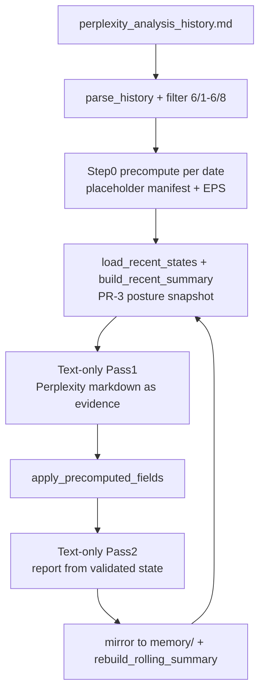

# June Perplexity Backfill for PR-3 Memory

## Problem restated

You have **no chart packs** for 2026-06-01 through 2026-06-08, but you **do** have the original analyses in [`perplexity_analysis_history.md`](../perplexity_analysis_history.md). States on disk from the earlier import use `framework_version: perplexity-migration` and **fail** current `DailyState` validation — so PR-3 [`load_recent_states()`](spx-analyst/src/memory.py) skips them and rolling memory is effectively empty for that window.

**Objective:** Rebuild a valid June chain in `memory/` that PR-3 can roll up, **approximating** what the revamped engine would have produced (schema, precompute numerics, posture fields) without re-analyzing charts you do not have.

**Not achievable without charts:** A pixel-perfect reproduction of Pass 1/2 chart reads. The backfill uses Perplexity prose as the qualitative evidence substitute and yfinance precompute for authoritative numerics where possible.

---

## Why the current archive cannot be rolled up

Existing files (e.g. [`2026-06-01-state.json`](spx-analyst/memory/daily_states/2026-06-01-state.json)) vs valid reference ([`2026-06-10-state.json`](spx-analyst/memory/daily_states/2026-06-10-state.json)):

| Gap | Old migrated file | Required `daily-2026-06` |
|-----|-------------------|--------------------------|
| `structural_bias` | Missing | Required |
| `decision_matrix` | Flat keys (`valuation`, `technicals`, …) | `{ rows: [18 DecisionMatrixRow] }` |
| `monte_carlo` | Missing or embedded in prose | Full `MonteCarloDetail` object |
| `signals` | Extra fields (`vix`, `monte_carlo_probability`) | Strict `SignalSet` only |
| `schk_close` | Present | Forbidden (extra field) |

[`rebuild-summary`](spx-analyst/src/cli.py) alone cannot fix this — it only formats **already-valid** states.

Re-running the **current** [`migrate_perplexity.py`](spx-analyst/src/migrate_perplexity.py) without code changes would get closer (prompt already asks for `structural_bias`, `decision_matrix.rows`, `monte_carlo`), but still:

- Sets `framework_version: perplexity-migration` in [`_enforce_close()`](spx-analyst/src/migrate_perplexity.py) line 306
- Does **not** run Step 0 precompute or [`apply_precomputed_fields()`](spx-analyst/src/state_enforcement.py)
- Uses old memory header `## Recent historical memory` (not PR-3 posture snapshot)
- Has **no CLI** — only `migrate_history()` API

---

## Recommended approach: upgraded Perplexity backfill pipeline



### What this mimics from the live engine

| Engine step | Backfill equivalent |
|-------------|---------------------|
| Step 0 precompute | **Yes** — yfinance for historical date + EPS-only `external_context.json`; placeholder 1-chart manifest (no real charts needed) |
| Pass 1 chart read | **No** — Perplexity markdown replaces chart evidence |
| Pass 1 structured state | **Yes** — `run_text_structured_state` + current `DailyState` schema |
| Post-Pass 1 enforcement | **Yes (new)** — `apply_precomputed_fields` overwrites `spx_close`, `monte_carlo`, matrix numerics from `analysis_context` |
| Pass 2 report | **Yes** — text-only report pass from validated state + Perplexity narrative |
| PR-3 memory rollup | **Yes** — sequential runs accumulate valid states; rolling rebuild after each session |

### What remains approximate

- `structural_bias`, qualitative signals, divergences, `what_changed_today` — inferred from Perplexity text, not today's charts
- MC **interpretation** in narrative may differ; MC **numbers** come from precompute after enforcement
- Reports are regenerated in engine markdown shape, not identical to original Perplexity formatting

---

## Implementation work (PR-3.1 backfill)

### 1. Extend [`migrate_perplexity.py`](spx-analyst/src/migrate_perplexity.py)

**Precompute hook** (per session date):

- Call [`scaffold_run_dir()`](spx-analyst/src/files.py) if `data/runs/{date}/` missing
- Require `external_context.json` with `forward_eps` / `trailing_eps` (user-provided or copied from a template)
- Run [`run_precompute()`](spx-analyst/src/precompute.py) with placeholder manifest
- Inject [`analysis_context`](spx-analyst/src/schemas.py) into migration Pass 1 body (same block as live runs)

**Enforcement hook** (after successful `parse_daily_state`):

- Call `apply_precomputed_fields(daily_state, analysis_context)` before report pass
- Log enforcement warnings in `run_log` like live engine

**Schema alignment:**

- Set `framework_version` to `daily-2026-06` (or `daily-2026-06-perplexity-backfill` if you want provenance — either must pass `DailyState` validation)
- Remove/stop writing legacy fields (`schk_close`, flat matrix)

**PR-3 memory integration:**

- Replace `## Recent historical memory` with same wrapper as [`_optional_memory_block()`](spx-analyst/src/prompts.py) in migration prompts
- Call [`rebuild_rolling_summary()`](spx-analyst/src/memory.py) after each successful `migrate_session` (mirror live engine)

### 2. Add CLI command [`src/cli.py`](spx-analyst/src/cli.py)

```bash
python -m src.cli migrate-perplexity \
  --history ../perplexity_analysis_history.md \
  --from 2026-06-01 \
  --to 2026-06-08
```

Wraps `migrate_history()` with logging and sequential processing.

### 3. EPS template for June dates

Create minimal run dirs (no charts beyond placeholder):

```bash
for d in 2026-06-01 2026-06-02 2026-06-04 2026-06-05 2026-06-08; do
  python -m src.cli setup-run --date $d
done
```

Edit each `data/runs/{date}/external_context.json` with the EPS you used in June (or a single reasonable constant e.g. forward 354 / trailing 220 if unknown — document assumption in run_log).

Precompute will fetch **historical** yfinance bars for each date's `as_of_date`.

### 4. Tests

- Extend [`tests/test_migrate_perplexity.py`](spx-analyst/tests/test_migrate_perplexity.py): mock precompute + verify output validates as `DailyState`
- Fixture: migrated state produces valid [`build_recent_summary()`](spx-analyst/src/memory.py) line (categorical signals, no close in rollup)

### 5. Docs

- Add section to [`docs/PR-3-memory-rollup-overhaul.md`](spx-analyst/docs/PR-3-memory-rollup-overhaul.md) or new `docs/PR-3.1-perplexity-backfill.md` with operator steps
- Update [`README.md`](spx-analyst/README.md) Legacy Perplexity migration section: old `perplexity-migration` files are obsolete; backfill produces `daily-2026-06`

---

## Operator runbook (after PR-3.1 code lands)

### Step 0 — Archive invalid June files

```bash
cd spx-analyst
mkdir -p memory-archive/perplexity-migration-2026-06
mv memory/daily_states/2026-06-0{1,2,4,5,8}-state.json memory-archive/perplexity-migration-2026-06/
mv memory/daily_reports/2026-06-0{1,2,4,5,8}-analysis.md memory-archive/perplexity-migration-2026-06/ 2>/dev/null || true
```

Keep or re-backfill 2026-06-10 separately (already valid).

### Step 1 — Prepare EPS-only run dirs

Setup + edit EPS for all five dates (see above).

### Step 2 — Sequential backfill (oldest first)

```bash
python -m src.cli migrate-perplexity \
  --history ../perplexity_analysis_history.md \
  --from 2026-06-01 \
  --to 2026-06-08
```

Sessions in export: **2026-06-01, 02, 04, 05, 08** (5 days).

Each session: loads PR-3 posture snapshot from prior valid states → migrates → enforces precompute → saves to `memory/` → rebuilds rolling.

**API cost:** 5 dates × 2 text-only Claude passes (no images — cheaper than full runs).

### Step 3 — Verify

```bash
python -m src.cli rebuild-summary --days 6
cat memory/rolling/recent_summary.md
```

Check:

- Five `### 2026-06-…` blocks with categorical `signals:` lines
- Footer regime arc + watchlist
- All `memory/daily_states/2026-06-0*-state.json` validate as `daily-2026-06`
- `framework_version` and `run_log.source` document backfill provenance

### Step 4 — Optional chain extension

- Re-backfill **2026-06-12** (currently invalid `perplexity-migration`) via same pipeline
- Keep **2026-06-10** as-is or re-backfill if you want MC/enforcement consistent with the June chain

### Step 5 — Enable live memory

```bash
# .env
SPX_INCLUDE_MEMORY=true
```

Future daily runs append to the valid archive and PR-3 rollup.

---

## Alternative: offline JSON conversion (not recommended)

A script could heuristically map old flat-matrix JSON → new schema without Claude. **Problems:**

- Old files lack `structural_bias`, `monte_carlo` object — heavy guessing
- No precompute enforcement
- Divergence IDs and matrix rows would be low fidelity

Only consider if API re-migration is blocked.

---

## Acceptance criteria

- [ ] Five valid `daily-2026-06` states for 2026-06-01, 02, 04, 05, 08 in `memory/daily_states/`
- [ ] Matching reports in `memory/daily_reports/`
- [ ] `memory/rolling/recent_summary.md` shows PR-3 posture format for all five
- [ ] `build_recent_summary` / `rebuild-summary` with `skipped_invalid == 0`
- [ ] Each backfilled run has `analysis_context.json` in `output/{date}/` from historical precompute
- [ ] `apply_precomputed_fields` applied; `run_log` documents backfill source and warnings
- [ ] Provenance documented (`framework_version` or `run_log.source`)

---

## Summary for you

| Question | Answer |
|----------|--------|
| Can we rebuild rolling history without chart packs? | **Yes**, via upgraded Perplexity backfill + precompute |
| Is `rebuild-summary` enough today? | **No** — existing JSON is invalid for PR-3 |
| Does re-migrating with current code alone fix it? | **Partially** — schema closer, but missing precompute, enforcement, CLI, PR-3 prompt wrapper |
| Closest to "revamped engine"? | Text migration + **historical precompute** + **enforcement**, sequential with PR-3 memory |
