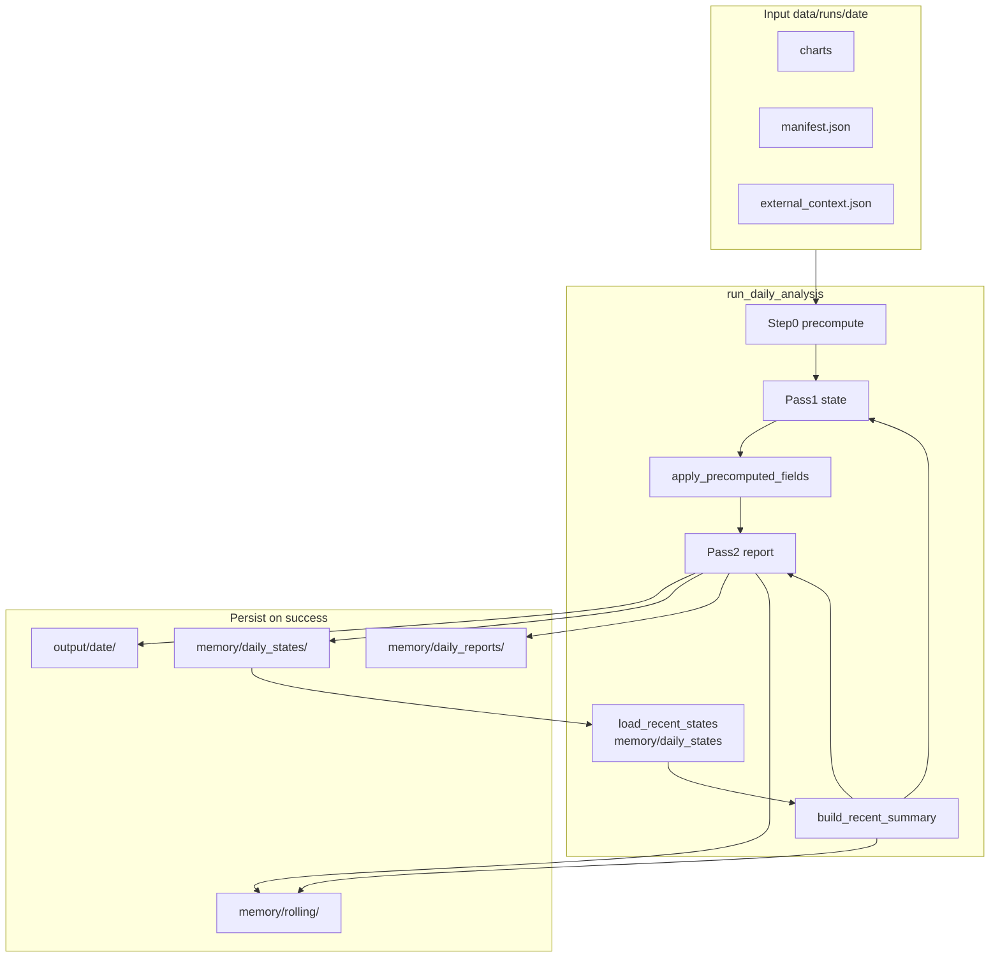

# Memory Rollup Overhaul Plan

**Status: IMPLEMENTED** — canonical implementation record: [`spx-analyst/docs/PR-3-memory-rollup-overhaul.md`](spx-analyst/docs/PR-3-memory-rollup-overhaul.md)

## Executive summary

The SPX analyst engine stores durable memory in [`memory/daily_states/`](spx-analyst/memory/daily_states/) and injects a **text rollup** into Pass 1 and Pass 2 when `SPX_INCLUDE_MEMORY=true`. Today that rollup is built by [`build_recent_summary()`](spx-analyst/src/memory.py) and wrapped by [`_optional_memory_block()`](spx-analyst/src/prompts.py).

**Product spec (locked):** The redesign is a **strict posture snapshot**. Carry regime continuity, current action posture, structured deltas, and unresolved tensions. Drop narrative replay and **all historical numerics** in the prompt payload. The framework requires each run to be treated as a **fresh analysis**; the prompt contract already makes [`analysis_context`](spx-analyst/src/precompute.py) the **sole numeric source of truth** ([PR-1](spx-analyst/docs/PR-1-spx-daily-framework-migration.md), [PR-2](spx-analyst/docs/PR-2-spx-two-pass-prompt-overhaul.md)).

This PR replaces the rollup format, prompt framing, load observability, and rebuild timing. It does **not** change `DailyState` schema, archive mirroring, or the on-disk full-JSON contract.

---

## Resolved decision: zero historical numerics in rollup

**Decision (locked):** The signal snapshot is **categorical-only**. No `spx_close`, no exact F&G scores, RSI values, spread percentages, or vs50dma percentages in the memory block.

| Rejected alternative | Why rejected |
|---------------------|--------------|
| Keep small historical numerics (close, RSI, etc.) | Contradicts "no stale numerics" and still anchors today's read |
| Soften claim to "drop stale decision-driving numerics" | Weaker than framework fresh-analysis rule |

Historical state on disk retains full numerics for audit, viewer, and chat stub. Only the **prompt rollup** is categorical.

---

## Current memory architecture (as built)



**After this PR:** `rebuild_rolling_summary` runs after **every** successful mirrored run. `SPX_INCLUDE_MEMORY` gates **prompt injection only**.

### Configuration ([`config.py`](spx-analyst/src/config.py))

| Variable | Default | Effect (after PR) |
|----------|---------|-------------------|
| `SPX_INCLUDE_MEMORY` | `false` | Gates **prompt injection only** |
| `SPX_RECENT_STATE_COUNT` | `6` | Max prior states loaded (excluding today's date) |

Archiving to `memory/` and rolling rebuild happen on **every** successful run regardless of `SPX_INCLUDE_MEMORY`.

### Load path

[`load_recent_states()`](spx-analyst/src/memory.py) — **unchanged signature** (returns `list[DailyState]`). Delegates internally to new companion.

[`load_recent_states_with_stats()`](spx-analyst/src/memory.py) — **new companion** returning `(list[DailyState], MemoryLoadStats)`. Used by `analysis_engine.py` for `run_log.json`. Existing consumers (`chat_context.py`, CLI, `rebuild_rolling_summary`) keep calling `load_recent_states()` unchanged.

---

## Issues identified with current structure

1. **Too prose-heavy** — concatenates `trend_regime`, `base_case`, `primary_tension`, `narrative_summary`; omits structured continuity fields
2. **Stale numerics and narrative anchoring** — MC, Fib, ERP, close, legacy actions embedded in prose
3. **Silent schema skips** — legacy files dropped without observability
4. **Weak prompt contract** — "optional narrative context" invites story continuation
5. **Stale rolling artifacts** — rebuild coupled to `SPX_INCLUDE_MEMORY` while archiving always runs
6. **Prior plan draft inconsistency** — proposed `close {spx_close}` and numeric signal line while claiming "no stale numerics"

---

## Proposed design: strict posture snapshot

### Design goals

1. **Continuity without replay** — posture labels, categorical signal states, deltas, unresolved threads
2. **Zero historical numerics in rollup** — no close, scores, spreads, percentages, MC, Fib, ERP
3. **Structured fidelity** — `what_changed_today`, conflicts with compressed rules
4. **Bounded size** — soft target **≤ 2,500 chars / 6 days**; hard test ceiling **≤ 3,000 chars**
5. **Fresh-analysis guard** — posture snapshot only; `analysis_context` + charts authoritative for today

---

## Inclusion matrix (locked)

| Field group | Decision | Rationale |
|-------------|----------|-----------|
| `date`, `structural_bias`, `signal_alignment.overall`, normalized `recommended_action` | **Include every day** | Regime-first posture labels |
| Categorical signal labels (see below) | **Include every day** | Continuity without numeric anchoring |
| `what_changed_today` | **Include, capped** | Cleanest delta carrier (textual deltas OK; they describe change, not authoritative levels) |
| `primary_tension` | **Include, truncated** | Live contradiction without full narrative |
| `open_questions` | **Rollup-level unresolved watchlist only** | Avoid per-day stale accumulation |
| `conflicting_evidence` | **Max 1–2/day:** `{id} \| {layers} \| {rule}` by weight | Compressed resolution logic for Pass 2 reconciliation |
| `spx_close`, numeric signals, `narrative_summary`, `base_case`, full `trend_regime`, MC, Fib, ERP, legacy action strings | **Exclude** | Historical numerics and narrative replay |

---

## Categorical signal labels (locked — as built)

Deterministic bucketing from [`SignalSet`](spx-analyst/src/schemas.py) — no floats in rollup output. Internal bucket keys use snake_case for matching; **rendered prompt output uses human-readable labels** via `_display_signal_label()` (spaces, not snake_case).

```python
def _signal_labels(s: DailyState) -> str:
    # Returns e.g.: "F&G fear | VIX elevated | RSI neutral | credit wide | vs50d below"
```

| Source field | Internal bucket | Rendered label (examples) | Bucketing rule |
|--------------|-----------------|---------------------------|----------------|
| `fear_greed_zone` (fallback: `fear_greed` score) | extreme_fear, fear, neutral, greed, extreme_greed, unknown | extreme fear, fear, neutral, greed, extreme greed, unknown | Zone normalized (longest match first: extreme_greed before greed); score bands 0–24 / 25–44 / 45–55 / 56–74 / 75+ |
| `vix_regime` | low, normal, elevated, high, unknown | same | Keyword parse on regime text only (no numeric VIX field in schema); **`elevated` before `high`** to avoid misbucketing e.g. "highly elevated" |
| `rsi14` | oversold, neutral, overbought, unknown | same | <30 oversold, 30–70 neutral, >70 overbought; null → unknown |
| `high_yield_spread` | tight, normal, wide, extreme, unknown | same | <1.0 tight, 1.0–1.3 normal, 1.3–1.5 wide, >1.5 extreme; null → unknown |
| `pct_vs_50dma` | below, near, above, extended, unknown | same | <-1 below, -1 to +3 near, +3 to +8 above, >+8 extended; null → unknown |

Output format (single line, pipe-separated labels):

```
signals: F&G fear | VIX elevated | RSI neutral | credit wide | vs50d below
```

Prefix with `F&G` / `VIX` etc. for readability; values are **closed-set categorical labels only** (human-readable in prompt).

---

## Action normalization (locked — as built)

Deterministic closed-set mapping — no subjective rewriting. Cap final string at 60 chars.

**Closed set (exact tokens emitted):**

| Token | Meaning |
|-------|---------|
| `deploy` | Active add / re-entry deployment |
| `light deploy` | Partial / conditional add |
| `hold and monitor` | Default hold; no trim or add edge |
| `trim bias` | Defensive trim posture without full exit |
| `defensive patience` | Capital preservation; no new longs |

**Matching algorithm** (`_normalize_action(raw: str, *, current_reading: str = "", signal: str = "") -> str`):

1. Lowercase, collapse whitespace, strip `hold_schk_` / `schk_` prefixes
2. Apply first matching rule (order matters):

| Step | Pattern (substring match) | Token |
|------|---------------------------|-------|
| 1 | `partial trim`, `defensive trim`, `wave 1`, then bare `trim` | `trim bias` |
| 2 | literal `light deploy` | `light deploy` |
| 3 | `deploy`, `reentry`, `re-entry`, **`add tranche`** | `deploy` |
| 4 | `partial`, `25%`, `light`, bare **`tranche`** (excludes strings containing `add tranche`) | `light deploy` |
| 5 | `defense`, `defensive`, `patience`, `capital preservation`, `protect` | `defensive patience` |
| 6 | `hold`, `monitor`, `wait`, `gtc` | `hold and monitor` |
| 7 | (no match) | `hold and monitor` (safe default) |

`add tranche` always resolves to `deploy` because step 3 runs before the bare-`tranche` rule in step 4.

3. If matrix `current_reading` is ≤60 chars and matches none of the above, use first 60 chars of `current_reading` **only when** `signal` token is empty or identical to snake_case noise — otherwise prefer mapped token from `signal`.

Full table also in [`docs/PR-3-memory-rollup-overhaul.md`](spx-analyst/docs/PR-3-memory-rollup-overhaul.md).

---

## Rollup structure

Two sections: **per-day snapshots** (oldest→newest) + **rollup footer**.

### Per-day block (no historical numerics)

```
### {date}
{structural_bias} | {signal_alignment.overall} | action: {action_norm}
signals: F&G fear | VIX elevated | RSI neutral | credit wide | vs50d below
changed: {item1}; {item2}; {item3}
tension: {primary_tension truncated}
conflicts: {DIV-1} | technical/structural | When breadth and credit diverge from price, elevate caution…
```

No `close` line. No `open:` per day.

### Rollup footer

```
---
Regime arc (6 sessions): Late Bull / Topping (held)
Unresolved watchlist: Does VIX spike into 25-30 capitulation zone and reverse? | Will junk spread widening accelerate?
```

### Unresolved watchlist rules (locked)

Derived from `open_questions` across loaded states (newest-first order preserved in selection):

1. **Eligibility:** Include if question appears in the **most recent** loaded state **OR** normalized text matches in **≥ 2 of the last 3** sessions
2. **Expiry:** Drop after **2 consecutive** most-recent sessions without a normalized match
3. **Recency ordering:** Sort selected items by **most recent qualifying session date** (newest first)
4. **Wording stability:** Emit the **exact string from the newest qualifying state's** `open_questions` entry — use normalization **only** for dedupe/match, never for display text
5. **Cap:** Max **2 items × 80 chars** (truncate display string only if over 80; do not rewrite)

### Conflict lines

Max 2/day, 90 chars each: `{id} | {layers} | {truncated framework_rule}`. Select by weight: high → medium → low.

---

## Truncation caps (locked)

| Field | Cap |
|-------|-----|
| `recommended_action` (normalized) | 60 chars |
| `what_changed_today` | 3 × 60 chars |
| `primary_tension` | 120 chars |
| `conflicting_evidence` | 2 × 90 chars |
| Unresolved watchlist | 2 × 80 chars (rollup footer) |
| **6-day rollup total** | Soft ≤ 2,500; **hard test ≤ 3,000** |

---

## Revised prompt wrapper — [`_optional_memory_block()`](spx-analyst/src/prompts.py)

```
## Prior posture snapshot (continuity only — not authoritative for today's numerics)
Each run is a fresh analysis. Use this block only to track regime shifts, action posture,
day-over-day changes, and unresolved tensions. All calculations, thresholds, targets, and
price levels come from today's analysis_context and charts — never from prior sessions.

{summary}
```

When `recent_summary` is `None`, this block is **omitted entirely** from Pass 1 and Pass 2. The engine passes `None` when `SPX_INCLUDE_MEMORY=false`. When memory is enabled but the archive is empty, the block is still injected with the text `No prior sessions on record.` (within spec — omission is not required for empty archive).

---

## Example output (categorical, illustrative)

```
### 2026-06-02
Late Bull / Topping | mixed | action: hold and monitor
signals: F&G greed | VIX low | RSI neutral | credit wide | vs50d extended
changed: 7th ATH but smallest gain of streak; RSI below 70 on ATH day
tension: melt-up posture vs credit widening at April-shock levels
conflicts: DIV-1 | technical/structural | When breadth and credit diverge from price, elevate caution

### 2026-06-10
Late Bull / Topping | aligned_trim | action: defensive patience
signals: F&G fear | VIX elevated | RSI neutral | credit wide | vs50d below
changed: broke 50d and 20d SMA; distribution close; credit widening
tension: intact 50>200d vs breadth/credit/sentiment all defensive
conflicts: DIV-1 | technical/structural | Elevate caution when breadth and credit diverge

### 2026-06-12
Late Bull / Topping | mixed | action: hold and monitor
signals: F&G fear | VIX elevated | RSI neutral | credit wide | vs50d above
changed: 2nd up day off prior low; reclaimed key support; re-entry zone not touched
tension: price improving vs unconfirmed credit/breadth backdrop
conflicts: DIV-1 | technical/sentiment | Relief rally must prove itself with credit/breadth

---
Regime arc (6 sessions): Late Bull / Topping (held)
Unresolved watchlist: Does VIX spike into the 25-30 capitulation zone and reverse? | Will junk spread widening accelerate?
```

---

## Implementation plan

### Files to change

| File | Change |
|------|--------|
| [`spx-analyst/src/memory.py`](spx-analyst/src/memory.py) | Categorical labels, action table, watchlist with recency, `load_recent_states_with_stats`, new rollup |
| [`spx-analyst/src/analysis_engine.py`](spx-analyst/src/analysis_engine.py) | Unconditional `rebuild_rolling_summary`; `memory_load` in `run_log.json`; warn on `skipped_invalid > 0` |
| [`spx-analyst/src/prompts.py`](spx-analyst/src/prompts.py) | Strict posture snapshot header |
| [`spx-analyst/tests/test_memory_rollup.py`](spx-analyst/tests/test_memory_rollup.py) | Full unit coverage + red-line omission |
| [`spx-analyst/tests/test_prompt_builder.py`](spx-analyst/tests/test_prompt_builder.py) | Header + absent when no memory |
| [`spx-analyst/tests/test_engine.py`](spx-analyst/tests/test_engine.py) | Rebuild-always, warning cases |
| [`spx-analyst/README.md`](spx-analyst/README.md) | See README wording section below |
| **`spx-analyst/docs/PR-3-memory-rollup-overhaul.md`** | Full spec: action table, signal buckets, before/after metrics |

### `load_recent_states()` backward compatibility (locked)

```python
def load_recent_states(...) -> list[DailyState]:
    states, _ = load_recent_states_with_stats(...)
    return states

def load_recent_states_with_stats(...) -> tuple[list[DailyState], MemoryLoadStats]:
    ...
```

Do **not** change the return type of `load_recent_states()`.

### README wording updates (done)

Operator contract in [`README.md`](spx-analyst/README.md):

- Successful runs **always** mirror `{date}-state.json` and `{date}-analysis.md` to `memory/`
- `rebuild_rolling_summary` runs after **every** successful mirrored run → refreshes `memory/rolling/recent_summary.md` and `recent_memory.json`
- `SPX_INCLUDE_MEMORY=true` gates **prompt injection** of the posture snapshot into Pass 1/Pass 2 only
- Memory rollup contains **categorical posture labels only** — no historical price levels or numeric indicators

---

## Proposed `memory.py` structure

```python
@dataclass
class MemoryLoadStats:
    requested: int
    loaded: int
    skipped_invalid: int
    skipped_before_date: int

def load_recent_states_with_stats(...) -> tuple[list[DailyState], MemoryLoadStats]: ...
def load_recent_states(...) -> list[DailyState]: ...  # unchanged; delegates

def _truncate(text: str, max_len: int) -> str: ...
def _normalize_action(raw: str, *, current_reading: str = "") -> str: ...
def _bucket_fear_greed(s: SignalSet) -> str: ...
def _bucket_vix(s: SignalSet) -> str: ...
def _bucket_rsi(s: SignalSet) -> str: ...
def _bucket_credit(s: SignalSet) -> str: ...
def _bucket_vs50d(s: SignalSet) -> str: ...
def _display_signal_label(bucket: str) -> str: ...
def _signal_labels(s: DailyState) -> str: ...
def _conflict_line(d: Divergence) -> str: ...
def _select_conflicts(divergences: list[Divergence]) -> list[Divergence]: ...
def _format_day(s: DailyState) -> str: ...
def _regime_arc(states: list[DailyState]) -> str: ...
def _build_unresolved_watchlist(states: list[DailyState]) -> str: ...
def build_recent_summary(states: list[DailyState]) -> str: ...
def rebuild_rolling_summary(...) -> tuple[str, Path]: ...
```

---

## Logging behavior (locked — as built)

When `SPX_INCLUDE_MEMORY=true`, write `memory_load` counts to `output/{date}/run_log.json`. Warn **only** when `skipped_invalid > 0`. Do not warn for young archives alone.

`rebuild_rolling_summary` runs on every successful mirrored run regardless of injection flag.

---

## Test plan

### Unit tests ([`test_memory_rollup.py`](spx-analyst/tests/test_memory_rollup.py))

- Format: structural_bias, alignment, normalized action, categorical signals
- Caps: changed 3×60, tension 120, conflicts 2×90, watchlist 2×80
- `test_signal_labels_no_numeric_output` — assert no `\d+\.\d+` patterns in signals line
- `test_format_day_omits_spx_close` — no `close ` prefix / no state close value
- **`test_red_line_omissions`** — inject fixture state with narrative, MC, Fib, ERP, close; assert none appear in rollup (regex/substring blocklist: `narrative_summary` prose snippets, `prob_up`, Fib levels like `7,151`, ERP `%`, raw `spx_close` value)
- Watchlist: recency order, exact wording from newest qualifying state, 2-of-3 repeat, 2-session expiry
- Action normalization: table cases for SCHK legacy strings → closed tokens
- Regime arc held / transitions
- Hard ceiling 3000 chars / 6 states; soft ceiling 2500 on realistic 6-day fixture
- VIX elevated-before-high; F&G extreme zone display labels
- Action: `add tranche` → deploy, `partial trim` → trim bias, `light deploy` literal
- `load_recent_states_with_stats` counts; `load_recent_states` still returns list only

### Engine tests ([`test_engine.py`](spx-analyst/tests/test_engine.py))

- **`test_memory_block_absent_when_include_memory_false`** — via prompt snapshot or FakeClient body inspection
- **`test_rolling_rebuilt_without_include_memory`** — `recent_summary.md` mtime/content after run
- **`test_no_warning_young_archive_zero_invalid_skips`**
- **`test_warning_when_prior_file_unreadable`** — corrupt JSON + `include_memory=true`

### Prompt tests ([`test_prompt_builder.py`](spx-analyst/tests/test_prompt_builder.py))

- New header present when memory provided; absent when `recent_summary=None`
- Old "Optional prior-run narrative context" absent

---

## Acceptance criteria (locked)

| Criterion | Target |
|-----------|--------|
| 6-day rollup size | Soft ≤ 2,500 chars; hard test ≤ 3,000 |
| Zero historical numerics | No `spx_close`, no float scores/spreads/pct in rollup |
| Signal line | Categorical closed-set tokens only |
| Per-day includes | date header, bias, alignment, normalized action, labels, changed, tension, conflicts |
| Per-day excludes | narrative, base_case, trend_regime, MC/Fib/ERP, numeric signals |
| Watchlist | Footer only; recency-ordered; exact newest qualifying wording |
| Action mapping | Deterministic closed-set table |
| Prompt injection | Gated by `SPX_INCLUDE_MEMORY`; block absent when `recent_summary is None` |
| Rebuild | After every successful mirrored run |
| Logging | `memory_load` in `run_log.json` when memory enabled; warn only on `skipped_invalid > 0` |
| `load_recent_states()` | Signature unchanged |
| Disk contract | Full JSON unchanged on disk |
| Red-line test | Passes omission blocklist |

---

## Before/after comparison

| Dimension | Current | Proposed |
|-----------|---------|----------|
| Purpose | Narrative replay | Strict posture snapshot |
| Historical numerics | close + prose MC/Fib/ERP | **None** (categorical labels only) |
| ~Tokens (6 days) | ~3,700 | ~550–650 |
| Signal line | Numeric / verbose | Categorical buckets |
| `what_changed_today` | Missing | Capped deltas |
| Action | Raw SCHK strings | Closed-set normalized |
| Rolling rebuild | Coupled to include_memory | Every successful run |
| Skip observability | Silent | Logged; warn on invalid |

---

## Resolved design decisions (all rounds)

| Question | Decision |
|----------|----------|
| Historical numerics in rollup? | **No** — categorical signal labels only; no close |
| `open_questions`? | Rollup watchlist; exact wording from newest qualifying state |
| Conflict detail? | `id \| layers \| truncated framework_rule` |
| Rebuild on every run? | **Yes** |
| Warn when loaded < requested? | **No** — warn only on `skipped_invalid > 0` |
| Load API? | **`load_recent_states_with_stats()` companion**; keep `load_recent_states()` unchanged |
| Action normalization? | **Deterministic closed-set table** — token `defensive patience` (no slash) |
| VIX bucketing scope? | **`vix_regime` text only**; elevated before high; no numeric VIX in schema |
| Signal display? | **Human-readable labels in prompt**; snake_case internal buckets only |

---

## PR-3 sign-off

**Status:** Implemented and tested (101 tests). Canonical spec: [`docs/PR-3-memory-rollup-overhaul.md`](spx-analyst/docs/PR-3-memory-rollup-overhaul.md).

**Architecture fit:** Matches the framework fresh-analysis rule and PR-1/PR-2 authority split — full `DailyState` JSON on disk for audit/viewer; prompt memory is a compact continuity layer only (posture, deltas, unresolved tensions), not a replay channel.

**Locked contracts (as built):** Zero historical numerics in rollup; human-readable categorical signal labels; deterministic action normalization (`defensive patience`); recency-ordered watchlist with exact newest wording; companion load stats; unconditional rolling rebuild; warnings only on `skipped_invalid > 0`; prompt omission when `recent_summary is None`.

---

## Cursor handoff — four implementation buckets (complete)

| Bucket | Files | Scope |
|--------|-------|-------|
| **1. Memory formatter** | [`memory.py`](spx-analyst/src/memory.py) | Helpers, categorical `_signal_labels`, action table, watchlist, `load_recent_states_with_stats`, `build_recent_summary` rewrite |
| **2. Engine orchestration** | [`analysis_engine.py`](spx-analyst/src/analysis_engine.py) | Unconditional `rebuild_rolling_summary`; `memory_load` in `run_log.json`; warn on invalid skips only |
| **3. Prompt wrapper** | [`prompts.py`](spx-analyst/src/prompts.py) | Strict posture snapshot header |
| **4. Tests + docs** | `tests/`, [`README.md`](spx-analyst/README.md), [`docs/PR-3-memory-rollup-overhaul.md`](spx-analyst/docs/PR-3-memory-rollup-overhaul.md) | Acceptance set + red-line omission; README operator contract |

### Acceptance set (verified)

- Memory block **absent** when `SPX_INCLUDE_MEMORY=false` or `recent_summary is None`
- Rolling artifacts **refreshed** after successful run even when injection disabled
- **No warning** for young archive with zero invalid skips
- **Warning emitted** when ≥1 prior file is unreadable/schema-invalid
- Signal line **categorical-only** with human-readable labels (no numeric leakage)
- **Red-line omission** test: no historical `spx_close`, MC, Fib, ERP, or narrative prose in rollup
- Action tokens: `defensive patience`; `add tranche` → `deploy`
