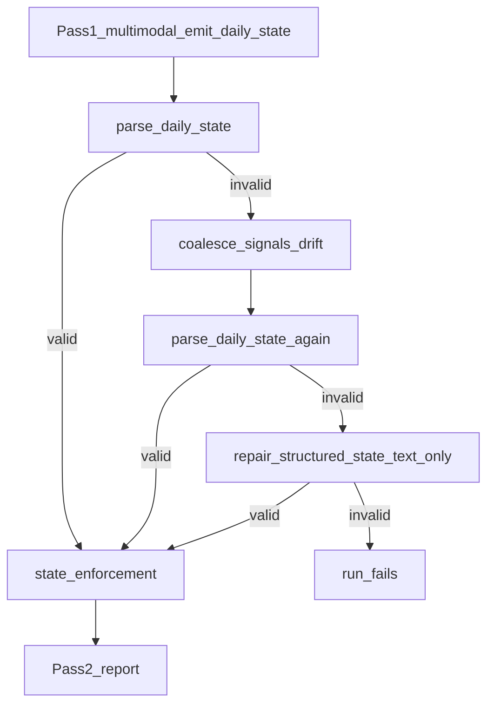
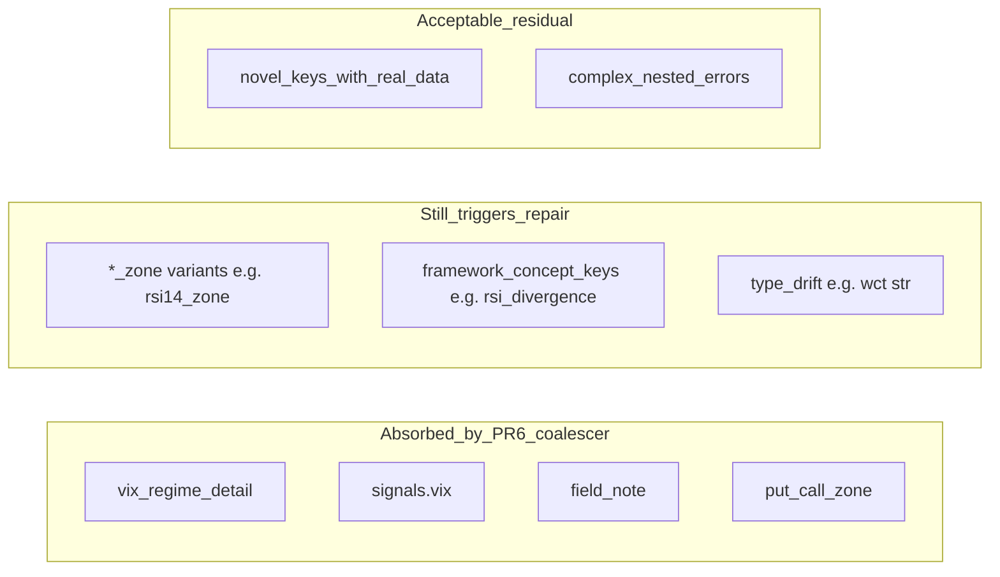

# Pass 1 Repair Pass: RCA, Frequency, and Hardening Plan

## Executive summary

The SPX analyst’s two-pass pipeline treats **Pass 1 repair** as a deliberate fallback: when `emit_daily_state` output fails Pydantic validation and the PR-6 signals coalescer cannot fix it, the engine makes one lightweight API call to re-emit corrected JSON. Repair is **not a bug**—it is the safety net after Layers 1–3 fail.

**Observed problem:** Among instrumented live runs in this session, **2 of 6 runs (33%)** triggered repair—worse than the operator target of **~1 in 7–8 (12–14%)** and far from the north star of **~1 in 10 (10%)**.

**Root cause:** PR-6 successfully eliminated repair for **known `signals` drift** (`vix_regime_detail`, `vix`, `*_note`, `put_call_zone`) but left two failure classes unaddressed:

1. **New `signals` hallucinations** (`rsi14_zone`, `rsi_divergence`)—extensions of patterns PR-6 already handles for other fields.
2. **Top-level type drift** (`what_changed_today` emitted as `str` instead of `list[str]`)—a field with no prompt contract and no structural coercion.

**Proposed fix:** A small, targeted **PR-8** package extending the existing pipeline in [state_normalize.py](spx-analyst/src/state_normalize.py), [prompts.py](spx-analyst/src/prompts.py), and [schemas.py](spx-analyst/src/schemas.py)—no schema expansion, no blind key stripping, repair retained as fallback.

### Reviewer decision (approved with edits)

**Approved:** Incremental extension of PR-6; strict `extra="forbid"` unchanged; targets observed live failures only; repair remains fallback safety net; zero-repair explicitly not a goal.

**Required edits before build:**

1. **Rule 3d (framework-bleed denylist):** Drop denylisted keys **only when null or empty**. Non-null analytical content on a denylisted key stays untouched → validation fails → repair (or future mapping review). Unconditional drop regardless of value is **out of scope**—it conflicts with PR-6 fail-closed.
2. **Success metrics:** Formal SLO definition added in §2.5 (rolling window, denominator rules, primary vs secondary metrics). Retrospective 0/6 simulation is evidence only, not the acceptance criterion.

---

## 1. What the repair pass is (pipeline context)



### Where it lives

| Component | File | Role |
|-----------|------|------|
| Orchestration | [analysis_engine.py](spx-analyst/src/analysis_engine.py) L108–118 | Calls `resolve_pass1_daily_state` with `repair_fn` |
| Resolution | [state_normalize.py](spx-analyst/src/state_normalize.py) L192–240 | Coalesce → parse → optional repair |
| Repair API | [anthropic_client.py](spx-analyst/src/anthropic_client.py) L199–229 | Text-only; no images/framework; full `DailyState` tool schema |
| Audit | `run_log.pass1_schema_status`, `response_raw.state_pass_original`, `repair_pass` | Per PR-6 |

### What repair costs

| Run | Trigger | Repair input | Repair output | Est. cost |
|-----|---------|-------------|---------------|-----------|
| 6/10 | `signals.rsi14_zone` | 8,979 | 5,372 | ~$0.18 |
| 6/17 | `rsi_divergence` + `what_changed_today` type | 8,054 | 4,331 | ~$0.15 |

Repair adds **~30–40%** to a run’s API cost when fired, and re-serializes the entire state (risk of thinning `what_changed_today`—6/17 repair produced **1 bullet** vs 4–5 on clean runs).

### Design intent (PR-6)

From [PR-6-pass1-schema-discipline.md](spx-analyst/docs/PR-6-pass1-schema-discipline.md):

- **Goal:** “Repair remains a **rare** fallback.”
- **Deferred:** No new schema fields; no blind strip of unknown keys; `extra="forbid"` unchanged.
- **Layers 1–3** handle predictable drift; Layer 4 (repair) catches the rest.

---

## 2. Repair frequency: what we know

### 2.1 Instrumented live runs (post-PR-6, `pass1_schema_status` present)

| Date | First-pass valid? | Repair? | Validation errors (original) |
|------|-------------------|---------|------------------------------|
| 6/10 | No | **Yes** | `signals.rsi14_zone` |
| 6/12 | Yes | No | — |
| 6/15 | Yes | No | — |
| 6/17 | No | **Yes** | `signals.rsi_divergence`, `what_changed_today` not a list |
| 6/18 | Yes | No | — |
| 6/23 | Yes | No | — |

**Rate: 2 / 6 = 33%** (confidence interval wide; n=6).

Among the four June chart-pack runs in this session: **1 / 4 = 25%** (6/17 only).

### 2.2 Pre-PR-6 historical fixtures (retrospective)

All six fixtures in [tests/fixtures/state_normalize/](spx-analyst/tests/fixtures/state_normalize/) had **invalid first-pass `signals`**:

| Fixture | Extra key | Coalescer rule |
|---------|-----------|----------------|
| 2026-06-02 | `put_call_zone` | Drop |
| 2026-06-04 | `vix` | Merge → `vix_regime` |
| 2026-06-08, -10, -12 | `vix_regime_detail` | Append → `vix_regime` |
| ab-test-off | `middle_band_regime_note` | Append → base field |

After coalesce: **100% parse success, zero repair needed.**

**Interpretation:** Before PR-6, every logged session had signals drift; PR-6 coalescer eliminated that class of repair. Remaining repairs are **novel drift patterns** not yet in the allowlist.

### 2.3 Runs without schema telemetry

2026-06-01 through 2026-06-08 outputs lack `pass1_schema_status` (predate PR-6 instrumentation). They cannot be counted in repair-rate denominators but fixtures prove first-pass signals were routinely invalid pre-coalescer.

### 2.4 Target framing

| Benchmark | Repair rate | Meaning |
|-----------|-------------|---------|
| **Current (instrumented)** | ~33% (2/6) | Too high |
| **Operator target** | ~12–14% (1/7–8) | Acceptable residual |
| **North star** | ~10% (1/10) | Aspirational; assumes ongoing novel drift |
| **Not a goal** | 0% | Unrealistic for tool-use + strict `extra="forbid"` + evolving model behavior |

**First-principles expectation:** With a 12-key `SignalSet`, framework vocabulary that mentions divergences/zones, and memory injecting semicolon-joined change lines, **occasional novel keys and type mistakes are inevitable**. The system should **absorb predictable mistakes structurally** and **repair only when substance is at risk**.

### 2.5 Success metric definition (SLO)

Use a **rolling window** so small samples (e.g. n=6) do not overstate confidence.

| Metric | Definition | Target |
|--------|------------|--------|
| **Primary: `repair_rate`** | `repair_triggered=true` / instrumented runs in window | ≤ **14%** (1/7) operator; ≤ **10%** north star |
| **Denominator** | Runs with `run_log.pass1_schema_status` present, **post-PR-8 deploy only** | Min **10 runs** before declaring SLO met or missed |
| **Window** | Last **20** qualifying runs (or all since deploy if fewer than 20) | Recompute after each successful run |
| **Secondary: `coalesce_rescue_rate`** | Runs where `original_valid=false` AND `repair_triggered=false` AND `final_valid=true` | Informational; expect PR-8 to raise this |
| **Secondary: `first_pass_valid_rate`** | `original_valid=true` / window | Informational; prompt/schema effect |
| **Excluded from SLO** | Pre-PR-6 runs without `pass1_schema_status`; failed runs (`status != ok`) | Do not blend eras |

**Acceptance:** PR-8 is successful if, over the first 20 post-deploy instrumented runs, `repair_rate` ≤ 14%. Hitting 0/6 retrospectively on known failures is **necessary regression evidence** (fixtures + unit tests), not sufficient proof of the SLO.

**Quality signal (warning only):** `what_changed_today_count < 2` after normalize → log warning in `pass1_schema_status`; does not fail run or trigger re-repair.

---

## 3. Case study: 2026-06-17 repair (detailed RCA)

### 3.1 Failure A — `what_changed_today` type drift

**Schema:** `what_changed_today: List[str]` ([schemas.py](spx-analyst/src/schemas.py) L318)

**Emitted:**
```text
"what_changed_today": "RECOVERY FAILED / ROLLOVER: After reclaiming the 23.6% fib..."
```
(single `str`, ~280 chars)

**Expected (peer runs):** 3–5 list items, e.g. 6/15:
```json
["RECOVERY EXTENDED: close 7,554.29...", "VIX cooled further...", "Sentiment improving but..."]
```

**Why the model did this (hypothesis, ranked):**

1. **Narrative salience:** 6/17 is a single dominant reversal of the 6/15 recovery—one headline beat vs multiple incremental changes.
2. **Prompt gap:** [build_state_prompt](spx-analyst/src/prompts.py) L288–295 documents the `signals` contract in detail but **never mentions `what_changed_today` shape**.
3. **Memory format bleed:** Injected memory ([memory.py](spx-analyst/src/memory.py) L282–284) renders prior changes as one line: `changed: item1; item2; item3`. The model may have conflated rollup display format with the JSON field type.
4. **No `Field(description=...)`** on `what_changed_today`—unlike `vix_regime`, `fear_greed_zone`, `put_call` on `SignalSet`.

**Coalescer behavior:** `coalesce_signals_drift` only touches `signals`—no structural coercion. Parse fails → repair.

**Repair outcome:** Valid schema, but **degraded content**—repair wrapped the single string as a one-element list, losing multi-bullet structure that feeds memory rollup and day-over-day continuity.

### 3.2 Failure B — `signals.rsi_divergence: null`

**Emitted:** `"rsi_divergence": null` alongside otherwise valid signals.

**Why the model did this:**

1. **Framework vocabulary:** [SPX-Daily-Analysis-Framework.md](spx-analyst/framework/SPX-Daily-Analysis-Framework.md) L182–187 instructs analysts to identify RSI/MFI bullish/bearish divergences.
2. **Correct semantic home:** `conflicting_evidence` divergences with `chart_refs`—prompt L280–281 mentions this, but does not say “do not add `rsi_divergence` to signals.”
3. **RSI context on 6/17:** RSI fell 64 → 41 during rollover—natural divergence thinking.
4. **Null placeholder:** Model reserved a key then left it `null` (worse than omitting—still forbidden by `extra="forbid"`).

**Coalescer behavior:** Unknown key → `untouched_unknown` → fail closed (PR-6 design). Repair required.

### 3.3 Audit trail (6/17)

From `output/2026-06-17/run_log.json`:
```json
"pass1_schema_status": {
  "original_valid": false,
  "normalized": false,
  "repair_triggered": true,
  "normalize_audit": { "untouched_unknown": ["signals.rsi_divergence"] },
  "validation_errors_original": [
    "signals.rsi_divergence: Extra inputs are not permitted",
    "what_changed_today: Input should be a valid list"
  ]
}
```

Both errors are **independent**—fixing only one would still trigger repair.

---

## 4. Secondary case: 2026-06-10 (`rsi14_zone`)

Same pattern as PR-6’s handled `put_call_zone`:

- Model invented `signals.rsi14_zone` (zone label for RSI band).
- Prompt already says no extra `*_zone` except `fear_greed_zone`—model violated anyway.
- Coalescer has no rule for `rsi14_zone` → repair.

**Lesson:** The `*_zone` prohibition in prompts is necessary but **insufficient**; `put_call_zone` needed an explicit drop rule. `rsi14_zone` is the same failure mode one month later.

---

## 5. Failure taxonomy (first principles)



| Class | Mechanism | Fix layer | Zero-repair? |
|-------|-----------|-----------|--------------|
| Known signals extras | Model extends allowed fields | Coalescer allowlist | Yes for known |
| Zone-label creep | RSI/MFI/put_call zone pairs | Drop `*_zone` except `fear_greed_zone` | Mostly |
| Framework concept keys (null) | Placeholder keys e.g. `rsi_divergence: null` | Denylist drop **null/empty only** | Yes for null |
| Framework concept keys (non-null) | Real text on wrong field | Leave untouched → repair | No (by design) |
| List field as string | Type confusion | Structural coercion | Mostly |
| Genuine malformed state | Missing required fields, wrong enums | Repair (keep) | No |

**Principle:** Coalesce **shape and noise**; repair **semantic reconstruction**. Do not coalesce away non-null unknown values with analytical content (PR-6 fail-closed rule stays).

---

## 6. Proposed hardening (limited, targeted)

Scope: **PR-8** — extend PR-6 layers without new `SignalSet` fields or blind stripping.

### 6.1 Layer 1 — Prompt additions ([prompts.py](spx-analyst/src/prompts.py))

Add to `build_state_prompt` Task block (after signals contract, ~L295):

```
`what_changed_today` contract:
- Must be a JSON array of 3–5 strings (never a single string).
- Each item: one material change vs prior session (price structure, VIX, breadth/credit, valuation, Monte Carlo).
- Compare against prior posture snapshot when memory is present.

Divergences and zone labels:
- RSI/MFI divergences belong in `conflicting_evidence`, not new `signals` keys.
- No `rsi_divergence`, `rsi14_zone`, `mfi_zone`, or other invented signal fields.
```

**Rationale:** Zero token-schema cost for shape; aligns framework vocabulary with JSON homes. Reduces but does not eliminate stochastic violations.

### 6.2 Layer 2 — Schema descriptions ([schemas.py](spx-analyst/src/schemas.py))

Add `Field(description=...)` on:

- `DailyState.what_changed_today` — “Array of 3–5 change bullets; never a single string.”
- `DailyState.open_questions` — “Array of strings; never a single string.” (proactive; same failure mode)

Flows into `emit_daily_state` tool schema at no extra prompt cost (PR-6 pattern).

### 6.3 Layer 3 — Extend coalescer ([state_normalize.py](spx-analyst/src/state_normalize.py))

Rename or wrap: `coalesce_pass1_drift(tool_input)` calling existing `coalesce_signals_drift` plus new **structural** rules.

#### Rule 3a: `what_changed_today` string → list

```python
if isinstance(wct, str) and wct.strip():
    out["what_changed_today"] = [wct.strip()]
    audit.structural.append({"field": "what_changed_today", "action": "wrap_str_as_list"})
```

**Optional (defer v1):** Split on `"; "` only when string contains 2+ clause markers and length > 200 chars—higher false-positive risk; start with simple wrap.

**Would have prevented:** 6/17 repair (partially—content still thin, but no API call).

#### Rule 3b: Drop null/empty unknown `signals` keys (general)

Applies to **any** key not in `ALLOWED_SIGNAL_KEYS`:

```python
if key not in ALLOWED_SIGNAL_KEYS:
    if value is None or value == "" or value == {}:
        del signals[key]
        audit.dropped.append({"key": f"signals.{key}", "reason": "null_or_empty_unknown"})
        continue
```

**Would have prevented:** 6/17 `rsi_divergence: null` error (also covered by Rule 3d when key is on denylist).

**Fail-closed preserved:** Non-null unknown values still untouched → validation fails → repair if substantive.

#### Rule 3c: Drop `*_zone` except `fear_greed_zone`

Generalize `put_call_zone` rule:

```python
if key.endswith("_zone") and key != "fear_greed_zone":
    audit.dropped.append(...)
    del signals[key]
```

**Would have prevented:** 6/10 `rsi14_zone`; future `mfi_zone`, etc.

#### Rule 3d: Framework-bleed denylist (null/empty only — v1)

Static set of keys the framework vocabulary tempts but `SignalSet` does not define (extend from production logs):

```python
FRAMEWORK_BLEED_KEYS = frozenset({
    "rsi_divergence", "mfi_divergence",
    "bearish_divergence", "bullish_divergence",
})
```

**v1 behavior (approved):**

```python
if key in FRAMEWORK_BLEED_KEYS:
    if value is None or value == "" or value == {}:
        del signals[key]
        audit.dropped.append({"key": f"signals.{key}", "reason": "framework_bleed_null_or_empty"})
        continue
    # non-null: leave untouched → untouched_unknown → repair
```

**Rationale:** Dropping `rsi_divergence: null` is safe noise removal. Dropping a non-null divergence narrative would **silently discard analytical content** and violate PR-6 fail-closed. If the model puts real text on a denylisted key, repair (or a future explicit merge-into-`conflicting_evidence` rule) is the correct path.

**Would have prevented:** 6/17 repair (combined with Rule 3a), because live failure was `null` + string `what_changed_today`.

**Explicitly deferred:** Unconditional denylist drop; auto-merge of non-null framework-bleed text into `conflicting_evidence` (semantic coercion → future PR if pattern recurs).

### 6.4 Layer 4 — Observability (no behavior change)

Extend `normalize_audit` / `pass1_schema_status`:

- `structural_coercions: []` — log wrap_str_as_list, etc.
- `what_changed_today_count` after normalize
- `repair_avoided: bool` — true when original invalid but post-coerce valid
- `what_changed_today_count_warning: bool` — true when count &lt; 2 after normalize (warning only)

Enables measuring PR-8 impact against §2.5 SLO (rolling 20-run window).

### 6.5 Tests

| Test | File |
|------|------|
| Fixture `2026-06-17.json` from `response_raw.state_pass_original` | [tests/fixtures/state_normalize/](spx-analyst/tests/fixtures/state_normalize/) |
| Fixture `2026-06-10-rsi14-zone.json` from 6/10 original | same |
| `test_wct_string_wraps_to_list` | [tests/test_state_normalize.py](spx-analyst/tests/test_state_normalize.py) |
| `test_rsi14_zone_dropped` | same |
| `test_null_rsi_divergence_dropped` | same |
| `test_non_null_rsi_divergence_left_untouched_triggers_repair_path` | same |
| `test_resolve_pass1_skips_repair_for_2026_06_17_fixture` | same |
| Prompt contains `what_changed_today` contract | [tests/test_prompt_builder.py](spx-analyst/tests/test_prompt_builder.py) |

### 6.6 Explicit non-goals

- **No** `rsi_divergence` on `SignalSet` (PR-6 deferred; avoid schema creep).
- **No** blind strip of all unknown `signals` keys with values.
- **No** removal of repair pass.
- **No** post-repair quality gate / re-prompt for thin `what_changed_today` (future PR).
- **No** repo doc file unless requested (per operator preference)—this plan is the deliverable for Perplexity review.

---

## 7. Expected impact on repair rate

| Scenario | Estimated repair rate | Role |
|----------|----------------------|------|
| Current instrumented (pre-PR-8) | 33% (2/6) | Baseline; low n |
| Retrospective on 6/10 + 6/17 originals | 0/2 failures remain | **Fixture/regression evidence only** |
| Forward expectation (prompt + coerce) | **~10–15%** | Planning assumption |
| SLO operator target (§2.5) | ≤ **14%** over 20 post-deploy runs | **Acceptance criterion** |
| North star | ≤ **10%** | Aspirational |

**Retrospective simulation:** Rules 3a + 3b + 3c + 3d (null-only) on documented 6/10 and 6/17 originals → both parse without repair. This validates the hardening package against **observed** failures; it does **not** substitute for the rolling-window SLO.

**Residual repairs (expected):** Non-null framework-bleed keys, novel unknown keys with content, missing required fields, enum drift, nested matrix errors—repair remains appropriate.

**Cost savings (if SLO met):** ~$0.15–0.18 per avoided repair × ~1 repair per 7 runs ≈ **$0.02–0.03 per run** average. Avoiding repair also avoids **state quality regression** (6/17 repair thinned `what_changed_today` to one bullet).

---

## 8. Implementation order

1. **Coalescer rules 3a–3d** + tests + fixtures (highest ROI, deterministic)
2. **Schema `Field` descriptions** (cheap, flows to tool)
3. **Prompt contract** (helps quality of multi-bullet wct, not just shape)
4. **Observability fields** in `pass1_schema_status`
5. Run ≥10 live dates post-deploy; evaluate against §2.5 SLO before any denylist expansion

---

## 9. Files to change

| File | Change |
|------|--------|
| [state_normalize.py](spx-analyst/src/state_normalize.py) | Structural coercion; extended signals rules; audit struct |
| [schemas.py](spx-analyst/src/schemas.py) | `Field(description=...)` on list fields |
| [prompts.py](spx-analyst/src/prompts.py) | `what_changed_today` + divergence contract |
| [tests/test_state_normalize.py](spx-analyst/tests/test_state_normalize.py) | New unit + fixture tests |
| [tests/fixtures/state_normalize/](spx-analyst/tests/fixtures/state_normalize/) | `2026-06-17.json`, `2026-06-10-rsi14-zone.json` |
| [tests/test_prompt_builder.py](spx-analyst/tests/test_prompt_builder.py) | Assert new prompt lines |

No changes to [analysis_engine.py](spx-analyst/src/analysis_engine.py) repair wiring unless observability fields added to `pass1_schema_status()` dataclass.

---

## 10. Resolved review decisions

| Question | Decision |
|----------|----------|
| `*_zone` vs explicit denylist | **Pattern first** (`*_zone` drop except `fear_greed_zone`); framework-bleed uses small explicit denylist |
| `what_changed_today` string split | **Wrap only in v1**; defer `"; "` split heuristic |
| Denylist non-null values | **Leave untouched → repair**; do not silently discard substantive content |
| SLO denominator | **Rolling last 20 post-PR-8 instrumented runs**; min 10 before judgment |
| Thin `what_changed_today` after coerce | **Warning only** in `pass1_schema_status`; no re-repair |

## 11. Open questions (post-approval, low priority)

1. If non-null `rsi_divergence` appears repeatedly in logs, should v2 add an explicit merge-into-`conflicting_evidence` coalescer rule (semantic, not drop)?
2. Should `FRAMEWORK_BLEED_KEYS` be documented in PR-8 doc alongside PR-6 coalescence table?
