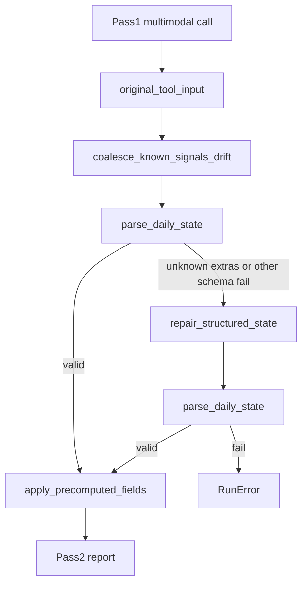

# Pass 1 Schema Discipline — Implementation Plan (approve-with-edits)

## Product decision (one line)

**Reduce Pass 1 schema repair by making signals contract expectations explicit, coalescing only known extra-field drift before parse, and logging every normalization or repair step as auditable structured state.**

## Review decision

**Go for implementation** (spec corrected 2026-06-22). v1 keeps `DailyState` and `SignalSet` shape unchanged, implements only enumerated normalization rules from observed failures, and **fails closed** on unknown extras so novel drift still hits validation and repair.

---

## Problem statement

Pass 1 calls `emit_daily_state` and validates the tool output with Pydantic (`extra="forbid"` on [`DailyState`](spx-analyst/src/schemas.py) and nested `SignalSet`). When validation fails at the **schema** level, `parse_daily_state` returns `daily_state = None` and the engine triggers a **text-only repair API call** ([`analysis_engine.py` L108–114](spx-analyst/src/analysis_engine.py), [`anthropic_client.repair_structured_state`](spx-analyst/src/anthropic_client.py)).

This is a **design flaw**, not random model noise: the framework asks for richer VIX interpretation, but the schema offers one `vix_regime` string, so the model invents sibling fields (`vix_regime_detail`, `vix`, `put_call_zone`, `*_note`).

Repair is **not** triggered by softer issues (e.g. missing matrix rows as warnings). Only hard Pydantic failures invoke repair.

**Architectural principle (unchanged):** deterministic validation and enforcement remain authoritative; LLM repair stays a fallback, not part of the happy path.



---

## Evidence

### Observed failures (first-pass tool output in `output/**/response_raw.json`)

| Run | First pass valid? | Extra `signals` key(s) |
|-----|-----------------|------------------------|
| 2026-06-01 (backfill) | OK | — |
| 2026-06-02 (backfill) | FAIL | `put_call_zone` |
| 2026-06-04, 05 (backfill) | FAIL | `vix` |
| 2026-06-08 (backfill) | FAIL | `vix_regime_detail` |
| **2026-06-10, 12 (live chart runs)** | **FAIL** | **`vix_regime_detail`** |
| ab-test/off | FAIL | `middle_band_regime_note` |
| ab-test/on-fixed | FAIL | `vix_regime_detail`, `pct_vs_200dma_note` |
| ab-test/on | OK | — (1/4 arms) |

**Recurrence:** ~83% backfill dates, **100%** full chart runs (6/10, 6/12), ~75% A/B arms.

### Example (6/12 first pass — invalid)

```json
"vix_regime": "Standard (15-20)",
"vix_regime_detail": "VIX 17.68, back below 20 and below its 50-day MA"
```

Error: `signals.vix_regime_detail: Extra inputs are not permitted`

Repair merges into one `vix_regime` string; qualitative read is preserved — only shape is wrong.

### Cost impact (per failed run, `claude-opus-4-8` @ $5/$25 MTok)

- Wasted Pass 1 output (~4,700 tokens): ~$0.12
- Repair call (est. ~4,700 in / ~4,500 out): ~$0.14
- **Total waste ≈ $0.27/run** when repair fires

### Root causes

1. **Schema asymmetry:** `fear_greed` + `fear_greed_zone` is the only allowed score+label pair; VIX has only `vix_regime`.
2. **Prompt gap:** no explicit allowed-key list or extra-key prohibition.
3. **Tool schema:** `additionalProperties: false` but no `Field(description=...)`.
4. **Framework pressure:** VIX section demands zone, level, MA context, capitulation nuance.
5. **Observability gap:** live runs do not surface normalization or repair as structured audit events.

---

## Proposed solution (layered defense)

Goal: **first-pass schema pass rate ≥95%** on chart runs without weakening `extra="forbid"` or changing `DailyState`/`SignalSet` shape in v1.

### Layer 1 — Pass 1 prompt discipline (~50 tokens)

**File:** [`spx-analyst/src/prompts.py`](spx-analyst/src/prompts.py)

Add explicit `signals` contract block to `build_state_prompt` task section:

- Use **only** keys defined in `emit_daily_state.signals`; no `*_detail`, `*_note`, or extra `*_zone` fields.
- `fear_greed` + `fear_greed_zone` is the **only** score+label pair.
- `vix_regime`: one string with zone **and** level/MA context; no `vix_regime_detail` or `signals.vix`.
- `put_call`: numeric ratio only; no `put_call_zone`.

**Test:** [`tests/test_prompt_builder.py`](spx-analyst/tests/test_prompt_builder.py)

### Layer 2 — Pydantic `Field(description=...)` on `SignalSet`

**File:** [`spx-analyst/src/schemas.py`](spx-analyst/src/schemas.py)

Descriptions on critical fields flow into tool schema via [`_state_tool()`](spx-analyst/src/anthropic_client.py) at zero extra prompt cost.

**Test:** schema JSON includes descriptions on `vix_regime`, `fear_greed_zone`, `put_call`.

### Layer 3 — Contract-preserving coalescer (narrow allowlist, fail closed)

**New file:** `spx-analyst/src/state_normalize.py`

**Framing:** This is **not** a general cleanup layer. It is a **contract-preserving coalescer** for a small allowlist of observed `signals` drift patterns. Unknown extras are **never** silently stripped — they remain for validation/repair (**fail closed**).

```python
@dataclass(frozen=True)
class NormalizeAudit:
    merged: list[dict]      # {from_key, to_key, action: "append"|"prepend", value}
    dropped: list[dict]       # {key, reason}
    untouched_unknown: list[str]  # unknown extras left for validation

def coalesce_signals_drift(tool_input: dict) -> tuple[dict, NormalizeAudit]:
    ...
```

**Allowlisted rules (v1 — from observed failures only):**

| Extra key | Action | Audit |
|-----------|--------|-------|
| `signals.vix_regime_detail` | Append to `vix_regime` with `" — "`; delete extra | `merged` |
| `signals.vix` (float) | Append `"VIX {v:.2f}"` to `vix_regime` if level not already present; delete | `merged` |
| `signals.{field}_note` | If `{field}` exists and is `str`, append with `" — "`; else drop | `merged` or `dropped` |
| `signals.put_call_zone` | Drop (no target field) | `dropped` with reason |
| **Any other unknown `signals` key** | **Leave untouched** | `untouched_unknown` → parse fails → repair |

**Wire before first `parse_daily_state` in:**

- [`analysis_engine.py`](spx-analyst/src/analysis_engine.py)
- [`migrate_perplexity.py`](spx-analyst/src/migrate_perplexity.py)

If coalescer + parse succeeds, **skip repair**.

### Layer 4 — Observability (first-class audit trail)

**`run_log.json` — operational metric block:**

```json
"pass1_schema_status": {
  "original_valid": false,
  "normalized": true,
  "repair_triggered": false,
  "final_valid": true,
  "normalize_audit": {
    "merged": [{"from_key": "signals.vix_regime_detail", "to_key": "signals.vix_regime", "action": "append"}],
    "dropped": [],
    "untouched_unknown": []
  },
  "validation_errors_original": ["signals.vix_regime_detail: Extra inputs are not permitted"],
  "validation_errors_after_normalize": [],
  "repair_usage": null
}
```

When repair fires, set `repair_triggered: true` and populate `repair_usage` from API response.

**`response_raw.json` — three traceable payloads:**

| Key | When present |
|-----|--------------|
| `state_pass_original` | Always (raw first-pass tool input) |
| `state_pass_normalized` | Only when coalescer changed payload |
| `repair_pass` | Only when repair API call ran |

Existing `state_pass` may alias `state_pass_original` for backward compat, or be deprecated in favor of explicit names — document in PR-6.

**Warnings:** human-readable summary when normalize or repair runs (align backfill `"state required one repair pass"` wording).

**Test:** [`tests/test_engine.py`](spx-analyst/tests/test_engine.py) — mock paths for (a) original valid, (b) normalize saves, (c) repair fallback.

---

## Acceptance criteria (strengthened)

### Schema / contract

- [ ] `DailyState` and `SignalSet` shape **unchanged** in v1
- [ ] `extra="forbid"` retained everywhere
- [ ] Unknown `signals` extras are **not** auto-stripped

### Historical regression (shape + semantics)

For each fixture from observed failures (6/02, 6/04, 6/08, 6/10, 6/12, ab-test/off):

1. [ ] `coalesce_signals_drift` → `parse_daily_state` passes **without repair**
2. [ ] **Material equivalence:** normalized `signals` fields match the **repaired** state's corresponding fields for all coalesced keys (compare against saved final `*-state.json` from the same run where repair occurred). Goal: preserve intended qualitative read, not just pass parse.

Example equivalence check for `vix_regime_detail` cases:

```python
assert normalized["signals"]["vix_regime"] == repaired_state.signals.vix_regime
```

### Live gate

Re-run 2026-06-10 and 2026-06-12. Require:

- [ ] `pass1_schema_status.repair_triggered == false`
- [ ] `pass1_schema_status.final_valid == true`
- [ ] **Prefer** `original_valid == true` (first-pass compliance improved by Layers 1–2)
- [ ] If `original_valid == false`, **allow only when** `normalized == true` **and** `normalize_audit` contains **only allowlisted** merged/dropped entries (no `untouched_unknown` that blocked parse)

This keeps the product goal of better first-pass compliance while not failing a run that succeeds through the approved deterministic coalescer.

### Ongoing metric

- [ ] Every successful run writes `pass1_schema_status` with all four booleans (`original_valid`, `normalized`, `repair_triggered`, `final_valid`)
- [ ] Target: `repair_triggered` rate <5% over rolling 10 chart runs post-fix
- [ ] Track `original_valid` rate separately as a prompt/schema effectiveness metric (improvement over time, not a hard gate when coalescer succeeds)

---

## Explicitly deferred (P3 — only if live gate fails)

**Option A:** Add `vix: Optional[float]` to `SignalSet` — defer unless prompt + descriptions + coalescer insufficient.

**Rejected for v1:**

- Official `vix_regime_detail` field
- Blind strip of unknown `signals` keys
- Removing `extra="forbid"`

---

## Files to change

| File | Change |
|------|--------|
| [`src/prompts.py`](spx-analyst/src/prompts.py) | Pass 1 `signals` discipline block |
| [`src/schemas.py`](spx-analyst/src/schemas.py) | `Field(description=...)` on `SignalSet` |
| `src/state_normalize.py` | **New** — allowlisted coalescer + `NormalizeAudit` |
| [`src/analysis_engine.py`](spx-analyst/src/analysis_engine.py) | Coalesce → parse → repair pipeline; `pass1_schema_status`; payload persistence |
| [`src/migrate_perplexity.py`](spx-analyst/src/migrate_perplexity.py) | Same pipeline |
| [`src/anthropic_client.py`](spx-analyst/src/anthropic_client.py) | Repair `usage` on `CallResult` if needed |
| `tests/test_state_normalize.py` | **New** — parse + equivalence tests |
| `tests/fixtures/state_normalize/*.json` | **New** — original invalid + expected normalized/repaired pairs |
| [`tests/test_prompt_builder.py`](spx-analyst/tests/test_prompt_builder.py) | Discipline + schema description assertions |
| [`tests/test_engine.py`](spx-analyst/tests/test_engine.py) | `pass1_schema_status` paths |
| `docs/PR-6-pass1-schema-discipline.md` | **New** — implementation record |

---

## Risk and mitigations

| Risk | Mitigation |
|------|------------|
| Normalizer silently rewrites semantics | Structured `NormalizeAudit`; equivalence tests vs repaired state |
| Normalizer becomes general cleanup | Allowlist only; `untouched_unknown` fails closed |
| Reviewers cannot trace what happened | Three payloads in `response_raw` + `pass1_schema_status` |
| Over-fitting to `vix_regime_detail` | Rules cover all 5 observed extra-key families |

---

## Implementation order

1. `state_normalize.py` + fixtures + equivalence tests (TDD against historical payloads)
2. Prompt discipline + schema descriptions
3. Wire pipeline + `pass1_schema_status` + `response_raw` payloads
4. Engine/migrate tests
5. PR-6 doc
6. Live gate (6/10, 6/12)
