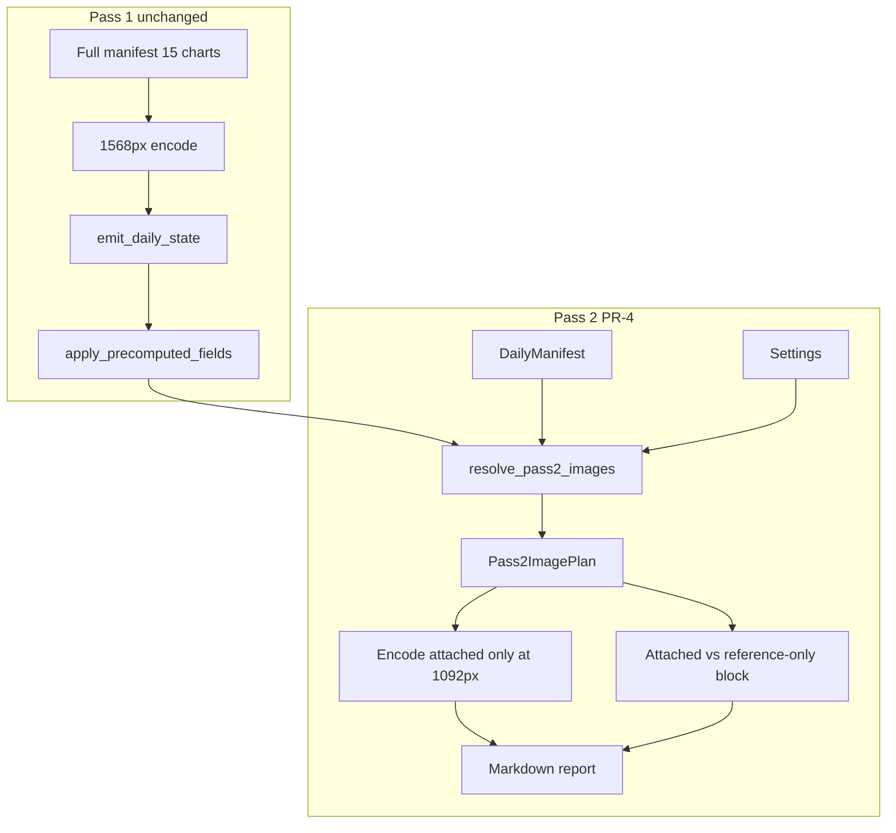

# PR-4: Pass 2 Dynamic Image Selection and Downscaling

**Builds on:** [PR-1](spx-analyst/docs/PR-1-spx-daily-framework-migration.md) · [PR-2](spx-analyst/docs/PR-2-spx-two-pass-prompt-overhaul.md) · [PR-3](spx-analyst/docs/PR-3-memory-rollup-overhaul.md)

> Renumbering: image optimization was originally PR-3; [PR-3-memory-rollup-overhaul.md](spx-analyst/docs/PR-3-memory-rollup-overhaul.md) shipped first. This work is **PR-4**.

**Plan status:** Implemented. Live A/B on 2026-06-10 complete (2026-06-21).  
**Implementation record:** [spx-analyst/docs/PR-4-pass2-image-optimization.md](spx-analyst/docs/PR-4-pass2-image-optimization.md)  
**A/B results:** [spx-analyst/output/ab-test/RESULTS.md](spx-analyst/output/ab-test/RESULTS.md)

---

## Goal

Reduce Pass 2 multimodal input cost by sending **fewer charts** at **slightly lower resolution**, without losing signal or nuance on charts that matter. Pass 1 behavior is **frozen** — full manifest, full-fidelity images, existing prompt unchanged.

Every Pass 2 attachment decision must be **explainable after the run** via `Pass2ImagePlan.selection_reason` and observability fields.

---

## Architecture guardrail (authority boundaries)

Pass 2 must not indirectly re-read omitted charts. Reject any implementation that:

- Sends full manifest images while only *labeling* some as reference-only (images still visible to the model).
- Encodes omitted charts at zero opacity, hidden blocks, or duplicate low-res copies outside the attached set.
- Prompts Pass 2 to "re-examine all charts" without distinguishing attached vs reference-only authority.

**Correct model:**

| Source | Pass 2 authority |
|--------|------------------|
| **Attached images** | Inspectable evidence — descriptive detail and conflict reconciliation for those files only |
| **Reference-only manifest entries** | Filename + label visible; **not** visually inspectable — cite workflow relevance only from validated state / conflict checklist text |
| **Validated daily state** | Immutable numeric and qualitative truth for the report — when attached-image impressions, prompt wording, and validated daily state differ, **validated daily state is authoritative** |
| **Prior posture snapshot (PR-3)** | Continuity only — not today's chart evidence |

Pass 1 is the sole pass that reads the full chart pack at full fidelity.

---

## 1) Pass separation

| Pass | Charts | Resolution | Prompt |
|------|--------|------------|--------|
| **Pass 1** | Full manifest (all `manifest.ordered_charts()`) | `SPX_IMAGE_MAX_DIMENSION` (1568) | **Unchanged** — full `_manifest_block`, existing task, optional posture snapshot |
| **Pass 2** | `Pass2ImagePlan.attached` only | `SPX_PASS2_IMAGE_MAX_DIMENSION` (1092) when optimization on | Attached/reference manifest block + existing PR-2 task + optional posture snapshot |

Selection runs **after** `apply_precomputed_fields()` — input is post-enforcement `DailyState`, not raw Pass 1 tool output.

When `SPX_PASS2_IMAGE_OPTIMIZATION=false`, see **flag-off semantics** at the end of §2.

---

## 2) Selector module

**New file:** [`src/pass2_images.py`](spx-analyst/src/pass2_images.py)

**Entry point:**

```python
def resolve_pass2_images(
    run_dir: Path,
    manifest: DailyManifest,
    daily_state: DailyState,
    settings: Settings,
) -> Pass2ImagePlan: ...
```

**Properties:**

- Pure Python, deterministic, no LLM involvement.
- Same inputs → same outputs (stable for tests and audit).

**`Pass2ImagePlan` dataclass:**

| Field | Type | Purpose |
|-------|------|---------|
| `attached` | `list[Path]` | De-duplicated manifest-ordered set of chart files actually encoded and sent to Pass 2 API |
| `reference_only` | `list[ChartEntry]` | Manifest entries not attached, emitted in manifest order |
| `selection_reason` | `dict[str, list[str]]` | Per **attached** filename → **all** reasons that selected it (e.g. `["conflict_ref", "matrix_layer:Credit Condition"]`). A chart may accumulate multiple reasons in one run; preserve every reason for auditability — do not collapse to a single winner. |
| `unresolved_chart_refs` | `list[UnresolvedChartRef]` | Structured warnings (see §3) |

**Manifest-order contract:**

- `attached` is a **de-duplicated set** ordered by manifest `order` (each filename appears once even if selected by both conflict protection and matrix expansion).
- `reference_only` lists every manifest entry **not** in `attached`, also in manifest `order`.
- Prompt block and API image sequence follow this same manifest order.

**`UnresolvedChartRef` dataclass (or equivalent):**

| Field | Purpose |
|-------|---------|
| `original_ref` | Raw string from `conflicting_evidence[].chart_refs` |
| `outcome` | e.g. `no_manifest_match` |
| `message` | Human-readable normalization failure |

When a chart is first added via conflict protection, append `"conflict_ref"` to that file's `selection_reason` list (do not replace later matrix reasons).

### Flag-off semantics (`SPX_PASS2_IMAGE_OPTIMIZATION=false`)

When optimization is disabled, `resolve_pass2_images()` returns:

| Field | Value |
|-------|-------|
| `attached` | Full manifest paths (`files.chart_paths(run_dir, manifest)`) |
| `reference_only` | `[]` (empty) |
| `pass2_charts_omitted` (observability) | `[]` (empty — nothing omitted) |
| `selection_reason` | Every attached filename → `["optimization_disabled"]` |

Pass 2 prompt uses the existing full `_manifest_block(manifest)` (not attached/reference split). Pass 2 encoding uses `SPX_IMAGE_MAX_DIMENSION` (same as Pass 1).

**Backward compatibility:** `run_log.chart_count` == `pass1_chart_count` == `len(full_manifest_paths)` in both flag-on and flag-off modes.

---

## 3) Protected conflict refs

**Rule:** Every filename in `daily_state.conflicting_evidence[].chart_refs` **must** appear in `attached`.

**Normalization:**

- Match by case-insensitive basename against `manifest.charts[].file`.
- Accept refs that include path segments (use basename only).

**Pruning:** Protected charts are **never** removed by redundancy pruning (Step 3).

**Unresolved refs:**

- Do **not** fail the run.
- Append to `Pass2ImagePlan.unresolved_chart_refs`.
- Emit structured warning in `run_log.warnings` and include in observability payload.
- Pass 2 prompt conflict checklist still lists the ref text from state; model reconciles from checklist text, not from a missing image.

---

## 4) Matrix-driven expansion

After protected set is built, add charts from **qualitative** decision-matrix rows only.

**Qualitative rows** = the 11 rows **not** in `PRECOMPUTE_OWNED_MATRIX_ROWS` ([`prompts.py`](spx-analyst/src/prompts.py)).

**Product boundary — `PRECOMPUTE_OWNED_MATRIX_ROWS` dependency:**

The selector's qualitative-row scope is defined **only** by exclusion from `PRECOMPUTE_OWNED_MATRIX_ROWS`. That constant is the product boundary between engine-owned numeric matrix rows and Pass-1/Pass-2 qualitative rows. If row names or ownership change in `prompts.py` or `state_enforcement.py` without updating the selector and its tests, matrix expansion scope will drift silently.

**Required:** Add a test (e.g. `test_qualitative_row_scope_matches_precompute_owned_boundary`) that asserts the selector's qualitative row set equals `DECISION_MATRIX_ROWS \ PRECOMPUTE_OWNED_MATRIX_ROWS` by exact label match. Test must **fail loudly** on any rename, add, or ownership transfer — not allow silent behavior changes.

**Rows that never auto-add charts** (unless explicitly in conflict `chart_refs`):

- Leverage Risk State
- Overall Signal Balance
- Recommended Action

**Mapping (deterministic):**

| Matrix row | Chart selection rule |
|------------|---------------------|
| Trend Regime | Add one `technical` chart: prefer `3month` or `6month` if signal contains `maturing`, `diverg`, or `flatten`; else longest `technical` timeframe not yet attached and not redundant |
| Intraday Close Position | `timeframe=intraday` |
| RSI / MFI State | `timeframe=1month`, `category=technical` |
| 20-Day SMA Status | `timeframe=1month`, `category=technical` (same file as RSI row — attach once) |
| Bollinger Band State | `timeframe=1month`, `category=technical` (same file — attach once) |
| Credit Condition | `category=credit` |
| Breadth Condition | `category=breadth`; if two breadth charts, prefer McClellan (`*mcclellan*` in filename or label) |
| VIX Regime | `category=volatility` |

**Non-neutral qualitative row heuristic (deterministic selector behavior):**

Evaluation uses **only** the documented token lists below — no fuzzy matching, substring heuristics beyond these lists, or LLM judgment.

A row qualifies for matrix expansion when its `signal` field (lowercased), after stripping whitespace:

1. Is non-empty, **and**
2. Does **not** consist solely of tokens from the neutral-only list, **and**
3. Contains at least one token from the qualifying list (substring match on the lowercased signal is allowed **only** for qualifying-list entries).

**Neutral-only token set (v1):** `neutral`, `within`, `monitor`, `insufficient`, `stable`, `unknown`, `none`.

**Qualifying tokens (any one triggers expansion):** `trim`, `bear`, `bull`, `caution`, `diverg`, `widen`, `tighten`, `fear`, `greed`, `extreme`, `elevated`, `oversold`, `overbought`, `distribution`, `regime shift`, `defensive`, `attractive`, `weak`, `strong`, `deteriorat`, `improv`.

**Ambiguity rule (after token-list evaluation only):** If a signal matches **both** a neutral-only token and a qualifying token, **prefer expansion** in v1 — conservative against signal loss. This rule applies only after the two lists above have been evaluated; it does not introduce additional matching logic.

When a chart is added via matrix expansion, append `matrix_layer:{row_label}` to that file's `selection_reason` list (do not replace an existing `conflict_ref` entry).

Document this heuristic in `pass2_images.py` module docstring as the product contract.

---

## 5) Conservative redundancy pruning

Apply **only** to charts added in matrix expansion (Step 2). **Never** prune protected conflict charts.

| Candidate | Prune when | v1 default |
|-----------|------------|------------|
| `5day` technical | `1month` technical already attached | **Prune** |
| `3year` technical | `6month` or `1year` technical attached | **Prune** |
| `1year` technical | both `3month` and `6month` attached | **Prune** |
| `52wk` breadth | McClellan breadth attached | **Prune** |
| F&G momentum (`09_*`) | F&G overview (`08_*`) attached | **Prune** |
| Safe haven (`14_*`) | F&G overview attached and not conflict-protected | **Keep** (ambiguous — prefer keep in v1) |

**Ambiguity rule:** If a prune rule's preconditions are not clearly met, **keep the chart**.

**Final ordering:** Emit `attached` as a de-duplicated set in manifest `order`; emit `reference_only` as remaining manifest entries, also in manifest `order`.

**No fixed Pass 2 core bundle in v1** — no always-on intraday/1month charts beyond conflict + matrix rules.

---

## 6) Zero-chart Pass 2 support

**Valid outcome:** `attached == []` when:

- No conflict `chart_refs` resolve to manifest files, **and**
- No qualitative matrix row qualifies as non-neutral, **and**
- No matrix-driven charts added.

Pass 2 must **complete successfully** with zero images:

- Prompt explicitly states **no chart images are attached**.
- Report written from validated state + conflict checklist + analysis_context.
- `run_log.pass2_chart_count == 0` is normal, not an error.

---

## 7) Downscaling

**Settings** ([`config.py`](spx-analyst/src/config.py)):

```python
pass2_image_optimization_enabled: bool = Field(default=True, alias="SPX_PASS2_IMAGE_OPTIMIZATION")
pass2_image_max_dimension: int = Field(default=1092, alias="SPX_PASS2_IMAGE_MAX_DIMENSION")
```

**Wiring** ([`anthropic_client.py`](spx-analyst/src/anthropic_client.py)):

- `run_structured_state` → `settings.image_max_dimension` (1568) via existing `_user_content` / `_encode_image`.
- `run_markdown_report` → `settings.pass2_image_max_dimension` when optimization enabled; else `image_max_dimension`.
- **No new image stack** — reuse `_encode_image(path, max_dim)` only.

Documented operator floor: do not set `SPX_PASS2_IMAGE_MAX_DIMENSION` below **784** without accepting fidelity risk.

---

## 8) Prompt contract

**Pass 1:** No changes to `build_state_prompt` beyond what already exists (PR-2/PR-3).

**Pass 2:** Replace `_manifest_block(manifest)` with `_pass2_manifest_block(attached_entries, reference_only_entries, manifest)`.

**Block content:**

```
## Pass 2 chart pack
Attached images (N) — inspectable evidence:
  1. {label} ({file})
  ...

Reference only (not attached) — filename visible, not visually inspectable:
  - {label} ({file})
  ...

Authority: Attached images may be used for descriptive detail and conflict reconciliation.
Reference-only charts may be cited by filename and explained using validated state only.
Do NOT infer fresh numeric values, new divergences, or pixel-level observations from reference-only charts.
```

**Task section additions** (append to existing PR-2 task):

- Attached images: reconciliation and descriptive detail for listed conflicts only where cited.
- Reference-only: workflow citations from validated state / conflict checklist text only.
- Do not contradict validated state (PR-2 exposition lock).
- Prior posture snapshot: continuity only (PR-3 — do not edit `_optional_memory_block`).
- When attached-image impressions, prompt wording, and validated daily state differ, validated daily state is authoritative.

**Product record ([`docs/PR-4-pass2-image-optimization.md`](spx-analyst/docs/PR-4-pass2-image-optimization.md)) must include:**

> When attached-image impressions, prompt wording, and validated daily state differ, validated daily state is authoritative.

**Pass 2 body order (fixed):**

1. Prior posture snapshot — when `SPX_INCLUDE_MEMORY=true` (`_optional_memory_block`; PR-3 unchanged)
2. Precomputed analysis context
3. External context
4. Attached / reference-only chart block (PR-4)
5. Validated daily state (immutable JSON)
6. Conflict checklist
7. Task section

**Rejected patterns:** Do not include full manifest wording like "images attached in this order" for all 15 charts when only N are attached.

---

## 9) Observability and auditability

**Backward compatibility:**

- `run_log.chart_count` = **Pass 1 chart count** (same as today: `len(full_manifest_paths)`).

**New fields — `run_log.json`:**

- `pass1_chart_count`
- `pass2_chart_count`
- `pass2_image_optimization_enabled`
- `pass2_image_max_dimension`
- `pass2_charts_attached` (filenames, manifest order)
- `pass2_charts_omitted` (filenames; `[]` when flag-off)
- `pass2_selection_reasons` — `dict[str, list[str]]`, all reasons per attached file (e.g. `{"15_junk_bond_spread.png": ["conflict_ref", "matrix_layer:Credit Condition"]}`)
- `pass2_unresolved_chart_refs` (list of structured objects: `original_ref`, `outcome`, `message`)

**New fields — `request_snapshot.json` (`report_pass`):**

- Same pass2_* fields as above (via extended `_snapshot()`)
- `pass2_image_max_dimension_used` — actual encode dimension for the report pass

**Audit invariant (implemented):** `pass2_selection_reasons` keys match attached filenames exactly; pruned matrix candidates are excluded. Duplicate unresolved refs are deduped across divergences.

PR-3 fields (`memory_included`, `memory_load`) unchanged.

---

## 10) Required tests

**New file:** [`tests/test_pass2_images.py`](spx-analyst/tests/test_pass2_images.py)

**Unit tests (required):**

| Test | Asserts |
|------|---------|
| Protected refs always attached | All resolved conflict refs in `attached`; `selection_reason` includes `conflict_ref` |
| Multi-reason audit | Chart selected by conflict + matrix → `selection_reason[file]` lists both e.g. `["conflict_ref", "matrix_layer:Credit Condition"]` |
| Qualitative row boundary | `test_qualitative_row_scope_matches_precompute_owned_boundary` fails on `PRECOMPUTE_OWNED_MATRIX_ROWS` / `DECISION_MATRIX_ROWS` drift |
| Pruning never removes protected | Protected ref survives even when redundancy rule would drop same category |
| Matrix expansion — Credit | Non-neutral Credit Condition row → credit chart attached |
| Matrix expansion — Breadth | Non-neutral Breadth row → breadth chart (McClellan preferred) |
| Matrix expansion — VIX | Non-neutral VIX row → volatility chart |
| Redundancy prune | `5day` dropped when `1month` attached via matrix; not when only protected refs |
| Zero-chart day | Neutral matrix + no conflicts → `attached=[]`, prompt explicit |
| 2026-06-10 fixture | Reduced subset (~7–9 charts), all conflict refs present |
| Downscale dimensions | Pass 1 path uses 1568; Pass 2 uses 1092 (mock or spy on `_encode_image`) |
| Feature flag off | `attached` = full manifest; `reference_only=[]`; `pass2_charts_omitted=[]`; every file `selection_reason=["optimization_disabled"]`; full `_manifest_block`; `chart_count==pass1_chart_count` |
| Unresolved refs | Non-matching ref → structured warning, run continues |

**Golden-style selector fixtures (product contract):**

Store as JSON or inline pytest cases in `tests/fixtures/pass2_images/`:

| Fixture | Scenario | Expected shape |
|---------|----------|----------------|
| `conflict_heavy.json` | Multiple divergences with overlapping chart_refs | All refs attached; matrix adds minimal; prune does not drop protected |
| `neutral_zero_chart.json` | No conflicts, all-neutral qualitative matrix | `attached=[]`, full manifest in `reference_only` |
| `matrix_add.json` | No conflicts, non-neutral Credit + VIX rows | Credit + volatility attached; no fixed core beyond matrix |

**Integration tests:**

- [`tests/test_prompt_builder.py`](spx-analyst/tests/test_prompt_builder.py) — attached/reference block text; reference-only authority wording; posture snapshot coexistence
- [`tests/test_engine.py`](spx-analyst/tests/test_engine.py) — FakeClient receives subset on report pass; `run_log` pass2 fields; `chart_count == pass1_chart_count`
- [`tests/test_memory_rollup.py`](spx-analyst/tests/test_memory_rollup.py) — **must stay green** (PR-3 coexistence)

**Gate:** Full `pytest` green.

---

## 11) Acceptance criteria

**Pass behavior**

- [x] Pass 1 is **identical** to pre-PR-4 behavior (15 charts @ 1568, prompt unchanged).
- [x] Pass 2 never omits a resolved conflict `chart_ref`.
- [x] Pass 2 runs successfully with **zero** attached charts.
- [x] Mixed-signal days attach **fewer than 15** charts when optimization enabled (live: 11/15).
- [x] 2026-06-10 baseline `validate_report` passes (`output/2026-06-10/`); live A/B report gate blocked by Pass 2 model stub on `claude-opus-4-8` (both arms — see `output/ab-test/RESULTS.md`).

**Architecture**

- [x] Selection occurs **post-enforcement only**.
- [x] No `DailyState` schema changes.
- [x] No fixed Pass 2 core chart bundle in v1.
- [x] Every attached file has a non-empty entry in `selection_reason` (`dict[str, list[str]]`); multi-reason files list all reasons; keys match attached files only (pruned charts excluded).
- [x] `attached` and `reference_only` are manifest-ordered; `attached` is de-duplicated.
- [x] Reference-only charts are not sent as image bytes to the API.

**PR-3 unchanged**

- [x] Posture snapshot header and contract unchanged.
- [x] `rebuild_rolling_summary()` on every successful run unchanged.
- [x] `memory_load` in run_log when memory enabled unchanged.

**Efficiency** (live 2026-06-10 A/B — documented in PR-4 doc + `output/ab-test/RESULTS.md`)

- [x] `pass2_charts_attached` length < 15 on mixed day (11).
- [x] Pass 2 input tokens −45%; total run input −25%.

**Test gate:** `pytest` — 125 passed (includes `test_pass2_images`, engine pass2 paths, `test_memory_rollup` coexistence).

---

## 12) Out of scope

Explicitly **not** in PR-4:

- Plotly or chart rendering changes
- Scraper / chart creation automation
- `DailyState` schema changes
- Validation logic changes (`validation.py`)
- Pass 1 prompt redesign
- Memory rollup logic changes (`memory.py`)
- Speculative selector heuristics beyond:
  - protected conflict refs
  - matrix-driven adds (documented mapping + non-neutral heuristic)
  - conservative redundancy prune (documented rules)

Also out of scope: `migrate_perplexity.py` memory header alignment (legacy "Recent historical memory" — separate cleanup).

---

## Flow diagram



---

## PR-3 interaction (unchanged from prior plan review)

| PR-3 artifact | PR-4 touch |
|---------------|------------|
| `_optional_memory_block` | **Do not edit** |
| `memory_load` in run_log | Coexist with pass2_* fields |
| Rollup `conflicts:` lines | Not selector input — today's refs only from `conflicting_evidence` |
| Zero-chart Pass 2 | Synergy: posture snapshot + validated state backstop |

---

## Files to change

| File | Change |
|------|--------|
| [`src/pass2_images.py`](spx-analyst/src/pass2_images.py) | **New** — selector module + docstring contract |
| [`src/config.py`](spx-analyst/src/config.py) | Pass 2 image settings |
| [`src/analysis_engine.py`](spx-analyst/src/analysis_engine.py) | Split paths post-enforcement; observability |
| [`src/anthropic_client.py`](spx-analyst/src/anthropic_client.py) | Pass 2 max_dim; snapshot fields |
| [`src/prompts.py`](spx-analyst/src/prompts.py) | `_pass2_manifest_block`; `build_report_prompt` wiring only |
| [`tests/fixtures/pass2_images/*.json`](spx-analyst/tests/fixtures/pass2_images/) | **New** — 3 golden fixtures |
| [`tests/test_pass2_images.py`](spx-analyst/tests/test_pass2_images.py) | **New** — selector tests |
| [`tests/test_prompt_builder.py`](spx-analyst/tests/test_prompt_builder.py) | Prompt authority contract |
| [`tests/test_engine.py`](spx-analyst/tests/test_engine.py) | End-to-end pass2 fields |
| [`docs/PR-4-pass2-image-optimization.md`](spx-analyst/docs/PR-4-pass2-image-optimization.md) | **New** — product record |

---

## Expected token impact (2026-06-10 reference)

| Scenario | Attached | ~Image tokens @ 1092 |
|----------|----------|----------------------|
| Today (15 @ 1568) | 15 | ~22,000 |
| PR-4 mixed day | ~7–9 | ~5,000–6,300 |
| PR-4 neutral zero-chart | 0 | 0 |

---

## Risks and mitigations

| Risk | Mitigation |
|------|------------|
| Pass 2 infers from reference-only charts | Strict prompt authority; images not sent for reference-only |
| Ambiguous prune drops signal | v1: prefer keep; safe-haven prune deferred |
| Zero-chart report too thin | Validated state + conflict checklist + optional posture snapshot |
| Unresolved chart_refs | Structured warnings; reconciliation from checklist text |
| Rollup vs today conflicts confused | Selector uses `conflicting_evidence` only; prompt distinguishes PR-3 snapshot |

---

## Open items (post-implementation)

1. ~~**Live A/B on 2026-06-10**~~ — Done 2026-06-21; see `spx-analyst/output/ab-test/RESULTS.md` and PR-4 doc.
2. ~~**Pass 2 stub responses**~~ — Fixed in [PR-4.1](spx-analyst/docs/PR-4.1-pass2-stub-response-fix.md) (stub detection + tools-free retry).
3. Tune neutral/qualifying token lists after further live runs if matrix expansion is too aggressive or too sparse.

---

## Implementation handoff (do not reopen without conflict)

Implement this plan **as written**. Do not weaken scope unless an implementation detail directly conflicts with documented authority boundaries or acceptance criteria.

**Non-negotiable during implementation:**

- Pass 1 unchanged — full manifest, full fidelity, existing prompt behavior.
- Validated daily state is authoritative when attached-image impressions, prompt wording, and state differ — do not weaken this sentence.
- `selection_reason` stays `dict[str, list[str]]` — preserve all reasons per file; never collapse to one reason.
- Reference-only charts are **not** sent as image bytes — no hidden mechanism that exposes omitted charts to Pass 2.
- Selector contract: de-duplicated manifest-ordered `attached`, manifest-ordered `reference_only`, flag-off semantics exactly as specified.
- Tests enforce product boundaries (`PRECOMPUTE_OWNED_MATRIX_ROWS` drift test, multi-reason audit, golden fixtures, flag-off).

**Scope freeze:** No plotly/scraper/schema/validation/memory-rollup changes. No speculative selector heuristics beyond conflict refs, matrix adds, and documented prune rules.
