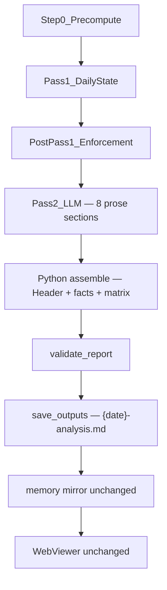

# Pass 2 Investor Report Template — Final Plan

**Status:** Approved for implementation  
**Framework version:** `daily-2026-06`  
**Builds on:** [PR-2: Two-pass prompt overhaul](spx-analyst/docs/PR-2-spx-two-pass-prompt-overhaul.md)  
**Governing references:** [README.md](spx-analyst/README.md), [SPX-Daily-Analysis-Framework.md](spx-analyst/framework/SPX-Daily-Analysis-Framework.md)

---

## Decision summary

| Decision | Resolution |
|----------|------------|
| Pipeline shape | `Step 0 → Pass 1 → enforcement → Pass 2 → assemble → validate → persist` |
| Publish artifact | Existing `{date}-analysis.md` + `{date}-state.json` — same paths, memory mirror, viewer contract |
| Pass 2 role | Exposition-only narrative (unchanged authority); this PR separates factual framing from prose |
| Factual framing | Python-only Header Snapshot, injected numeric blocks, Updated Decision Matrix |
| Evidence and Tensions | Always required every day |
| Raw prose retention | `response_raw.report_pass_prose` — pre-assembly Pass 2 output for audit and future RAG |
| Heading validation | Strict hard-fail on missing, extra, renamed, or out-of-order top-level `##` sections |
| Website / viewer v1 | Fully functional on existing contract; **no viewer changes required** |

---

## Nine visible parts vs eight LLM sections

This distinction governs implementation, tests, and prompts. Do not conflate them.

### What investors see in `{date}-analysis.md` (nine visible parts)

| Part | Label | `##` heading? | Author |
|------|-------|---------------|--------|
| **Header Snapshot** | Factual preamble prepended to the report | No — uses `#` title + bold fact lines only | **Python** |
| **1** | Today's Posture | Yes | **Pass 2 LLM** |
| **2** | Market Regime | Yes | **Pass 2 LLM** |
| **3** | Price and Trend | Yes | **Pass 2 LLM** |
| **4** | Technicals and Sentiment | Yes | **Pass 2 LLM** |
| **5** | Valuation and ERP | Yes — Pass 2 prose + Python facts block injected after heading | **Pass 2 LLM** + **Python** (facts) |
| **6** | Risk and Monte Carlo | Yes — Pass 2 prose + Python facts block injected after heading | **Pass 2 LLM** + **Python** (facts) |
| **7** | Tactical Levels and Next Session Plan | Yes — Pass 2 prose + Python levels block injected after heading | **Pass 2 LLM** + **Python** (levels) |
| **8** | Evidence and Tensions | Yes | **Pass 2 LLM** |
| **9** | Updated Decision Matrix | Yes — must be the final section | **Python** |

**Nine visible parts** = Header Snapshot + parts 1–9 (eight `##` narrative sections from Pass 2, plus one Python-rendered matrix section).

### What Pass 2 LLM writes (eight sections only)

Pass 2 returns markdown containing **exactly eight** `##` sections — `PASS2_PROSE_SECTIONS` (parts 1–8 above). It does **not** write:

- the Header Snapshot (`#` title or factual subtitle lines)
- injected numeric/levels fact blocks (Python inserts these during assembly)
- the Updated Decision Matrix (part 9 — Python only)

**Eight LLM sections. Two Python-owned framing elements (Header Snapshot + Decision Matrix). Three sections receive Python fact injections during assembly (parts 5–7).** Pass 2 already produces narrative today; this PR does not add a new analytical stage — it assigns ownership of factual framing to Python and keeps Pass 2 on explanatory prose.

### What `validate_report()` checks

Validation runs against the **assembled** `{date}-analysis.md` (all nine visible parts present). Pass 2 prose is validated separately only via structural checks on the eight LLM sections before or during assembly; the publish gate is always the final assembled file.

---

## Why this is not Pass 3

The engine already has everything required to publish after Pass 2:

- Precomputed numerics in `analysis_context.json` (Step 0)
- Authoritative posture in enforced `DailyState` (Pass 1 + `state_enforcement.py`)
- Narrative exposition from Pass 2 (LLM, contradiction-gated per PR-2)

This PR tightens Pass 2's output contract, assembles Python-owned factual blocks deterministically, and extends existing validation. It does not add a third LLM call, new artifact lineage, prose-to-JSON extractors, or viewer migration.

---

## Decisions now locked

1. **Evidence and Tensions is mandatory on every run.** On quiet days the section addresses `primary_tension`, confirming evidence, and any listed divergences — or explicitly states none remain unresolved. Investors track tension resolution across sessions in a consistent location.

2. **`response_raw.json` retains raw pre-assembly Pass 2 prose** as `report_pass_prose`. The assembled `{date}-analysis.md` is the publish artifact; raw prose is audit-only and reserved for future RAG/retrieval.

3. **Heading validation is strict.** `validate_report()` hard-fails on any top-level `##` section that is missing, extra, renamed, or out of order relative to `INVESTOR_REPORT_SECTIONS`. No warnings-only fallback for structural drift.

4. **Header Snapshot is Python-only.** Pass 2 must not emit `#` title lines, framework-version headers, close/bias/posture fact lines, or the Decision Matrix.

---

## Final architecture and authority model



### Authority split

| Stage | Owns | Must not |
|-------|------|----------|
| **Step 0** (`precompute.py`) | All precomputed numerics in `analysis_context.json` | — |
| **Pass 1 + enforcement** | `DailyState`: structural bias, matrix rows, divergences, executive fields | Recompute owned numerics |
| **Pass 2 LLM** | Eight narrative `##` sections; chart-backed exposition | Contradict state; write Header Snapshot, fact blocks, or matrix |
| **Python assembler** (`report_assembly.py`) | Header Snapshot, fact/levels blocks (parts 5–7), Decision Matrix (part 9) | Introduce new analytical readings |
| **`validate_report()`** | Structural and consistency gates on assembled report | — |

PR-2 guarantees preserved: exposition-only lock, always-on `_validate_state_consistency`, high-weight divergence-id coverage in Evidence and Tensions.

### Data flow per run

```
Pass 2 LLM → eight prose sections
  → persisted as response_raw.report_pass_prose
  → assemble_investor_report(state, context, prose_md)
  → final {date}-analysis.md (nine visible parts)
  → validate_report(final_md, daily_state=state)
  → save_outputs + memory mirror
```

---

## Final section outline

### Framework mapping (methodology unchanged)

| Visible part | Framework source |
|--------------|------------------|
| Market Regime | Pre-step: Structural Regime Classification |
| Price and Trend | Step 1 |
| Technicals and Sentiment | Step 2 |
| Valuation and ERP | Step 3 |
| Risk and Monte Carlo | Steps 4 + 5 |
| Tactical Levels and Next Session Plan | Step 6 + Step 7 |
| Evidence and Tensions | Evidence Reconciliation (investor-facing rename) |
| Updated Decision Matrix | Framework ending matrix ([SPX-Daily-Analysis-Framework.md](spx-analyst/framework/SPX-Daily-Analysis-Framework.md)) |

### Pass 2 output contract

Pass 2 returns **eight** `##` sections only (`PASS2_PROSE_SECTIONS`), in order, with no `#` preamble and no Decision Matrix. Pre-rendered fact references for parts 5–7 appear in the prompt; the model interprets them but does not duplicate numerics in prose.

### Section budgets (prompt guidance)

| Section | Target |
|---------|--------|
| Today's Posture | 150–250 words; lead with action |
| Market Regime | 200–300 words |
| Price and Trend through Tactical Levels | 150–350 words each |
| Evidence and Tensions | ≥1 block per divergence id when present; ≥100 words when none |

### Tone contract

- Written for market participants, not internal framework review
- No methodology meta-commentary ("Step 2 requires…")
- No regenerated numerics in prose where Python injects a facts block
- Must not contradict validated state (PR-2 `_validate_state_consistency`)

---

## File-by-file implementation handoff

### 1. [`spx-analyst/src/prompts.py`](spx-analyst/src/prompts.py)

**Add constants:**

```python
INVESTOR_REPORT_SECTIONS: list[str] = [
    "Today's Posture",
    "Market Regime",
    "Price and Trend",
    "Technicals and Sentiment",
    "Valuation and ERP",
    "Risk and Monte Carlo",
    "Tactical Levels and Next Session Plan",
    "Evidence and Tensions",
    "Updated Decision Matrix",  # present in assembled report only; not in Pass 2 output
]

PASS2_PROSE_SECTIONS: list[str] = INVESTOR_REPORT_SECTIONS[:-1]  # eight LLM sections

EVIDENCE_AND_TENSIONS_HEADING = "Evidence and Tensions"
```

Remove `EVIDENCE_RECONCILIATION_HEADING` from Pass 2 task text; replace all references with `EVIDENCE_AND_TENSIONS_HEADING`.

**Rewrite `build_report_prompt()` task block:**

- Output exactly `PASS2_PROSE_SECTIONS` — eight `##` headings, nothing else
- No `#` title, no Header Snapshot, no Decision Matrix
- PR-2 exposition-only lock unchanged
- Evidence and Tensions required every run; address divergences by id (PR-2 Q5); on zero-divergence days cover `primary_tension` and confirming evidence
- Investor tone; read-only fact snippets for parts 5–7

**Do not change:** Pass 1 prompt, `_state_tool()`, chart blocks, PR-4 Pass 2 image authority text.

---

### 2. [`spx-analyst/src/report_assembly.py`](spx-analyst/src/report_assembly.py) *(new)*

```python
def assemble_investor_report(
    *,
    date: str,
    daily_state: DailyState,
    analysis_context: AnalysisContext,
    prose_md: str,
) -> str:
    """Compose publish markdown: Header Snapshot + eight prose sections + fact injections + matrix."""
```

| Function | Responsibility |
|----------|----------------|
| `render_header_snapshot(...)` | Part: Header Snapshot — `#` title + factual subtitle from state/context |
| `render_valuation_facts_block(...)` | Injected under part 5 heading |
| `render_monte_carlo_facts_block(...)` | Injected under part 6 heading |
| `render_tactical_levels_block(...)` | Injected under part 7 heading |
| `render_decision_matrix_table(...)` | Part 9 — GFM table from `daily_state.decision_matrix.rows` |
| `extract_prose_sections(prose_md)` | Parse eight Pass 2 sections; strip stray preamble/matrix if model drifted |
| `assemble_investor_report(...)` | Concatenate nine visible parts in canonical order |

**Rules:** Matrix always from state. Assembler strips forbidden Pass 2 output defensively; validator still hard-fails structural drift.

---

### 3. [`spx-analyst/src/validation.py`](spx-analyst/src/validation.py)

Replace workflow-step heading checks with strict validation against `INVESTOR_REPORT_SECTIONS` on the **assembled** report.

| Code | Severity | Rule |
|------|----------|------|
| `missing_section` | error | Any of nine `##` sections absent |
| `extra_section` | error | Any `##` heading not in allowlist |
| `section_order` | error | Headings out of canonical order |
| `missing_evidence_and_tensions` | error | Part 8 absent — every run |
| `missing_primary_tension` | error | Part 8 does not address `primary_tension` |
| `missing_high_weight_conflict` | error | High-weight divergence id not addressed |
| `matrix_not_last` | error | Content after Updated Decision Matrix |
| `matrix_state_mismatch` | error | Rendered table ≠ `daily_state.decision_matrix` |
| `contradicting_structural_bias` | error | PR-2 gate — unchanged |
| `missing_structural_bias` | error | PR-2 gate — unchanged |
| `recommended_action_not_echoed` | warning | Unchanged |
| `too_long` | warning | Existing char limit |

Remove: `WORKFLOW_STEPS` iteration, `missing_pre_step`, mixed-day-only `missing_evidence_reconciliation`.

---

### 4. [`spx-analyst/src/analysis_engine.py`](spx-analyst/src/analysis_engine.py)

```python
report_prose = report_call.text or ""
report_md = assemble_investor_report(
    date=date,
    daily_state=daily_state,
    analysis_context=analysis_context,
    prose_md=report_prose,
)
report_validation = validate_report(
    report_md, date, settings.max_report_chars, daily_state=daily_state
)
```

**Persist in `response_raw.json`:**

```python
payload["report_pass_prose"] = report_prose
payload["report_pass"] = report_call.raw_response
```

**Add to `run_log.json`:**

```json
"report_assembly": {
  "matrix_source": "daily_state",
  "prose_sections": 8,
  "prose_chars": 12345,
  "assembled_chars": 15678
}
```

**Do not change:** Step 0, Pass 1, enforcement, Pass 2 chart selection, failure semantics, `mirror_to_memory` rules.

---

### 5. [`spx-analyst/src/files.py`](spx-analyst/src/files.py)

No signature changes. `save_outputs()` writes assembled markdown to `{date}-analysis.md`.

---

### 6. Tests

| File | Coverage |
|------|----------|
| `tests/test_report_assembly.py` *(new)* | Header Snapshot render; fact blocks; matrix render; full nine-part assembly golden snapshot |
| `tests/test_validation.py` | Strict section order; extra section fail; always-on Evidence and Tensions; matrix-state echo |
| `tests/test_engine.py` | `report_pass_prose` in `response_raw.json`; assembled report has nine visible parts |
| `tests/test_prompts.py` | Prompt targets eight LLM sections; excludes matrix and preamble instructions |

Test fixtures: Pass 2 prose samples contain exactly eight `##` sections; assembled fixtures contain nine visible parts.

---

### 7. Documentation

| File | Action |
|------|--------|
| [`spx-analyst/README.md`](spx-analyst/README.md) | Document assembly step; nine visible parts vs eight LLM sections |
| [`spx-analyst/docs/PR-7-pass2-investor-report-template.md`](spx-analyst/docs/PR-7-pass2-investor-report-template.md) *(new)* | Implementation record |

**Do not change in v1:** `spx-analyst/web/*`, `spx-analyst/src/web/*`, `SPX-Daily-Analysis-Framework.md`.

---

## Acceptance criteria

### Pipeline

- [ ] Successful run writes `{date}-analysis.md` containing all **nine visible parts** (Header Snapshot + eight `##` Pass 2 sections + Python Decision Matrix as part 9)
- [ ] Pass 2 LLM output (`report_pass_prose`) contains exactly **eight** `##` sections — no preamble, no matrix
- [ ] Decision Matrix in final markdown matches `daily_state.decision_matrix` exactly
- [ ] No third Anthropic API call added

### Validation

- [ ] Missing, extra, renamed, or out-of-order `##` section → `validate_report` error; run completes with FAIL (same semantics as today)
- [ ] Evidence and Tensions present on every run including aligned-buy and aligned-trim days
- [ ] `_validate_state_consistency` fires on structural bias mismatch
- [ ] High-weight divergence ids required when listed in state

### Website compatibility (hard rule)

- [ ] **The website remains fully functional on the existing `{date}-analysis.md` + `{date}-state.json` contract. No viewer, API, or frontend changes are required or permitted in v1.**
- [ ] Artifact paths unchanged: `output/{date}/{date}-analysis.md`, `memory/daily_reports/{date}-analysis.md`
- [ ] Existing web viewer loads and renders a successful run without code changes
- [ ] Failed Pass 1 runs still skip memory mirror
- [ ] `cli validate --date` validates the assembled report

### Quality

- [ ] All tests updated and passing (`pytest`)
- [ ] README and PR-7 doc describe the assembly flow and the nine-vs-eight distinction

---

## Risks and mitigations

| Risk | Mitigation |
|------|------------|
| Strict validation increases Pass 2 FAIL rate | Prompt lists exact eight headings; iterate on prompt before loosening validation |
| Model writes preamble or matrix despite instructions | Assembler strips; validator hard-fails; raw prose in `report_pass_prose` for debugging |
| Python preamble breaks viewer `parseHeader()` | Include parseable `Close:` line in Header Snapshot; viewer hero already derives from state JSON |
| Evidence and Tensions thin on quiet days | Prompt minimum: `primary_tension` + confirming evidence |
| Validation tests break on old workflow headings | Update fixtures to investor template in same PR |
| Historical reports retain old heading format | No backfill; viewer `splitSections` handles both |

---

## Out of scope

- Pass 3 or any third LLM pass
- New artifacts (`investor-report.md`, `report-handoff.json`, structured publish JSON)
- Viewer, API, or frontend changes
- Memory mirror path or policy changes
- Pass 1 `DailyState` schema changes
- Step 0 / enforcement changes
- Framework methodology changes
- Historical backfill
- Chat / RAG pipeline implementation (only `report_pass_prose` retention)
- Pass 2 chart selection changes (PR-4)

---

## Unchanged by this PR

- Step 0 precompute and numeric ownership ([PR-1](spx-analyst/docs/PR-1-spx-daily-framework-migration.md))
- Pass 1 schema, normalization, repair ([PR-6](spx-analyst/docs/PR-6-pass1-schema-discipline.md))
- Post-Pass-1 enforcement (`state_enforcement.py`)
- Pass 2 exposition-only authority model ([PR-2](spx-analyst/docs/PR-2-spx-two-pass-prompt-overhaul.md))
- Pass 2 chart selection ([PR-4](spx-analyst/docs/PR-4-pass2-image-optimization.md))
- `{date}-state.json` contract
- Failed-run memory isolation
- Rolling summary rebuild semantics
