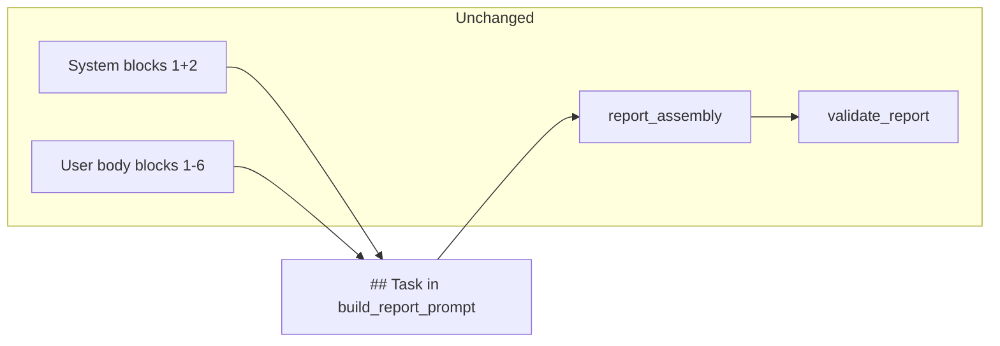

# Pass 2 Task Voice — Minimal-Plus Refactor

## Goal

Improve investor readability by tightening **Pass 2 user Task text only** in [`spx-analyst/src/prompts.py`](spx-analyst/src/prompts.py). Preserve the full PR-7 contract: exposition lock, eight prose sections, Do NOT emit list, section budgets, `mixed_note`, and `pass2_task_extra`.

**Out of scope:** system role, `HARD_CONSTRAINTS`, framework injection, `report_assembly.py`, `validation.py`, Pass 1 prompts, `migrate_perplexity.py` (separate legacy prompt builder), live reruns/backfill, exploration artifact regeneration.



---

## Sharpening decisions (locked)

| Question | Decision | Rationale |
|----------|----------|-----------|
| Merge gate | **Unit tests only** | Prompt change is contract-level; live API rerun is costly, non-deterministic, and belongs in optional post-merge operator verification |
| Checklist JSON still has `framework_rule` + `chart_refs` | **Add clarifier line in Task** | Bans apply to published prose, not to reading checklist inputs — avoids model confusion when JSON still contains internal labels |
| Post-generation validation for banned patterns | **Prompt-only** | `validate_report()` stays structural; prose lint is brittle; `rewrite_divergence_headings()` in assembly remains a safety net for snake_case headings |
| Keep exposition lock "Write investor-facing narrative…" | **Yes, unchanged** | PR-2 authority contract distinct from new Audience voice block; tests and semantics preserved |
| Extract voice to named constant | **No** | ~5-line inline replacement keeps diff in one hunk; extract only if block grows later |
| `migrate_perplexity.build_migration_report_prompt` | **Out of scope** | Legacy migration path uses old workflow headings; not wired through `build_report_prompt()` |

---

## Edit target

Single string replacement inside `build_report_prompt()` — lines **378–387** today:

```378:387:spx-analyst/src/prompts.py
        "Tone: write for market participants, not internal framework review. No methodology "
        "meta-commentary (e.g. 'Step 2 requires…'). Do not regenerate numerics in prose where "
        "Python injects a facts block — interpret the read-only snippets instead.\n\n"
        ...
        "and how the framework rule resolves it. On zero-divergence days, cover primary_tension "
```

Replace with the **minimal-plus** block below (Perplexity-adjusted: no 2–4 sentence mandate, no mandatory Evidence bullets).

---

## Wording revisions (locked)

| Location | Was | Now | Why |
|----------|-----|-----|-----|
| Audience line | experienced investor **morning brief** | experienced investor **daily market report** | Product is a full daily report/analysis, not a skim-oriented brief |
| Checklist clarifier | **reasoning inputs** | **background inputs** | Frames `framework_rule` / `chart_refs` as context to read, not meta-language about internal reasoning in prose |

Authority, section structure, and bans unchanged.

---

## Proposed Task text (final draft)

Keep everything before `Do NOT emit:` unchanged (exposition lock, recommended action, section list). Replace old `Tone:` paragraph; update Evidence sentence.

```markdown
Audience: experienced investor daily market report — not internal framework audit. Lead each section with the takeaway in the first sentence; support with evidence after.

Do not write in prose: chart filenames (e.g. *.png), workflow labels ("Step N", "Pre-Step", "the framework requires/flags/rules"), or snake_case divergence ids as headings — use plain English instead. You may use framework_rule and chart_refs from the conflict checklist as background inputs; do not quote filenames or framework-rule labels in published prose.

Do not regenerate numerics in prose where Python injects a facts block — interpret the read-only snippets instead. Use bullet lists for key levels, session triggers, or when multiple tensions need separating; short prose is fine for a single clear tension.

Section budgets: [unchanged — Today's Posture 150–250 words …]

`## Evidence and Tensions` is required every run. For each item in conflicting_evidence from the conflict checklist, give the bullish read, the bearish read, and how today's validated posture resolves the tension. On zero-divergence days, cover primary_tension and confirming evidence explicitly.
```

### Adopt vs skip (from Perplexity review)

| Element | Action |
|---------|--------|
| Investor audience + takeaway-first | Adopt |
| Banned prose (filenames, workflow labels, snake_case headings) | Adopt |
| Checklist clarifier (read JSON, don't quote in prose) | Adopt |
| Numerics guardrail | Adopt unchanged |
| Evidence → validated posture resolution | Adopt |
| Fixed 2–4 sentence paragraphs | **Skip** |
| Mandatory bullets in Evidence every run | **Skip** — soft rule only |

---

## Safety nets (unchanged, not edited)

- [`report_assembly.rewrite_divergence_headings()`](spx-analyst/src/report_assembly.py) still humanizes snake_case ids in Evidence section post-assembly
- [`validate_report()`](spx-analyst/src/validation.py) still checks eight-section order + state consistency — no new prose-pattern gates

---

## Tests

Update [`spx-analyst/tests/test_prompt_builder.py`](spx-analyst/tests/test_prompt_builder.py):

**`test_report_prompt_exposition_lock_and_divergence_ids`** — fix line 168 (`"snake_case" not in body` will fail once ban is added). Assert:

- `"not re-deciding"` still present
- `"investor-facing"` still present (exposition lock unchanged)
- `"daily market report"` or `"internal framework audit"` present
- `"background inputs"` or `"do not quote filenames"` present (checklist clarifier)
- `"today's validated posture resolves"` present
- `"framework rule resolves"` **absent**
- `"Tone:"` **absent**
- Chart filename ban present (e.g. `"*.png"`)

**Add `test_report_prompt_task_voice_guidance`** — dedicated test for voice contract (recommended, not optional).

No changes expected in `test_pass2_images.py`, `test_engine.py`, or `test_validation.py`.

Run: `pytest spx-analyst/tests/test_prompt_builder.py`

---

## Documentation

Add [`spx-analyst/docs/PR-18-pass2-task-voice.md`](spx-analyst/docs/PR-18-pass2-task-voice.md):

- Summary: Pass 2 Task voice only; PR-7 contract unchanged
- Before/after Task excerpt
- Locked sharpening decisions (table above)
- Acceptance criteria
- Optional post-merge: re-run Pass 2 for one date and spot-check prose (not merge-blocking)

Add one line to [`spx-analyst/README.md`](spx-analyst/README.md) PR index for PR-18 (do not backfill missing PR-15–17 links in this PR).

Footnote in [`spx-analyst/docs/exploration/pass2-task-proposed-draft.md`](spx-analyst/docs/exploration/pass2-task-proposed-draft.md): **Implemented as minimal-plus → PR-18**. Do not regenerate `_user_body.md`.

---

## Acceptance criteria

- Pass 2 Task still requires exactly eight prose sections; Do NOT emit title / fact blocks / matrix unchanged
- Task reflects investor audience, takeaway-first, prose bans, and checklist clarifier
- Evidence and Tensions resolves via **today's validated posture**, not "framework rule"
- `pytest tests/test_prompt_builder.py` passes
- No edits to system prompts, hard constraints, assembly, or validation gates

## Verification (optional, post-merge)

Re-run Pass 2 for one date (e.g. 2026-06-29) and spot-check: fewer `.png` in prose, less "Step N" / "framework flags" language. **Not required for merge.**
