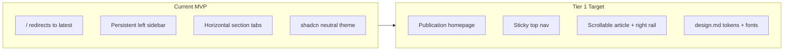
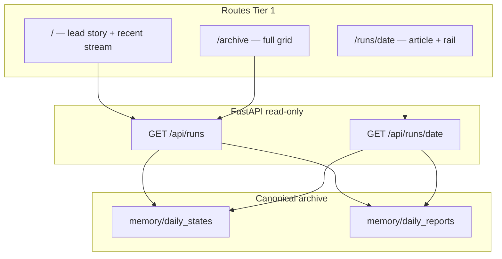

# Publication Archive UI — Implementation Plan

**Status:** Approved with edits (ready for implementation)

**Verdict:** Aligned with engine → memory → FastAPI → Next.js layering. Proceed once dev-fixture gate is satisfied.

## Codebase review summary

The stack already has the right **separation of concerns**: the engine writes canonical artifacts; FastAPI reads them read-only; Next.js renders them. The gap is almost entirely **presentation and information architecture**, not missing backend contracts.

### What exists today

| Layer | Status | Key files |
|---|---|---|
| **Engine → archive** | Solid | [`spx-analyst/src/files.py`](spx-analyst/src/files.py), [`spx-analyst/src/memory.py`](spx-analyst/src/memory.py) — successful runs mirror `{date}-state.json` + `{date}-analysis.md` into `memory/` |
| **FastAPI viewer** | Minimal, correct | [`spx-analyst/src/web/service.py`](spx-analyst/src/web/service.py) — 3 GET routes, path-safe, skips orphans/corrupt state |
| **API contracts** | Sufficient for Tier 1 | [`RunSummary`](spx-analyst/src/web/models.py) already exposes archive metadata: `structural_bias`, `trend_regime`, `valuation_bucket`, `recommended_action`, `signal_alignment` |
| **Next.js viewer** | Functional MVP | [`spx-analyst/web/`](spx-analyst/web/) — SSR fetches via [`lib/api.ts`](spx-analyst/web/lib/api.ts), rewrites to `:8000` |
| **Markdown pipeline** | Reusable | [`lib/report.ts`](spx-analyst/web/lib/report.ts) — `splitSections`, `parseHeader`, `viewerSections`, tone helpers |
| **Structured renderers** | Built, partially wired | [`run-header.tsx`](spx-analyst/web/components/run-header.tsx), [`signal-grid.tsx`](spx-analyst/web/components/signal-grid.tsx), [`decision-matrix.tsx`](spx-analyst/web/components/decision-matrix.tsx) — **not mounted on the run page** |
| **Design system** | Spec only | [`design.md`](design.md) — palette, typography, layout, components; **not applied** in [`globals.css`](spx-analyst/web/app/globals.css) |

### Current UX vs acceptance criteria



| Acceptance criterion | Current | Tier 1 fix |
|---|---|---|
| Browse archived runs | Sidebar date list only | `/` homepage + `/archive` grid with metadata chips |
| Open daily report | `/runs/[date]` works | Same route, editorial layout |
| Read markdown comfortably | Tabbed cards, `max-w-6xl` | Long-form article, ~68–72ch reading column, serif section headings |
| Structured state alongside report | Matrix only in Matrix tab | Right rail: action, tension, signals, matrix snapshot from `daily_state` |
| Desktop + mobile navigation | Fixed `w-72` sidebar | Top nav + responsive archive grid; rail collapses below article on mobile |
| No chatbot required | Already true | Preserve; add inert Tier 3 placeholder only |

### Architectural constraints (non-negotiable)

1. **Memory-only data authority** — UI reads `GET /api/runs` and `GET /api/runs/{date}` only. No reads from `data/runs/`, `output/`, or `analysis_context.json` in this phase.
2. **No frontend recomputation** — display `daily_state` and `report_markdown` as served; do not re-derive analytical outputs, matrix rows, signal readings, or posture classifications in the browser.
3. **No synthesized interpretations** — the UI must **not** create new market interpretations by combining prose and JSON, inferring composite summaries, or extrapolating beyond the fields returned by the API. Display-only helpers (date formatting, action string humanization, tone CSS class selection) are allowed; analytical meaning must come from canonical artifacts only.
4. **Structured state prefers JSON over markdown** — when both exist (e.g. decision matrix), render from `daily_state.decision_matrix`, not the markdown table. The markdown matrix exists for human audit and must match state; the viewer treats `DailyState` as authoritative.
5. **Pass 2 is exposition-only** — prose in `report_markdown` explains validated state; it must not be mined to populate structured UI modules when equivalent `DailyState` fields exist.
6. **Out of scope** — live market streaming, terminal dashboards, chat endpoints, mutating runs, search indexing, chart image serving.

### Implementation prerequisite: valid `memory/` fixtures

**Blocked until complete.** `memory/` is empty in the workspace; local UI work cannot be verified without at least one valid state+report pair.

Before any frontend implementation begins:

1. Seed `memory/daily_states/` and `memory/daily_reports/` with **≥2 runs** that validate against current `DailyState` schema (rows-format `decision_matrix`, `structural_bias` present).
2. Preferred path: `python -m src.cli run --date …` on dates with existing `data/runs/{date}/` inputs.
3. Alternative: copy validated pairs from pytest fixtures ([`tests/conftest.py`](spx-analyst/tests/conftest.py) `SAMPLE_STATE` + minimal markdown) into `memory/` for fast UI iteration.
4. **Do not** use [`memory-archive/`](spx-analyst/memory-archive/) Perplexity migration samples — they fail current schema validation (missing `structural_bias`, legacy `decision_matrix` object shape).

This prerequisite is a **gate**, not an optional note. Tier 1 verification depends on it.

### Published report contract (viewer must tolerate)

Per [README](spx-analyst/README.md) and [PR-7](spx-analyst/docs/PR-7-pass2-investor-report-template.md), Python assembles the canonical published report in [`report_assembly.py`](spx-analyst/src/report_assembly.py). The viewer renders `report_markdown` as a **display artifact**; it does not assume a brittle one-to-one mapping between `##` headings and UI modules.

**Current assembled shape (nine visible parts):**

| # | Section | Author | Viewer treatment |
|---|---|---|---|
| Preamble | `#` title + bold fact lines (close, instrument, regime) | Python `render_header_snapshot` | Supplement `RunHeader` via `parseHeader` only for display fields not in `DailyState` (e.g. day change %); authoritative close/action/bias from JSON |
| 1 | Today's Posture | Pass 2 prose | Render as `##` section block |
| 2 | Market Regime | Pass 2 prose | Render as section block |
| 3 | Price and Trend | Pass 2 prose | Render as section block |
| 4 | Technicals and Sentiment | Pass 2 prose | Render as section block |
| 5 | Valuation and ERP | Pass 2 prose + **Python-injected fact block** | Render full section body as markdown (prose + injected facts stay together) |
| 6 | Risk and Monte Carlo | Pass 2 prose + **Python-injected fact block** | Same |
| 7 | Tactical Levels and Next Session Plan | Pass 2 prose + **Python-injected tactical block** | Same; do not parse levels into rail — rail uses `monte_carlo` targets from `DailyState` only |
| 8 | Evidence and Tensions | Pass 2 prose | Caution callout styling; do not re-derive divergences — `conflicting_evidence` lives in `DailyState` for Tier 2 rail |
| 9 | Updated Decision Matrix | Python from `daily_state.decision_matrix` | **Always** render via [`DecisionMatrix`](spx-analyst/web/components/decision-matrix.tsx) component from JSON; markdown table is fallback only if state missing |

**Canonical section order** (from [`INVESTOR_REPORT_SECTIONS`](spx-analyst/src/prompts.py)): strict for new runs; validation enforces matrix-is-last.

**Historical variation:** Pre-PR-7 reports may use legacy workflow headings (e.g. numbered steps, "Evidence Reconciliation"). The viewer must:
- Render **all** `##` sections in document order via generic section blocks (no hard dependency on exact heading strings for layout)
- Use regex-based helpers ([`sectionTabLabel`](spx-analyst/web/lib/report.ts), `viewerSections`) only for optional UX affordances (TOC labels, evidence callout detection), never for data extraction
- Never fail to render a report because a heading doesn't match the canonical nine

**Anti-pattern:** Building rail modules or archive metadata by parsing prose sections, fact blocks, or matrix markdown.

---

## Target information architecture



**Navigation model change:** remove the always-on left sidebar. Replace with:
- **Sticky top nav** (wordmark, Archive, Latest, About stub)
- **Homepage** as the editorial front door (not a redirect)
- **Run-to-run navigation** via prev/next controls on the report page (derived from sorted `RunSummary[]`, no new API)

---

## Tier 1 — Implement now

Goal: meet all acceptance criteria with editorial theming and responsive layout.

### 1. Design tokens and typography

**Files:** [`spx-analyst/web/app/globals.css`](spx-analyst/web/app/globals.css), [`spx-analyst/web/app/layout.tsx`](spx-analyst/web/app/layout.tsx)

- Map [`design.md`](design.md) semantic palette to CSS variables:
  - `--ink-900`, `--paper-50`, `--surface-0`, `--border-soft`, `--market-green`, `--signal-blue`, `--caution-amber`, `--risk-red`, plus dark-mode counterparts
- Wire shadcn tokens (`--background`, `--foreground`, `--primary`, `--border`, `--card`) to editorial values (Market Green as `--primary`, Paper 50 as `--background`)
- Load fonts via `next/font/google`:
  - **Newsreader** → `--font-display` (headlines)
  - **Inter** → `--font-sans` (body/UI)
- Add spacing scale tokens (`--space-4` … `--space-16`) and shadow tokens (`--shadow-1` … `--shadow-3`)
- Update [`report-markdown.tsx`](spx-analyst/web/components/report-markdown.tsx) prose classes:
  - `max-w-[70ch]`, Body L sizing (`text-[19px] leading-[1.72]`)
  - serif `h2` via `font-display`, sans body
  - link color → Signal Blue

**Dark mode:** scaffold `.dark` token overrides per design.md; defer toggle UI to Tier 2 unless trivial (class on `<html>` + one button in header).

### 2. App shell and top navigation

**New:** `components/site-header.tsx`  
**Refactor:** [`app/layout.tsx`](spx-analyst/web/app/layout.tsx)

- Replace sidebar layout with:
  - `SiteHeader` (sticky, 64–72px, blur + Shadow 2)
  - `children` in a full-width main canvas (`bg-paper-50`)
- Header links: **Archive** (`/archive`), **Latest** (`/runs/{newest}`), **About** (static stub page or `#` placeholder)
- Fetch `listRuns()` once in layout for header “Latest” link and global run count; keep existing graceful API-down handling
- Remove [`run-list.tsx`](spx-analyst/web/components/run-list.tsx) from layout (retire or repurpose for mobile archive drawer in Tier 2)

### 3. Homepage (`/`)

**Refactor:** [`app/page.tsx`](spx-analyst/web/app/page.tsx)  
**New:** `components/home/lead-story.tsx`, `components/home/recent-stream.tsx`

- Stop auto-redirecting to latest run
- **Lead story = newest archived run only** — `runs[0]` from `GET /api/runs` (already sorted newest-first). This is a **presentation treatment** of the latest `RunSummary`, not an editorially curated feature. No new backend concept, no CMS, no manual pinning.
- Lead story block: date, `spx_close`, 2–3 metadata chips (`structural_bias`, `recommended_action`, `valuation_bucket`), CTA → `/runs/{date}`
- **Recent stream:** `runs.slice(1)` as compact archive rows (date, close, bias chip) linking to `/runs/{date}`
- Empty state: keep existing “no archived runs” guidance
- Responsive: single column mobile; lead story stacks metadata chips

### 4. Archive page (`/archive`)

**New:** `app/archive/page.tsx`, `components/archive/archive-grid.tsx`, `components/archive/archive-card.tsx`, `components/archive/metadata-chip.tsx`

- 3-col desktop / 2-col tablet / 1-col mobile grid per design.md
- **Archive card** fields (all from `RunSummary`, no API change):
  - Title line: formatted date
  - `spx_close` (Numeric XL styling)
  - Chips: structural bias, recommended action (humanized), valuation bucket
  - Optional muted line: `trend_regime` truncated
- Card hover: border contrast + Shadow 2
- No filtering yet (Tier 2)

### 5. Report page — article layout + right rail

**Refactor:** [`app/runs/[date]/page.tsx`](spx-analyst/web/app/runs/[date]/page.tsx), [`components/report-view.tsx`](spx-analyst/web/components/report-view.tsx)  
**New:** `components/report/report-article.tsx`, `components/report/report-rail.tsx`, `components/report/run-nav.tsx`, `components/report/section-block.tsx`

Replace tabbed reading with scrollable long-form article:

```
┌─────────────────────────────────────────────────────────────┐
│ SiteHeader                                                  │
├──────────────────────────────────┬──────────────────────────┤
│ RunHeader (title, close, action) │                          │
│ RunNav (prev / next / archive)   │   ReportRail (sticky)    │
│                                  │   - TodayStateModule     │
│ Section 1 (## heading + prose)   │   - SignalSnapshot       │
│ Section 2                        │   - MatrixSnapshot       │
│ ...                              │   - MonteCarloSummary    │
│                                  │                          │
└──────────────────────────────────┴──────────────────────────┘
        7 cols reading                    3 cols rail (desktop)
```

**Article column:**
- Mount existing [`RunHeader`](spx-analyst/web/components/run-header.tsx) with `state` + `reportMarkdown`
- Split markdown via `splitSections(markdown)` — render **all** `##` sections in document order as stacked blocks (not tabs). Do not require canonical heading names for rendering to succeed.
- Use `viewerSections()` only if still useful for skipping duplicate preamble content before "Today's Posture"; when in doubt, prefer showing the full assembled report in order (per PR-7 contract above).
- [`section-block.tsx`](spx-analyst/web/components/report/section-block.tsx):
  - Default: serif `h2` (from markdown heading text) + [`ReportMarkdown`](spx-analyst/web/components/report-markdown.tsx) for section body — includes Python-injected fact blocks inline
  - **Updated Decision Matrix** section (detect via `/decision matrix/i`, not exact string): render [`DecisionMatrix`](spx-analyst/web/components/decision-matrix.tsx) from `daily_state.decision_matrix`; markdown table is fallback only when state unavailable
  - Evidence section (detect via `/evidence (and tensions|reconciliation)/i`): caution-tinted callout styling only — content stays as served prose
- `RunHeader` fields come from `DailyState`; `parseHeader(reportMarkdown)` may supplement display-only fields (day change %) but must not override JSON authority

**RunHeader — field-level source map** (article column, not rail)

| UI element | Primary source | Supplement (display-only) |
|---|---|---|
| Date | `DailyState.date` | — |
| SPX close | `DailyState.spx_close` | `parseHeader` close if needed for consistency check only |
| Day change | — | `parseHeader` from markdown preamble |
| Recommended action | `decision_matrix` via `getRecommendedAction()` | — |
| Primary tension | `DailyState.primary_tension` | — |
| Structural bias / regime / valuation | `DailyState.*` | — |
| Signal grid tiles | `DailyState.signals`, `DailyState.monte_carlo`, `DailyState.signal_alignment` | — |

**Right rail — field-level source map**

Every datum in the rail must trace to `RunSummary` or `DailyState`. No prose parsing. Module order is **fixed across all runs** to preserve cross-date comparability.

| Module | UI label | Authoritative fields | Formatting only |
|---|---|---|---|
| **TodaysState** | Today's state | `structural_bias`, `trend_regime`, `valuation_bucket`, `primary_tension` | string display, truncation with tooltip |
| **SignalSnapshot** | Signals | `signals.vix_regime`, `signals.fear_greed`, `signals.fear_greed_zone`, `signals.rsi14`, `signals.mfi`, `signal_alignment.trim_signals_met`, `signal_alignment.buy_signals_met`, `signal_alignment.overall` | `toneFor()` for CSS class |
| **MatrixSnapshot** | Decision matrix | `decision_matrix.rows[]` — all rows; highlight row where `signal_layer` matches "Recommended Action" | `getRecommendedAction()` lookup; action humanization (`_` → space) |
| **MonteCarloSummary** | Monte Carlo | `monte_carlo.prob_up_first_adjusted`, `monte_carlo.prob_down_first_adjusted`, `monte_carlo.meets_threshold`, `monte_carlo.effective_threshold`, `monte_carlo.upside_target`, `monte_carlo.downside_target`, `monte_carlo.rally_exhaustion_score` | percent formatting, tabular nums |

**Explicitly excluded from rail (Tier 1):** Fib levels, liquidation zones, ERP numerics, breadth internals — these appear in report prose and/or `analysis_context.json`, which is out of API scope. Tier 2 may add `what_changed_today`, `open_questions`, `conflicting_evidence` from `DailyState` using the same field-only rule.

**Archive cards / homepage chips — field-level source map**

| UI element | Source | Model |
|---|---|---|
| Date | `RunSummary.date` | list/detail API |
| SPX close | `RunSummary.spx_close` | list/detail API |
| Structural bias chip | `RunSummary.structural_bias` | list API |
| Recommended action chip | `RunSummary.recommended_action` | list API |
| Valuation chip | `RunSummary.valuation_bucket` | list API |
| Trend regime (muted) | `RunSummary.trend_regime` | list API |

**Run navigation:** `run-nav.tsx` — prev/next date links computed from `listRuns()` passed from page (fetch runs in `page.tsx` alongside `getRun()`)

**Responsive (design.md §8):**
- `lg:` — 12-col grid, rail `position: sticky; top: headerHeight + space`
- `< lg` — single column; rail modules render **below** article in defined collapse order (state → signals → matrix → monte carlo)
- Keep title, date, recommended action visible early on mobile (in `RunHeader`, not buried in rail)

**Deprecate:** [`report-tabs.tsx`](spx-analyst/web/components/report-tabs.tsx) — remove after article path works; keep `sectionTabLabel` only if needed for a future in-page TOC (Tier 2)

### 6. Shared UI primitives

**New / extend:**
- `metadata-chip.tsx` — tone-aware chips using existing `toneFor()` from [`lib/report.ts`](spx-analyst/web/lib/report.ts); map emerald/amber/rose to Market Green / Caution / Risk tokens
- `components/ui/sheet.tsx` (shadcn) — optional for mobile nav; can stub if time-constrained
- Refactor `TONE_SURFACE` / `TONE_DOT` in [`lib/report.ts`](spx-analyst/web/lib/report.ts) to reference editorial CSS variables instead of raw Tailwind emerald/rose

### 7. Tier 3 placeholder (inert, no backend)

**New:** `components/chat/chat-panel-placeholder.tsx`

- Collapsed/disabled “Research assistant (coming soon)” affordance in header or report footer
- No API calls, no AI SDK, no session state — purely visual stub so layout doesn’t need rework later

### 8. Backend changes

**None required for Tier 1.** Existing [`test_web_api.py`](spx-analyst/tests/test_web_api.py) remains the contract gate.

### 9. README and operator documentation (required deliverable)

Update [`spx-analyst/README.md`](spx-analyst/README.md) Phase 2 web viewer section with:

| Doc requirement | Content |
|---|---|
| **Route map** | `/` (homepage), `/archive`, `/runs/{date}` — what each shows |
| **Dev seeding** | Step-by-step: activate venv, seed `memory/` via `cli run` or fixture copy, start uvicorn + `npm run dev` |
| **Data authority** | Viewer reads `memory/` only via API; UI does not recompute or synthesize interpretations |
| **Report contract pointer** | Link to PR-7 nine-part assembly; matrix rendered from `DailyState` |
| **Fixture prerequisite** | At least one valid archived pair required before UI verification |
| **Troubleshooting** | Empty archive, API unreachable, schema validation skips (orphan/corrupt state) |

**Doc acceptance criteria (Tier 1):**
- [ ] A new operator can seed `memory/`, start both servers, and load homepage + report without reading source code
- [ ] Route descriptions match implemented pages
- [ ] Field-authority rule stated explicitly (no prose-driven structured UI)
- [ ] `memory-archive/` called out as incompatible with current schema

---

## Product guidance: cross-run comparability

The editorial redesign must not sacrifice comparison speed across dates. The framework requires every run to answer the same core questions and end with a complete Updated Decision Matrix.

**Preserve comparability through:**
- **Stable metadata placement** — same chip order on archive cards, homepage stream, and `RunHeader` across all dates
- **Fixed rail module order** — TodaysState → SignalSnapshot → MatrixSnapshot → MonteCarloSummary on every report page
- **Stable report scaffolding** — long-form section order follows assembled markdown; canonical nine-part runs align visually even when headings vary historically
- **Consistent numeric formatting** — tabular figures, same decimal rules for close/prices/probabilities

**Avoid:** decorative layouts that move key posture fields (bias, action, close) to different positions per page type; rail modules that reorder based on content; summarizing matrix or signals differently per run in the frontend.

---

## Tier 2 — Next (outline)

| Feature | Approach | API impact |
|---|---|---|
| **Archive filtering** | Client-side filter on `RunSummary` fields (bias, action, date range) | None; optional later: `?bias=` query param |
| **Related-run navigation** | Rail module: adjacent dates + same `structural_bias` / `valuation_bucket` matches from `listRuns()` | None |
| **Richer matrix/state modules** | Expand rail: `what_changed_today`, `open_questions`, `conflicting_evidence` — **field-only**, same authority rules | None |
| **In-page section TOC** | Sticky mini-nav from `splitSections` headings | None |
| **Search** | Client filter on date + summary text | Optional: add `narrative_summary` to `RunSummary` (one-line API extension) |
| **Dark mode toggle** | `next-themes` or class toggle on `<html>` | None |
| **Mobile archive drawer** | Sheet triggered from header | None |

**Explicit deferral:** `analysis_context.json` structure levels (Fib, liquidation zones) stay out of the UI until a deliberate API extension exposes a **read-only, precomputed** slice—never parsed or recomputed in the frontend.

---

## Tier 3 — Later (chat panel)

Only after [`chat_service.py`](spx-analyst/src/chat_service.py) gains real HTTP endpoints:

- Collapsible right or bottom panel on report page
- Loads canonical `memory/` context server-side; chat session state is ephemeral (per original spec)
- Panel width capped so reading column stays ≥ 68ch on desktop
- Replace `chat-panel-placeholder.tsx` with real component behind feature flag

---

## File change map (Tier 1)

| Action | Path |
|---|---|
| Refactor | `web/app/layout.tsx`, `web/app/page.tsx`, `web/app/runs/[date]/page.tsx`, `web/app/globals.css` |
| Refactor | `web/components/report-view.tsx`, `web/components/report-markdown.tsx` |
| Wire existing | `web/components/run-header.tsx`, `signal-grid.tsx`, `decision-matrix.tsx` |
| New | `web/app/archive/page.tsx`, `web/components/site-header.tsx`, `web/components/archive/*`, `web/components/report/*`, `web/components/chat/chat-panel-placeholder.tsx` |
| Update tokens | `web/lib/report.ts` (tone → editorial colors) |
| Remove / deprecate | `web/components/report-tabs.tsx`, sidebar usage of `run-list.tsx` |
| Docs | `spx-analyst/README.md` (routes, dev seeding, field authority, troubleshooting) — **required** |

---

## Verification checklist

**Functional**
- [ ] `memory/` seeded with ≥2 valid current-schema pairs before UI work begins
- [ ] `GET /api/runs` returns summaries; homepage and archive render all valid pairs
- [ ] `/runs/{date}` renders full assembled report as scrollable article (prose + injected fact blocks + matrix section)
- [ ] Decision matrix section renders from `daily_state.decision_matrix`, not markdown table
- [ ] Right rail fields match source map exactly — no prose-derived values
- [ ] Lead story is `runs[0]` with no curation backend
- [ ] Legacy heading variation still renders (no crash on non-canonical `##` titles)
- [ ] Right rail shows structured state modules on desktop; stacks below on mobile in fixed order
- [ ] Prev/next run navigation works across archived dates
- [ ] Missing date → `not-found.tsx`; API down → `BackendUnavailable`
- [ ] No chat panel makes network requests

**Documentation**
- [ ] README Phase 2 section updated per §9 doc acceptance criteria
- [ ] New operator can reproduce local viewer from README alone

**Visual (against design.md)**
- [ ] Paper background, ink text, Market Green primary actions
- [ ] Newsreader headlines, Inter body, tabular numerals on prices
- [ ] Reading column capped ~68–72ch; wide screens add margin, not wider prose
- [ ] Archive grid density matches medium-high; article medium density

**Regression**
- [ ] `pytest tests/test_web_api.py` passes unchanged
- [ ] `cd web && npm run build` succeeds (Next 16 SSR)

**Manual responsive pass**
- [ ] 375px, 768px, 1280px, 1440px breakpoints

---

## Risks and decisions

| Risk | Mitigation |
|---|---|
| Empty `memory/` blocks UI dev | **Gate:** seed fixtures before frontend work (§ prerequisite) |
| Legacy `memory-archive/` incompatible with schema | Do not use for API testing; document in README |
| Report section titles vary across runs | Generic `splitSections` rendering; regex only for styling hooks, not data |
| Viewer assumes brittle heading → module map | Follow published report contract (§); matrix always from JSON |
| Rail modules drift from field authority | Enforce source map; code review against map table |
| Decorative layout hurts cross-run comparison | Fixed chip order, fixed rail order, stable scaffolding (§ product guidance) |
| Layout refactor breaks SSR data fetching | Keep all fetches in Server Components; pass serializable props to client subcomponents only where needed |
| `RunHeader` + `parseHeader` overlap | JSON authoritative for state; `parseHeader` supplements display-only markdown fields (day change) |

**Recommended implementation order:** dev fixtures → tokens/fonts → shell/header → archive page → report article+rail → homepage → placeholder → responsive polish → README docs → verification.
