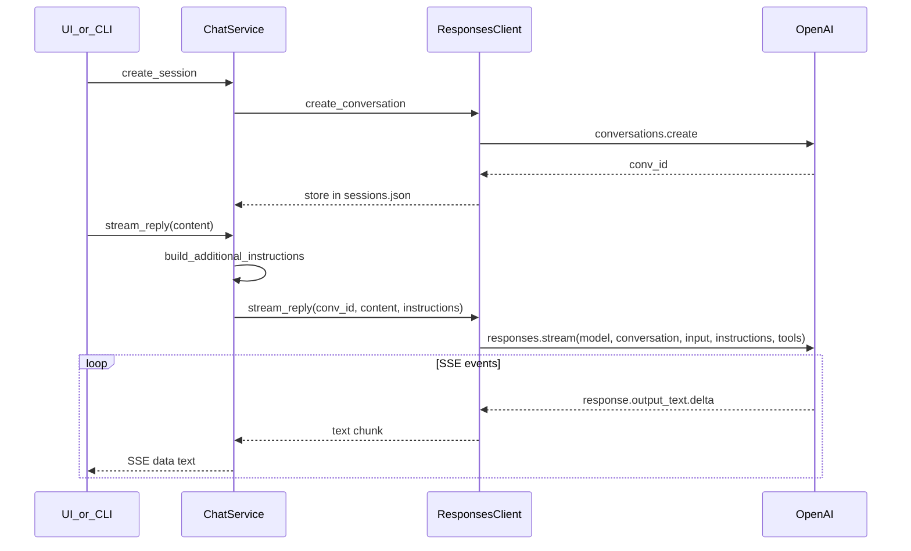

# Responses API — greenfield chat rewrite

## Context

**Current state:** Chat uses the deprecated [Assistants API](https://developers.openai.com/api/docs/deprecations) (`beta.threads`, `beta.assistants`, `runs.stream`) in [`spx-analyst/src/openai_assistant.py`](spx-analyst/src/openai_assistant.py). Sunset: **August 26, 2026**.

**Target state:** [Responses API](https://developers.openai.com/api/docs/guides/migrate-to-responses) + [Conversations API](https://developers.openai.com/api/docs/guides/conversation-state) per [official migration guide](https://developers.openai.com/api/docs/assistants/migration).

**Greenfield constraint:** Phase 2–4 code exists in repo, but the assistant has not been operator-tested; treat this as a **pre-launch greenfield replacement** — replace in place, no feature flag, no thread→conversation backfill, no existing `memory/chat/sessions.json` to preserve.

## Sharpened decisions (confirmed)

| Decision | Resolution | Rationale |
|---|---|---|
| Chat model | **`OPENAI_CHAT_MODEL` default `gpt-5`** | Responses-native; verify exact model slug (`gpt-5`, `gpt-5.2`, etc.) against your account during first E2E — adjust default if needed |
| Instructions | **`build_additional_instructions()` only** | Already bundles static instructions + LatestRunState + rolling summary; single source of truth |
| `store` flag | **`store=True`** on every `responses.stream` | Localhost debug via OpenAI logs; Conversation items persist separately |
| Vector store at chat | **Required** — fail fast if `OPENAI_VECTOR_STORE_ID` missing | Historic questions need `file_search`; consistent with index-rag requirement |
| Type renames | `ThreadMessage` → **`ChatMessageRecord`**, `AssistantError` → **`ResponsesError`**, `AssistantClient` → **`ResponsesClient`**, `FakeAssistantClient` → **`FakeResponsesClient`** | Greenfield rewrite; no Thread/Assistant naming left in chat layer |
| Setup script | **Rename** to `setup_openai_resources.py`; delete `setup_openai_assistant.py` | Name matches vector-store-only scope |
| Session field | `openai_thread_id` → **`openai_conversation_id`** | Maps to Conversations API |

**What stays unchanged:**
- Preload authority ([`chat_preload.py`](spx-analyst/src/chat_preload.py)) — still inject latest-run block + rolling summary + instructions on **every** turn
- RAG indexing ([`rag_index.py`](spx-analyst/src/rag_index.py)) — vector stores + `files.create(purpose="assistants")` remain valid for [Responses file_search](https://developers.openai.com/api/docs/guides/tools-file-search)
- FastAPI routes, SSE contract, Next.js UI, CLI REPL shape
- `memory/rag/{date}.json` manifests

---

## API mapping (OpenAI docs)

| Deprecated (today) | Replacement |
|---|---|
| `Assistant` + `OPENAI_ASSISTANT_ID` | **Inline `instructions`** on each `responses.create/stream` call (do **not** use dashboard Prompt objects — [deprecated Nov 30, 2026](https://developers.openai.com/api/docs/deprecations)) |
| `Thread` | `Conversation` via `client.conversations.create()` |
| `threads.messages.create` + `runs.stream` | Single `client.responses.stream(..., conversation=conv_id, input=..., tools=[file_search])` |
| `threads.messages.list` | `client.conversations.items.list(conversation_id, order="asc")` — filter `type=="message"` items |
| `threads.delete` | `client.conversations.delete(conversation_id)` |
| `additional_instructions` on run | Top-level `instructions=` on Responses call (resend preload every turn — required anyway per [conversation state docs](https://developers.openai.com/api/docs/guides/conversation-state)) |
| `stream.text_deltas` (Assistants) | Typed SSE events: `response.output_text.delta` ([streaming guide](https://developers.openai.com/api/docs/guides/streaming-responses)) |

### Recommended conversation model

Use **Conversations API** (not `previous_response_id` chains):



**Why Conversations over `previous_response_id`:** Closest semantic match to Threads; `get_messages` maps cleanly to `conversations.items.list`; conversation items persist without 30-day response TTL concerns.

---

## Architecture changes

### 1. Replace OpenAI client module

**Delete/rename:** [`openai_assistant.py`](spx-analyst/src/openai_assistant.py) → **`openai_responses.py`**

```python
class ResponsesClient(Protocol):
    def create_conversation(self) -> str: ...
    def delete_conversation(self, conversation_id: str) -> None: ...
    def list_messages(self, conversation_id: str) -> list[ChatMessageRecord]: ...
    def stream_reply(
        self, *, conversation_id: str, user_message: str, instructions: str
    ) -> Iterator[str]: ...
```

**`LiveResponsesClient` implementation:**

```python
with self._client.responses.stream(
    model=self._settings.openai_chat_model,
    conversation=conversation_id,
    input=[{"role": "user", "content": user_message}],
    instructions=instructions,  # build_additional_instructions() — static + preload + rolling
    store=True,
    tools=[{
        "type": "file_search",
        "vector_store_ids": [self._settings.openai_vector_store_id],
    }],
) as stream:
    for event in stream:
        if event.type == "response.output_text.delta":
            yield event.delta
        elif event.type in ("error", "response.failed"):
            raise ResponsesError(...)
```

**Message listing:** Paginate `conversations.items.list(conversation_id, order="asc")`; keep only `type=="message"` items; map `input_text` / `output_text` content blocks to **`ChatMessageRecord`** dataclass.

**File search latency:** Stream may emit `response.file_search_call.*` events before first text delta — UI already shows "Thinking…"; no change required unless we want search-status text later.

### 2. Session store schema

In [`schemas.py`](spx-analyst/src/schemas.py) and [`chat_sessions.py`](spx-analyst/src/chat_sessions.py):

- Rename `openai_thread_id` → **`openai_conversation_id`**
- Update docstrings ("maps to OpenAI conversation")

In [`chat_service.py`](spx-analyst/src/chat_service.py):

- Wire `create_conversation` / `delete_conversation` / `list_messages` / `stream_reply` with new field name
- Keep auto-title + `touch_updated_at=False` behavior unchanged

### 3. Configuration

[`config.py`](spx-analyst/src/config.py) + [`.env.example`](spx-analyst/.env.example):

| Remove | Add / keep |
|---|---|
| `OPENAI_ASSISTANT_ID` | **`OPENAI_CHAT_MODEL`** (default **`gpt-5`** — verify slug at first E2E) |
| — | `OPENAI_API_KEY` (unchanged) |
| — | `OPENAI_VECTOR_STORE_ID` (required for RAG indexing **and** chat `file_search`) |

[`LiveResponsesClient._require_chat_settings`]: require all three — same bar as a working assistant with historic retrieval.

### 4. Setup script

**Delete** [`scripts/setup_openai_assistant.py`](spx-analyst/scripts/setup_openai_assistant.py). **Add** [`scripts/setup_openai_resources.py`](spx-analyst/scripts/setup_openai_resources.py):

- **Keep:** `vector_stores.create(name=..., chunking_strategy max_chunk_size_tokens=1024)`
- **Remove:** `beta.assistants.create(...)` entirely
- **Print:** `OPENAI_VECTOR_STORE_ID=...` + suggested `OPENAI_CHAT_MODEL=gpt-5`

### 5. RAG indexing — no functional change

[`rag_index.py`](spx-analyst/src/rag_index.py): keep as-is. OpenAI docs confirm `file_search` in Responses uses the same vector store + file upload pattern.

Optional follow-up (out of scope): `phase1.1-reindex-cleanup` stale file deletion.

### 6. Tests

| File | Change |
|---|---|
| [`tests/test_web_chat_api.py`](spx-analyst/tests/test_web_chat_api.py) | `FakeResponsesClient`; assert preload in `instructions`; `openai_conversation_id` |
| [`tests/test_chat_sessions.py`](spx-analyst/tests/test_chat_sessions.py) | `openai_conversation_id` field |
| New **`tests/test_openai_responses.py`** (**required**) | Unit-test `ChatMessageRecord` parsing from fixture conversation items — highest-risk new contract (Conversations item shape differs from Assistants messages) |

**247+ tests** must pass after renames. No live OpenAI tests in CI.

### 7. Documentation

Update in one PR (record as **PR-14**):

- [`docs/research-assistant-operator-guide.md`](spx-analyst/docs/research-assistant-operator-guide.md) — remove Assistant/Thread steps; document vector store setup + `OPENAI_CHAT_MODEL`; update troubleshooting (no `OPENAI_ASSISTANT_ID`)
- [`README.md`](spx-analyst/README.md) — env table, setup script name, PR-14 link
- [`.env.example`](spx-analyst/.env.example)
- Brief note in [`docs/PR-11-research-assistant-phase2.md`](spx-analyst/docs/PR-11-research-assistant-phase2.md) superseded by PR-14 (historical record)
- New [`docs/PR-14-responses-api-chat.md`](spx-analyst/docs/PR-14-responses-api-chat.md)
- Plan todo in [`.cursor/plans/subscription_chat_assistant_9dcd0913.plan.md`](.cursor/plans/subscription_chat_assistant_9dcd0913.plan.md): add `responses-api-rewrite` completed item

### 8. SDK version bump

Bump [`pyproject.toml`](spx-analyst/pyproject.toml) + [`requirements.txt`](spx-analyst/requirements.txt):

- `openai>=1.40.0` → **`openai>=1.82.0`** (verify during implementation that `responses.stream` + `conversations` are available; adjust floor if needed)

---

## Files touched (summary)

| Area | Files |
|---|---|
| **Core rewrite** | `src/openai_responses.py` (new), delete `src/openai_assistant.py` |
| **Orchestration** | `src/chat_service.py`, `src/chat_sessions.py`, `src/schemas.py`, `src/config.py`, `src/web/chat_api.py` |
| **Setup** | delete `scripts/setup_openai_assistant.py`; add `scripts/setup_openai_resources.py` |
| **Tests** | `tests/test_web_chat_api.py`, `tests/test_chat_sessions.py`, **`tests/test_openai_responses.py` (required)** |
| **Docs** | operator guide, README, `.env.example`, PR-14 |
| **Unchanged** | `chat_preload.py`, `rag_index.py`, `web/lib/chat-api.ts`, `assistant-workspace.tsx`, FastAPI SSE routes |

---

## Verification

### Automated (CI)

1. **`pytest`** — all tests pass, including **required** `tests/test_openai_responses.py` (conversation item → `ChatMessageRecord` parsing)
2. **`npm run build`** — no web changes expected

### Product behavior contracts (must preserve — pre-launch baseline)

Even though the assistant has not been operator-tested, the shipped Phase 2–4 contracts define the product bar. PR-14 must not regress:

| Contract | How verified |
|---|---|
| **Streamed text chunks** | `POST /api/chat/sessions/{id}/messages` SSE emits `data: {"text": "..."}` deltas; UI shows incremental assistant bubble |
| **`[DONE]` terminator** | Successful stream ends with `data: [DONE]\n\n`; client `streamChatMessage()` resolves cleanly |
| **Session create / list / delete** | `POST /api/chat/sessions` creates row + OpenAI conversation; `GET` lists newest-first; `DELETE` removes local row + conversation (best-effort remote delete) |
| **Refreshable message history** | After send + page refresh, `GET /api/chat/sessions/{id}/messages` returns full user/assistant transcript from conversation items |
| **Failed send rollback** | HTTP or SSE error does not leave phantom optimistic user bubble; `updated_at` not bumped on failed stream |
| **Preload on every turn** | `build_additional_instructions()` passed as Responses `instructions`; tests assert `latest_run_date` in payload |

### Manual operator flow (first live test)

```bash
python scripts/setup_openai_resources.py   # vector store only
# set OPENAI_API_KEY, OPENAI_VECTOR_STORE_ID, OPENAI_CHAT_MODEL=gpt-5 in .env
python -m src.cli index-rag --backfill
uvicorn src.web.app:app --host 127.0.0.1 --port 8000
cd web && npm run dev
```

### Authority checklist (live LLM — A1–A4)

From [operator guide](spx-analyst/docs/research-assistant-operator-guide.md) on `/assistant`:

- **A1** Posture from preload — names `latest_run_date`, cites matrix rows, matches latest `DailyState`
- **A2** Current vs historical — distinguishes latest run vs retrieved past sections
- **A3** Refusal — will not override published recommended action
- **A4** Historic retrieval — answers from indexed report sections when vector store populated

---

## Out of scope

- Dual Assistants/Responses backend
- Thread→conversation backfill
- Dashboard Prompt objects
- `previous_response_id` chaining (Conversations chosen instead)
- UI changes beyond error message text
- Live LLM authority tests in CI
