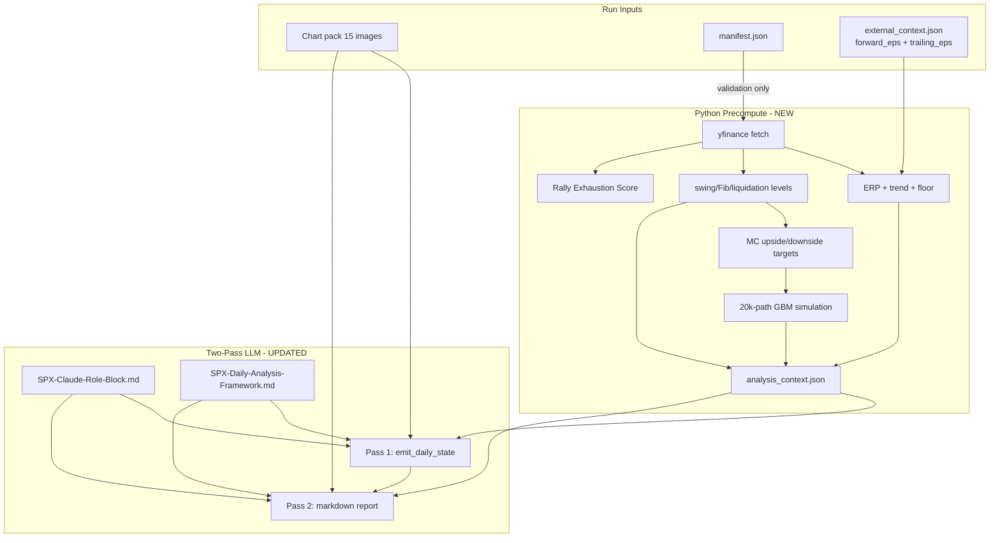

# SPX Daily Framework Engine Migration

## Validation of your assumptions

### 1. Chart reading in the two-pass pipeline — mostly correct, with one important nuance

**What you said:** Aside from forward/trailing EPS, all other indicators are read from charts in the two-pass process.

**What the code actually does today:**

| Evidence source | Pass 1 | Pass 2 |
|-----------------|--------|--------|
| 15 chart images | Sent to Claude; model reads RSI, MFI, VIX, F&G, breadth, spreads, etc. visually | Charts re-opened for Evidence Reconciliation only |
| [`external_context.json`](spx-analyst/data/runs/2026-06-10/external_context.json) | Also injected as JSON (`us10y`, `forward_eps`, all 7 F&G components) | Same JSON repeated |
| Monte Carlo probabilities | **LLM estimates** and writes `monte_carlo.*` in Pass 1 — no Python simulation | Treated as **immutable** in Pass 2 |

There is **no programmatic chart extraction**. The engine relies on multimodal LLM vision. Today you are **double-supplying** several scalars (VIX, put/call, junk spread, F&G) in both JSON and charts.

**Your intended end state is cleaner:** shrink [`ExternalContext`](spx-analyst/src/schemas.py) to `forward_eps` + `trailing_eps`; LLM reads all sentiment/credit/breadth/technical scalars from charts. That matches the Daily framework’s “supplied sentiment components” language if we treat charts as the supply mechanism.

**Correction on trailing PE:** not in current schema — only `forward_eps` exists. Migration adds `trailing_eps`.

---

### 2. yfinance scope — partially correct; must expand beyond 20 days for your MC-target choice

**What you said:** yfinance is only for Brownian drift and ERP trend; SMAs/Fib/structure come from charts.

**Tension:** you selected **engine-derived MC targets from yfinance structure** (swing high/low, Fib, liquidation zones). That requires the Python precompute layer to fetch enough SPX history to detect swings and compute Fib/liquidation prices — not just 20 sessions.

**Recommended fetch policy (resolves the tension):**

| yfinance series | Tickers | Lookback | Used for |
|-----------------|---------|----------|----------|
| SPX | `^GSPC` | 300 trading days | 20d realized vol, 200d SMA (drift μ), swing high/low, Fib levels, liquidation zones, MC targets, rally exhaustion magnitude |
| VIX | `^VIX` | ~60 days | σ proxy, VIX regime context in precompute |
| 10Y yield | `^TNX` | 25 sessions | current yield + 20-session ERP trend |

Charts remain the **authoritative source for the report** (RSI/MFI divergences, Bollinger regime, F&G components, McClellan, credit spread direction). yfinance is **authoritative for math** (ERP, GBM, structural price levels fed into simulation).

---

### 3. Python Monte Carlo module — correct direction

Today Pass 1 explicitly instructs the LLM to populate `monte_carlo` ([`prompts.py` L159–160](spx-analyst/src/prompts.py)). That must move to a deterministic Python module whose output is injected as **immutable precomputed context** before Pass 1. The LLM interprets results through the Daily framework; it does not run GBM.

---

### 4. Monte Carlo targets today — none configured

There is **no** target field in `manifest.json`, `external_context.json`, or config. The LLM implicitly chooses session-specific resistance/support (historically e.g. 7,250 vs 7,000 in Perplexity exports) while filling `prob_up_first` / `prob_down_first`.

**Your decision:** engine auto-derives targets from yfinance structure before the LLM run. Implementation will live in a new precompute module.

---

## Target architecture



---

## Phase 1 — Framework and prompt wiring

**Replace legacy references** across [`config.py`](spx-analyst/src/config.py), [`prompts.py`](spx-analyst/src/prompts.py), [`files.py`](spx-analyst/src/files.py), README, CLI help, tests, web copy:

- Framework default → [`framework/SPX-Daily-Analysis-Framework.md`](spx-analyst/framework/SPX-Daily-Analysis-Framework.md)
- System role → load [`framework/SPX-Claude-Role-Block.md`](spx-analyst/framework/SPX-Claude-Role-Block.md) (new `role_path` setting)
- Remove SCHK: drop `instrument_symbol` from manifest (or fixed `SPX`), remove `schk_close` from `DailyState`, update web types/components
- Archive/delete runtime use of V1/V3 files (keep in repo only if you want historical reference; engine must not load them)

**Update prompt constants** in [`prompts.py`](spx-analyst/src/prompts.py) + [`validation.py`](spx-analyst/src/validation.py):

| Constant | Old | New |
|----------|-----|-----|
| Pre-step | none | `Structural Regime Classification` |
| Step 4 name | Leverage & Margin Debt Monitor | Leverage and Liquidation Structure |
| Decision matrix | 8 V1 rows | 18 Daily rows (Structural Bias … Recommended Action) |
| Hard constraints | fixed 65% MC | regime thresholds 65/70/75%; MC values immutable from precompute |
| Pass 1 MC instruction | “Populate monte_carlo…” | Select threshold row from `analysis_context`; copy fields; do not recalculate |

---

## Phase 2 — Data contracts

### Slim `external_context.json`

```json
{
  "date": "2026-06-12",
  "forward_eps": 354.0,
  "trailing_eps": 220.0
}
```

Remove `us10y`, `fear_greed_index`, `fear_greed_components` from schema and templates.

### New `analysis_context.json` (engine-written per run)

Persisted under `data/runs/<date>/` and mirrored into output for reproducibility. Populated by precompute (Step 0) before Pass 1. This file is the **numeric source of truth** for the current run.

**Sections:**

- **`market_data`**: `spx_close` (yfinance `^GSPC`), `vix`, `us10y` (yfinance `^TNX`), `as_of_date`, `pct_above_200dma`, `realized_vol_20d`, `precompute_warnings` (e.g. `manifest.close` drift > 0.15%)
- **`valuation`**: `forward_pe`, `trailing_pe`, `forward_earnings_yield`, `erp`, `erp_trend` (vs 20-session avg), `erp_reentry_floor_at_0.5pct` — all computed from `market_data.spx_close`, `external_context` EPS, and `market_data.us10y`
- **`structure`**: active swing high/low (with dates and confirmation methods), fib_236/382/500/618, liquidation zones, `upside_target` / `downside_target` with `*_rule` provenance
- **`monte_carlo`** (Python-owned simulation output only):

| Field group | Fields |
|-------------|--------|
| Inputs | `sigma`, `mu`, `rally_exhaustion_score`, `exhaustion_discount` |
| Targets | `upside_target`, `downside_target`, `upside_target_rule`, `downside_target_rule` |
| Probabilities | `prob_up_first_raw`, `prob_down_first_raw`, `prob_up_first_adjusted`, `prob_down_first_adjusted` |
| Reporting | `cascades`, `median_days`, `drift_path`, `cash_drag_prob` |
| Threshold evaluation | `threshold_evaluation.65`, `.70`, `.75` — each row: `adjusted_prob_up_first`, `actionable` (bool) |

**`analysis_context.monte_carlo` must NOT contain:** `structural_bias`, `effective_threshold`, or `meets_threshold`. Those are assigned in Pass 1 on `DailyState`.

**Pass 1 Monte Carlo ownership:** LLM assigns `structural_bias` from charts, maps bias → threshold (65/70/75), **selects the matching precomputed row** from `threshold_evaluation`, and copies values into `DailyState.monte_carlo`. Pass 1 must not compute, adjust, or reinterpret probabilities.

---

## Phase 3 — New Python modules

### [`src/market_data.py`](spx-analyst/src/market_data.py) (new)

- `yfinance` wrapper with caching to `data/runs/<date>/market_history.json`
- Fetch **300 trading days** `^GSPC`, **60 days** `^VIX`, **25 sessions** `^TNX`
- yfinance is sole source for close/VIX/10Y in calculations; `manifest.close` validation-only (DL-2)
- Compute: 20d log-return σ, 200d SMA, 50d SMA (swing-low confirmation), pct above 200d, 20-session yield series

### [`src/structure.py`](spx-analyst/src/structure.py) (new) — **build first**

- Full DL-3 rules encoded in module docstring (confirmed local extrema, 300-day window, MC target selection)
- Frozen test fixtures must pass before `monte_carlo.py` is started
- Outputs: active swing high/low, fib levels, liquidation zones, primary upside/downside MC targets with `*_rule` provenance fields

### [`src/valuation.py`](spx-analyst/src/valuation.py) (new)

Inputs (no `manifest.close`):

- `analysis_context.market_data.spx_close` — from yfinance `^GSPC`
- `forward_eps` and `trailing_eps` — from `external_context.json`
- `us10y` — from yfinance `^TNX` (via `market_data`)

Computes:

- `forward_pe`, `trailing_pe`, `forward_earnings_yield`, `erp`
- ERP 20-session trend from stored `^TNX` yield history (`forward_eps` held constant per run — trend driven by yield changes)
- ERP floor price where ERP = 0.5%

`manifest.close` is used only in `market_data.py` / `precompute.py` for the validation cross-check that may emit `precompute_warning`; it is never passed into `valuation.py`.

### [`src/monte_carlo.py`](spx-analyst/src/monte_carlo.py) (new)

- 20,000-path GBM, 60 trading-day horizon
- Dynamic σ from realized vol (VIX/100 fallback)
- Dynamic μ from pct_above_200dma table in Daily framework
- Rally Exhaustion Score (3 inputs from yfinance structure)
- Apply exhaustion discount to upside-first probability (encode Moderate/High as fixed point discounts — recommend 5/8 pts from V3 spec since Daily says “modestly/materially”)
- First-hit and symmetric cascade probabilities
- Drift path at 5/10/20/30/60 days

Add `yfinance` + `numpy` (or `scipy`) to [`requirements.txt`](spx-analyst/requirements.txt).

### [`src/precompute.py`](spx-analyst/src/precompute.py) (new)

Orchestrates the above; called from [`analysis_engine.py`](spx-analyst/src/analysis_engine.py) as **Step 0** before Pass 1.

---

## Phase 4 — Schema and pipeline changes

### Revise [`schemas.py`](spx-analyst/src/schemas.py)

- `ExternalContext`: only date, forward_eps, trailing_eps
- `AnalysisContext`: full precompute contract matching Phase 2 sections (`market_data`, `valuation`, `structure`, `monte_carlo` with `threshold_evaluation`)
- `MonteCarloDetail` (on **`DailyState`**, Pass 1 output): `effective_threshold` (65 | 70 | 75), `meets_threshold` (bool), selected `prob_up_first_raw`, `prob_down_first_raw`, `prob_up_first_adjusted`, `prob_down_first_adjusted`, plus reference copies of `sigma`, `mu`, `upside_target`, `downside_target`, `rally_exhaustion_score`, `drift_path` summary — all **copied from** `analysis_context.monte_carlo` and the selected `threshold_evaluation` row; never recomputed
- `DailyState`: add `structural_bias` (LLM from charts); expand `decision_matrix` to row-based list or dedicated fields matching 18-row matrix; remove `schk_close`
- `SignalSet`: chart-derived fields LLM fills; do not duplicate precompute numerics (close, VIX, ERP, MC probs) — cite `analysis_context` in report instead

### Memory usage (independent daily runs)

- Prior-run memory is **not authoritative** for current-run calculations, structure detection, valuation, or Monte Carlo
- Step 0 precompute uses only: yfinance series, `external_context.json`, `manifest` (validation only), run date
- If `memory/` prior `DailyState` objects or rolling summaries are included in the prompt, they are **optional narrative continuity only** (e.g. `what_changed_today`, tone comparison) — never a numeric source of truth
- Each run must be valid in isolation given charts + `external_context.json` + `analysis_context.json`

### Revise [`analysis_engine.py`](spx-analyst/src/analysis_engine.py)

```
load role + framework
load manifest + external_context
run precompute → analysis_context.json   # sole numeric truth for this run
Pass 1 (charts + external_context + analysis_context + optional prior-run narrative context)
validate state
Pass 2 (charts + external_context + analysis_context + validated state + optional prior-run narrative context)
validate report
persist
```

### New CLI command

`python -m src.cli setup-run --date YYYY-MM-DD`

- Scaffold run dir + blank `external_context.json` (EPS fields only)
- Optionally fetch yfinance and write `analysis_context.json` preview for user verification before charts are added

---

## Phase 5 — Validation and tests

- Update [`tests/test_prompt_builder.py`](spx-analyst/tests/test_prompt_builder.py), [`tests/test_validation.py`](spx-analyst/tests/test_validation.py), [`tests/test_schemas.py`](spx-analyst/tests/test_schemas.py)
- New unit tests: ERP calc, σ/μ selection, GBM reproducibility (seeded RNG), swing/Fib/liquidation derivation, target selection
- Integration test: mock yfinance + mock Anthropic; assert `analysis_context` present in request snapshot and LLM not asked to compute MC

---

## Phase 6 — Web viewer (follow-up, not blocking engine)

[`web/lib/types.ts`](spx-analyst/web/lib/types.ts), [`decision-matrix.tsx`](spx-analyst/web/components/decision-matrix.tsx), layout copy — update to SPX-only schema and 18-row matrix. Can ship after engine passes tests.

---

## Phase 7 — Memory migration

- Bump `framework_version` to e.g. `daily-2026-06`
- Old `DailyState` JSON in `memory/` incompatible — either archive old memory or run fresh (document one-time reset)
- Rolling summary rebuild after first new-format run
- Config flag `SPX_INCLUDE_MEMORY` (default `false` for strict independence): when false, Pass 1/2 omit prior states; when true, include optional narrative context only (see Phase 4 memory usage)

---

## Explicit non-goals (per your Daily vs V3 split)

- Allocation sizing, trim wave %, cash deployment %, GTC orders, defensive tripwire
- SCHK instrument logic
- Loading V1/V3 methodology at runtime

---

## Design locks (frozen for implementation)

These rules resolve the pre-implementation ambiguities. Defaults apply unless you override before coding starts.

### DL-1 Manual input contract

**Locked:** `external_context.json` contains exactly three user fields per run:

```json
{
  "date": "YYYY-MM-DD",
  "forward_eps": <number>,
  "trailing_eps": <number>
}
```

- Step 3 keeps both Forward P/E and Trailing P/E (framework unchanged).
- Engine computes in `valuation.py`: `forward_pe = market_data.spx_close / forward_eps`, `trailing_pe = market_data.spx_close / trailing_eps` (yfinance close, not `manifest.close`).
- No `us10y`, F&G, spreads, or VIX in external context — charts supply those for qualitative reads.

**Alternative (not chosen):** drop Trailing P/E from framework and require only `forward_eps`. Revisit only if manual trailing entry becomes a burden.

---

### DL-2 Data authority and mismatch policy

Single precedence table — no LLM guessing:

| Field | Authoritative for precompute / ERP / GBM | Authoritative for report / Step 2 sentiment |
|-------|------------------------------------------|---------------------------------------------|
| SPX close | yfinance `^GSPC` — **sole source for all calculations** | Report cites `analysis_context.market_data.spx_close`; chart labels never override |
| VIX | yfinance `^VIX` — **sole source for all calculations** | Chart 13 for qualitative regime / MA geometry only; never overrides precompute VIX |
| 10Y yield | yfinance `^TNX` locked — **sole source for ERP** | Chart 09 for context only; never overrides precompute yield |
| RSI, MFI, Bollinger, F&G, breadth, spreads | — | Charts only |
| Forward/trailing EPS | `external_context.json` | Report uses precomputed PEs from `analysis_context` |
| Monte Carlo outputs | `analysis_context.json` (Python) | Immutable in Pass 1/2; never recalculated by LLM |
| Structural Bias | Pass 1 LLM (charts) | Selects which precomputed MC threshold row (65/70/75) applies |

**`manifest.close`:** validation only. Precompute compares to yfinance close; if absolute % difference > 0.15%, emit `precompute_warning` in `analysis_context`. **Never use `manifest.close` in calculations.** Do not fail the run.

**Chart labels:** never override numeric precompute values for close, VIX, or 10Y. LLM may describe chart/context; all math uses `analysis_context`.

**As-of date rule:** run `date` is the intended session; if markets closed, use the most recent prior trading day’s yfinance bar for SPX/VIX/TNX and record `as_of_date` in `analysis_context`.

**10Y ticker locked:** `^TNX` for ERP. No production override.

---

### DL-3 Structure spec (swing, Fib, liquidation, MC targets)

**Implementation order:** build [`src/structure.py`](spx-analyst/src/structure.py) first. Encode this entire section verbatim in the **module docstring**. Add frozen CSV/JSON fixtures under `tests/fixtures/structure/` and unit tests that must pass **before** any Monte Carlo code is written. This is the highest drift risk if left implicit.

#### Detection window

- **300 trading days** of `^GSPC` daily bars (close, high, low as needed).
- Select the **most recent structurally governing leg**, not absolute window extremes.

#### Active swing high (confirmed local maximum)

A bar at index `t` is a **candidate local maximum** if `high[t]` (or close if high unavailable) is greater than its `k` neighbors on each side (default `k=2` trading days).

A candidate becomes the **active swing high** when confirmed by **either**:
1. A **3% pullback** from the candidate peak: subsequent close ≤ peak × 0.97, **or**
2. **5 consecutive trading sessions** without a higher high.

**Active swing high** = the **most recent** confirmed local maximum in the 300-day window that governs the current leg (i.e. the latest confirmed peak still relevant to current structure, not an older superseded peak).

Record: `active_swing_high_date`, `active_swing_high_price`, `confirmation_method` (`pullback_3pct` | `five_sessions`).

#### Active swing low (meaningful local minimum)

A bar at index `t` is a **candidate local minimum** if `low[t]` (or close) is less than its `k` neighbors (default `k=2`).

A candidate becomes a **confirmed swing low** when it **preceded the current advance** and is validated by **either**:
1. A **5% rally** from the candidate trough: subsequent close ≥ trough × 1.05, **or**
2. **Recovery back above the 50-day SMA** (50-day SMA computed from the same 300-day series).

**Active swing low** = the **most recent meaningful** confirmed local minimum that preceded the advance into the current active swing high leg.

Record: `active_swing_low_date`, `active_swing_low_price`, `confirmation_method` (`rally_5pct` | `above_50dma`).

#### Fibonacci retracements

From active swing high `H` and active swing low `L`, range `R = H − L`:

| Level | Price |
|-------|-------|
| 23.6% | H − 0.236 × R |
| 38.2% | H − 0.382 × R |
| 50.0% | H − 0.500 × R |
| 61.8% | H − 0.618 × R |

#### Liquidation zones (from active swing high)

| Zone | Price |
|------|-------|
| Caution (−3%) | active_swing_high × 0.97 |
| Nervous (−5%) | active_swing_high × 0.95 |
| First liquidation (−10%) | active_swing_high × 0.90 |
| Cascade (−15%) | active_swing_high × 0.85 |

`first_liquidation_zone` = First liquidation (−10%) price.

#### Rally exhaustion inputs (for MC discount — computed after structure resolved)

- **Move magnitude:** `(close − active_swing_low) / active_swing_low` as %.
- **Move velocity:** magnitude % ÷ calendar weeks from `active_swing_low_date` to run date.
- **Vol compression:** 20d realized vol ÷ 60d realized vol; `< 0.85` = contracting.

Score: 0–1 elevated = Low; 2 = Moderate (−5 pt upside discount); 3 = High (−8 pt).

#### Monte Carlo primary targets (first-hit)

**Primary upside target:**
- If `close < active_swing_high`: upside = `active_swing_high_price`.
- If `close >= active_swing_high`: upside = **nearest structural resistance above price**, chosen as the minimum price among:
  1. The next confirmed local maximum (per swing-high rules) strictly above `close` in the 300-day window, if any;
  2. Else `close × 1.0125` (+1.25% extension).

Record `upside_target`, `upside_target_rule` (`active_swing_high` | `next_local_max` | `pct_extension`).

**Primary downside target:**
- **Default:** `fib_382_price` (38.2% retracement of the active H→L leg).
- **Promote** to `fib_500_price` or `first_liquidation_zone` only when 38.2% is **not** the most meaningful downside structure. Deterministic promotion rules:
  1. If `close <= fib_382` (38.2% already breached): use `fib_500`.
  2. Else if `first_liquidation_zone > fib_382` and `close` is within **1.0%** of `fib_382` (support being tested): use `first_liquidation_zone` (liquidation structure governs).
  3. Else if `pct_above_200dma > 12%` (elevated extension from market_data): use `fib_500` instead of `fib_382`.
  4. Else: use `fib_382`.

Record `downside_target`, `downside_target_rule` (`fib_382` | `fib_500` | `first_liquidation_zone`).

#### Monte Carlo cascade levels (reporting)

Precompute conditional P(next level | first level hit) for:

- **Upside chain:** close → primary upside → next resistance above upside (same nearest-resistance algorithm)
- **Downside chain:** close → primary downside → next lower fib (50% if primary is 38.2%; 61.8% if primary is 50%) → cascade zone

Store in `analysis_context.monte_carlo.cascades`.

#### Test fixtures (required before Monte Carlo)

Create at least three frozen `^GSPC`-like series in `tests/fixtures/structure/`:

1. **`leg_uptrend.json`** — clear low → high with 3% pullback confirmation; asserts active swing high/low and fib_382 downside.
2. **`leg_extended.json`** — price above active swing high; asserts upside uses next resistance rule.
3. **`leg_shallow_pullback.json`** — close near fib_382 with liquidation zone between; asserts downside promotion to first_liquidation_zone or fib_500 per rules.

---

### DL-4 Monte Carlo threshold selection (no bias prepass)

**Layer ownership (no ambiguity):**

| Layer | Owns |
|-------|------|
| `analysis_context.monte_carlo` (Python, Step 0) | Simulation inputs, targets, raw/adjusted probs, cascades, median days, drift path, `threshold_evaluation` for 65/70/75 |
| `DailyState.structural_bias` (Pass 1 LLM) | Early Bull / Mid Bull / Late Bull / Bear — from charts only |
| `DailyState.monte_carlo` (Pass 1 LLM) | `effective_threshold`, `meets_threshold`, and copied fields from the selected `threshold_evaluation` row |

**Locked:** Python runs **one** GBM simulation (seeded `numpy.random.default_rng(42)`). Exhaustion discount applies to upside-first probability **before** threshold comparison. Precompute writes:

```json
"monte_carlo": {
  "sigma": 0.18,
  "mu": 0.06,
  "prob_up_first_raw": 0.71,
  "prob_down_first_raw": 0.29,
  "prob_up_first_adjusted": 0.63,
  "prob_down_first_adjusted": 0.37,
  "threshold_evaluation": {
    "65": { "adjusted_prob_up_first": 0.63, "actionable": false },
    "70": { "adjusted_prob_up_first": 0.63, "actionable": false },
    "75": { "adjusted_prob_up_first": 0.63, "actionable": false }
  }
}
```

**Pass 1 procedure:**

1. Classify `structural_bias` from charts (Pre-Step).
2. Map bias → `effective_threshold` (Early/Mid Bull = 65; Late Bull = 70; Bear = 75).
3. Read `threshold_evaluation[effective_threshold]` from `analysis_context` — **do not recalculate**.
4. Set `DailyState.monte_carlo.meets_threshold` = selected row's `actionable`.
5. Copy simulation fields from `analysis_context.monte_carlo` into `DailyState.monte_carlo`.

Pass 2 treats `DailyState.monte_carlo` and `structural_bias` as immutable.

---

### DL-5 Prompt and MC instruction removal

Pass 1 task text must **not** instruct Claude to compute GBM. Required wording pattern:

- "Use `analysis_context` for all ERP, structural levels, and Monte Carlo values."
- "Select `effective_threshold` from `structural_bias`, copy the matching `threshold_evaluation` row and simulation fields from `analysis_context.monte_carlo` into `emit_daily_state`; do not recalculate or adjust probabilities."
- Remove legacy 3-of-5 hard constraint as sole alignment rule if Daily framework uses broader multi-indicator language (keep mixed-signal / no-forced-trade rules).

---

### DL-6 Implementation scope

**In first build:** engine, schemas, precompute, tests, CLI `setup-run`, prompt/validation alignment.

**Explicitly deferred:** Next.js/FastAPI viewer schema update (`web-followup` todo).

**Memory:** archive or ignore pre-migration `memory/daily_states/`; `framework_version: "daily-2026-06"`.

---

## Open items — all resolved

| Item | Locked decision |
|------|-----------------|
| Manual inputs | `forward_eps` + `trailing_eps` |
| MC targets | active swing high / nearest resistance vs 38.2% default with promotion rules |
| Swing detection | 300d window; confirmed local extrema (3% pullback / 5 sessions; 5% rally / above 50d SMA) |
| Data authority | yfinance sole source for close/VIX/^TNX in math; manifest.close validation only |
| Mismatch | warn if manifest.close drift > 0.15%; never use manifest in calculations |
| Impl order | structure.py docstring + fixtures + tests before monte_carlo.py |
| 10Y ticker | `^TNX` |
| MC thresholds | Python owns simulation + `threshold_evaluation`; Pass 1 selects row into `DailyState.monte_carlo` |
| Memory | Optional narrative only (`SPX_INCLUDE_MEMORY`); never authoritative for math |
| Web viewer | follow-up |
| Old frameworks | not loaded at runtime |
