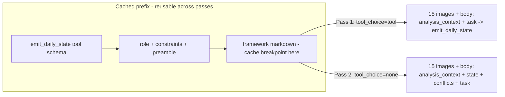

## SPX Two-Pass Prompt Overhaul

### Background

PR-1 ([spx-analyst/docs/PR-1-spx-daily-framework-migration.md](spx-analyst/docs/PR-1-spx-daily-framework-migration.md)) moved all numerics to Python (Step 0 precompute) and added deterministic post-Pass-1 enforcement ([spx-analyst/src/state_enforcement.py](spx-analyst/src/state_enforcement.py)), but the prompt text in [spx-analyst/src/prompts.py](spx-analyst/src/prompts.py) still carries pre-migration instructions that tell the model to compute/transcribe numbers the engine now owns and overwrites. The governing methodology [spx-analyst/framework/SPX-Daily-Analysis-Framework.md](spx-analyst/framework/SPX-Daily-Analysis-Framework.md) also still says "Calculate ..." throughout. We reconcile this in code (wrapper preamble) without editing the framework doc.

This is deliberately more than a prompt refactor: a prompt-and-client-only change cannot claim the fidelity conflicts are resolved, because [spx-analyst/src/state_enforcement.py](spx-analyst/src/state_enforcement.py) deterministically writes an inverted ERP signal into the decision matrix (C5 below), and Pass 2 contradiction is only partially guarded today. Scope therefore covers four source files plus tests:
- [spx-analyst/src/prompts.py](spx-analyst/src/prompts.py) - prompt wording (C1-C4, R1-R3, Q3-Q6).
- [spx-analyst/src/anthropic_client.py](spx-analyst/src/anthropic_client.py) - image caching (O1) and snapshot instrumentation (O6).
- [spx-analyst/src/state_enforcement.py](spx-analyst/src/state_enforcement.py) - ERP signal correctness (C5).
- [spx-analyst/src/validation.py](spx-analyst/src/validation.py) - always-on Pass 2 state-contradiction checks.

Scope still excludes any `DailyState` schema change and any edit to the framework markdown.

Optional split: if a single PR is too large, ship as two stacked PRs - PR-A (C5 enforcement fix + Pass 2 validation + tests; the fidelity-correctness half) and PR-B (prompt rewrite + caching + instrumentation; the efficiency/clarity half). Each is independently shippable and testable. Default is one PR unless reviewer prefers the split.

### Issue -> Solution map

Conflicts:
- C1 Framework "Calculate" verbs vs wrapper "do not recalculate". Fix: precompute-authority preamble in `load_system_role` reframing every framework "Calculate" as "interpret the precomputed value".
- C2 Pass 1 elaborately copies Monte Carlo numbers that `apply_precomputed_fields` overwrites wholesale. Fix: condense to one line stating the engine re-derives them; redirect effort to qualitative reads.
- C3 Pass 2 declares state immutable yet re-sends all charts and says "re-open charts" (drift risk caught only post-hoc by `_matrix_uniformly_directional`). Fix: bound chart re-reading to descriptive color + reconciliation; add explicit exposition-only lock.
- C4 Two close values in-prompt (manifest `7266.99` vs analysis_context `7266.990234375`). Fix: float rounding (Q6) makes them visually consistent; "validation only" label retained.
- C5 (live enforcement contradiction, not a prompt issue) `_erp_signal` in [spx-analyst/src/state_enforcement.py](spx-analyst/src/state_enforcement.py) maps `expanding -> "caution"` and `contracting -> "attractive"`, the opposite of the framework, which defines expanding ERP as "structural support improving" and contracting as "weakening" (framework lines 68-72; valuation posture lines 122-128 confirm higher/expanding ERP is supportive). The synced `ERP State and Trend` matrix signal is therefore inverted on every expanding/contracting day. Fix: swap the mapping to `expanding -> "attractive"`, `contracting -> "caution"`, `stable -> "neutral"`. The sample fixture uses `erp_trend="stable"`, so no existing test exercises the inverted branches; the fix is safe and gets new regression coverage.

Redundancy (no-ops because enforcement overwrites the output):
- R1 65/70/75 threshold map appears 4x (incl. injected JSON in Pass 1 task). Remove the injected JSON.
- R2 "Set spx_close from analysis_context" - overwritten. Remove as a numbered step.
- R3 7 of 18 matrix rows are model-built then overwritten by `sync_matrix_precomputed_rows`. Reframe so the model emits schema-valid placeholders and focuses on the 11 qualitative rows.

Quality / fidelity:
- Q3 Elevate `structural_bias` (the one non-overwritten, high-leverage Pass-1 output that selects the MC threshold) to the explicit primary task, justified against extension/ERP/credit/breadth.
- Q4 Pass 2 exposition-only lock: forbid introducing readings that contradict the validated state.
- Q5 Require Evidence Reconciliation to address each listed divergence by `id` (DIV-1, ...). Because `div.id` like `DIV-1` lowercases to `div-1`, this makes the existing `_conflict_addressed` token match in [spx-analyst/src/validation.py](spx-analyst/src/validation.py) fire for the right reason. See clarification 1 for the prompt-vs-gate split.
- Q6 Prompt-only rounding of analysis_context floats (float32 noise like `7266.990234375`, `7239.854907226562`) for cleaner echoes; persisted `analysis_context.json` unchanged.

Token optimization / observability:
- O1 (revised) Cross-pass system/tools caching. NOTE: image caching is NOT achievable here. Anthropic's cache prefix order is tools -> system -> messages; images live in the messages layer. Pass 1 forces the tool (`tool_choice: tool`) while Pass 2 must not, and a differing `tool_choice` invalidates the messages-layer cache, so the image prefix can never be read across the two passes (an image breakpoint would only add ~1.25x write cost on the largest segment). What IS reusable: if both passes send byte-identical `tools`, Pass 2 reads the framework + tool schema (tools+system layer, ~6k tokens) from Pass 1's cache despite the different `tool_choice`. Implementation: send `_state_tool()` on both passes; Pass 2 uses `tool_choice: none` so it still returns markdown. Do NOT add an image cache breakpoint. Net saving is modest (~a few k tokens/day), not the order-of-magnitude image reduction originally assumed.
- O5 (verify) The 2026-06-10 `request_snapshot.json` shows `framework_cached: false` despite the `prompt_cache_enabled=True` default in [spx-analyst/src/config.py](spx-analyst/src/config.py); confirm `SPX_PROMPT_CACHE_ENABLED` is actually on in the run environment.
- O6 (observability) `_snapshot` records `framework_cached` and `image_count`. (Dropped the `images_cached` flag: images are not cached, so it would always be false. Actual cache reuse is verified from `response.usage.cache_read_input_tokens` in the raw response, not the request snapshot.)

### Clarifications

1. Divergence-id coverage scope. The Pass 2 prompt instructs the model to address every listed divergence by id (all weights), because reconciling all surfaced conflicts is the desired report behavior. The validation gate stays weight-tiered to avoid false failures on minor conflicts: high-weight conflicts remain a hard requirement (existing `missing_high_weight_conflict`, escalated from warning to error on mixed days), while medium/low remain advisory. Net: prompt asks for all; CI/validation fails only when a high-weight conflict is unaddressed.

2. Precompute-owned matrix rows in Pass 1. Schema + `_validate_decision_matrix` require all 18 rows present with the exact `signal_layer` labels and a non-empty `Recommended Action`; `sync_matrix_precomputed_rows` then overwrites 7 of them (Structural Bias, Monte Carlo Threshold, Volatility Input, Drift Input, Rally Exhaustion Score, Monte Carlo Edge, ERP State and Trend). The prompt will therefore instruct: emit all 18 rows with correct labels, and for those 7 named rows put a brief placeholder (e.g. `"(engine-filled)"`) in `current_reading`/`signal` rather than reasoning out numbers. This preserves schema validity and validation pass while removing wasted prompt budget; the model spends effort only on the 11 qualitative rows.

### Caching prefix (O1)

Note: images are in the messages layer (after the breakpoint) and are NOT cached across passes — the differing `tool_choice` invalidates the messages-layer cache. Only the tools+system prefix (framework + tool schema) is reused on Pass 2.

### Concrete changes

1. [spx-analyst/src/state_enforcement.py](spx-analyst/src/state_enforcement.py) - C5
   - Fix `_erp_signal`: return `"attractive"` for `expanding`, `"caution"` for `contracting`, keep `"neutral"` for `stable`, `"unknown"` otherwise. One-line swap of the two branches; this is the only behavioral fix outside the prompt and is the reason scope cannot be prompt-only.

2. [spx-analyst/src/anthropic_client.py](spx-analyst/src/anthropic_client.py) - O1, O6
   - Factor `_state_tool()` so Pass 1 and Pass 2 send byte-identical tool definitions (required for the tools+system cache prefix to match).
   - `run_markdown_report` sends `tools=[_state_tool()]` with `tool_choice={"type": "none"}` so the framework + tool schema are read from Pass 1's cache while the model still returns markdown.
   - Do NOT add an image cache breakpoint (`_user_content` keeps appending images then body, no `cache_control`): images are messages-layer and the differing `tool_choice` invalidates that layer, so a breakpoint would only add write cost.
   - The text-only methods (`run_text_*`) do not use `_user_content`, so the Perplexity path is unaffected.
   - Net cache breakpoints: 1 (framework in system) - within Anthropic's limit of 4.
   - O6: `_snapshot(...)` records `image_count: int` (and existing `framework_cached`). Actual cross-pass reuse is confirmed from `response.usage.cache_read_input_tokens`, not the request snapshot.

3. [spx-analyst/src/prompts.py](spx-analyst/src/prompts.py) - C1, C2, R1-R3, Q3, Q4, Q5, Q6
   - Rewrite `HARD_CONSTRAINTS`: keep the "hold and monitor" line (test anchor); replace the long MC-copy bullet with one line establishing analysis_context as sole numeric truth and reframing all framework "Calculate" steps as "interpret precomputed value"; add a line stating the engine re-derives `spx_close`, the Monte Carlo block, and numeric matrix rows after Pass 1.
   - `load_system_role` returns role + the tightened constraints (this also flows into `migrate_perplexity.py`, which is consistent and desired).
   - `build_state_prompt` task: drop the injected `STRUCTURAL_BIAS_THRESHOLDS` JSON (R1) and the `spx_close` step (R2); restructure to prioritize (1) `structural_bias` with justification, (2) signals/alignment/confirming/conflicting evidence with `chart_refs`, (3) `primary_tension` + 2-4 sentence narrative, (4) all 18 matrix rows with exact labels, emitting the 7 precompute-owned rows as brief `"(engine-filled)"` placeholders (clarification 2); collapse numeric fields into one "schema-valid copy from analysis_context; the engine re-verifies, do not tune" line. Preserve substrings `emit_daily_state`, `structural_bias`, `analysis_context`, `PRE_STEP`.
   - `build_report_prompt` task: add exposition-only lock (Q4); bound "re-open charts" to descriptive/reconciliation use only (C3); require addressing each listed divergence by `id` in Evidence Reconciliation (Q5/clarification 1); reframe `mixed_note` as presentation guidance that does not alter validated values. Preserve substrings for all `WORKFLOW_STEPS`, `DECISION_MATRIX_ROWS`, `Updated Decision Matrix`, `Evidence Reconciliation`, and `primary_tension`.
   - Add a private `_round_floats(obj, places=4)` helper and apply it in `_analysis_context_block` to the dumped payload only (Q6). Keep the exact heading `Precomputed analysis context` (test anchor in `test_engine`).

4. [spx-analyst/src/validation.py](spx-analyst/src/validation.py) - Pass 2 contradiction gate
   - Add an always-on `_validate_state_consistency(report_md, daily_state)` invoked from `validate_report` whenever `daily_state` is provided (today most state-vs-report checks only run on mixed/hold days):
     - error if the validated `structural_bias` label does not appear anywhere in the report;
     - error if a different `StructuralBias` label is the only bias present (report asserts a regime contradicting state);
     - warning if the validated `recommended_action` text is not echoed near the Updated Decision Matrix.
   - Escalate `missing_high_weight_conflict` from warning to error on mixed days (clarification 1). Keep medium/low advisory.

5. Config / ops - O5
   - No code change to defaults. Verify `SPX_PROMPT_CACHE_ENABLED=true` in the live `.env`. Note 1-hour cache TTL as a possible future enhancement for cross-run framework reuse (out of scope here).

### Acceptance criteria

Functional:
- ERP matrix signal matches the framework on a synthetic expanding and a synthetic contracting day (regression test asserts `attractive` / `caution` respectively).
- A report that contradicts the validated `structural_bias` fails `validate_report` with an error (regression test).
- Full `pytest` green (62 existing + new tests).

Efficiency (measured on one representative live `run`, caching enabled), captured before vs after from API `response.usage`:
- Pass 1: `cache_creation_input_tokens` > 0 on the tools+system (framework) prefix (cache primed); functional output unchanged.
- Pass 2: `cache_read_input_tokens` covers the framework + tool schema (~6k tokens read from cache rather than re-billed as fresh input). Images remain fresh input on both passes (cannot be cached across passes given the forced-tool Pass 1 / free-text Pass 2 design).
- Net effect: a modest reduction in Pass 2 fresh input (~framework+tool tokens) with no image write-cost penalty. (The originally-claimed order-of-magnitude image reduction is not achievable here; pruning Pass 2 images is the real lever for image tokens and is a separate follow-up.)
- `output/<date>/request_snapshot.json` shows `framework_cached: true` for both passes.

Recording: note the before (current `main`) and after numbers for the same date and chart pack in the PR description; the before run can use the existing 2026-06-10 bundle as the baseline reference.

- ERP fix ([spx-analyst/tests/test_state_enforcement.py](spx-analyst/tests/test_state_enforcement.py)): add cases with `erp_trend="expanding"` (assert synced `ERP State and Trend` signal == `attractive`) and `erp_trend="contracting"` (== `caution`). Existing `stable` cases unaffected.
- Pass 2 contradiction ([spx-analyst/tests/test_validation_matrix.py](spx-analyst/tests/test_validation_matrix.py) or new `test_validation_consistency.py`): feed `validate_report` a report whose bias contradicts the validated state and assert an error issue; feed a consistent report and assert it passes; assert high-weight unaddressed conflict is now an error on a mixed day.
- Prompt wording ([spx-analyst/tests/test_prompt_builder.py](spx-analyst/tests/test_prompt_builder.py)): keep existing assertions; add assertions for the precompute-authority preamble in `system_role`, the Pass 2 exposition-only lock, the divergence-id coverage instruction, and the `(engine-filled)` placeholder guidance; assert the injected `STRUCTURAL_BIAS_THRESHOLDS` JSON and the `spx_close` step are gone (reduced Pass 1 numeric load).
- Rounding: assert `_round_floats` collapses `7266.990234375`-style values in the rendered `analysis_context` block while the persisted `analysis_context.json` (via `files.write_json`) is unchanged.
- Cache prefix + instrumentation (new `test_anthropic_caching.py`): verify `_system_blocks` marks the framework block with `cache_control` when enabled and not when disabled; verify `_state_tool()` is byte-stable (so both passes share the cache prefix); verify `_snapshot` reports `image_count` and `framework_cached`.
- [spx-analyst/tests/test_engine.py](spx-analyst/tests/test_engine.py): confirms `"Precomputed analysis context" in bundle.body` and records `body_chars` (no fixed-value assertion), so it remains green; run to confirm.
- Full `pytest` must stay green (62 existing + the new tests).
- Manual: a live `run` for one date, then inspect `output/<date>/request_snapshot.json` to confirm `framework_cached: true`, and confirm Pass 2 `response.usage.cache_read_input_tokens` reflects the framework+tool prefix; record before/after metrics for the acceptance criteria.

### Risks and mitigations

- Cache prefix only hits if Pass 2's tools+system bytes are identical to Pass 1 and within the 5-min TTL; both hold (sequential passes, `_state_tool()` byte-stable). Images are messages-layer and not reused across passes (differing `tool_choice`). If caching is disabled, behavior is unchanged (graceful no-op).
- Reduced Pass-1 numeric instruction could in theory yield a less-tuned `monte_carlo`, but enforcement overwrites it entirely, so output fidelity is unaffected.
- Rounding is applied only to the rendered prompt JSON, never to persisted `analysis_context.json`, so reproducibility artifacts are untouched.
- C5 ERP fix changes the synced `ERP State and Trend` signal on expanding/contracting days. This is the intended correction (it was previously wrong), but flag it in the PR as a visible output change for any historical-comparison consumers.
- New always-on Pass 2 consistency checks risk false failures (e.g. a report that legitimately omits the literal bias label). Mitigate by normalizing whitespace/slash spacing when matching the `StructuralBias` literals (handles `Late Bull / Topping` vs `Late Bull/Topping`) and keeping the recommended-action check a warning, not an error; validate against the existing 2026-06-10 report before enabling.
- Escalating `missing_high_weight_conflict` to error could fail previously-passing mixed-day reports; acceptable because Pass 2 prompt now explicitly requires divergence-id coverage, but call it out as a stricter gate.

### Out of scope

- Editing the framework markdown (handled via wrapper preamble per decision).
- Any `DailyState`/web/schema change (e.g. `structural_bias_rationale`).
- Pruning Pass 2 images. This is now the only real lever for image tokens (caching cannot reuse images across the two passes) and is a recommended follow-up PR, but is out of scope here to keep the change focused.