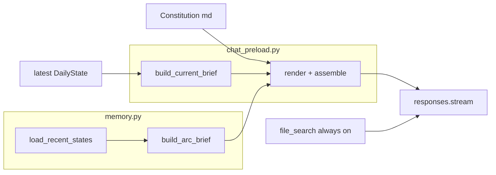

# Deterministic compact chat preload

**Status: directionally approved.** One implementation pass remains — tighten guardrails so the compact contract is implemented faithfully, not approximately.

**This PR does not add any intent router, heuristic selector, or pre-classifier; the fix is deterministic prompt compaction, not query classification.**

## Core contract (preserve exactly)

```text
every turn (deterministic, identical shape) =
  constitution
  + current_brief      (authoritative present-tense house view)
  + arc_brief          (compressed regime continuity)
  + file_search        (always enabled — historical expansion inside main Responses call)
```

No routing. No `user_message` input to `build_additional_instructions()`. No conditional layers.

---

## Problem (before)

[`build_additional_instructions()`](spx-analyst/src/chat_preload.py) today:

```text
constitution + full latest-run block + full recent_summary.md
```

Measured on 2026-06-25 ([`docs/chat-api-payload-example-2026-06-25.md`](spx-analyst/docs/chat-api-payload-example-2026-06-25.md)): **18,350 chars / ~4,837 tokens**. Over-anchors the assistant to today's full dump.

PR-10 authority order stays unchanged. Fix is **serialization**, not a new architecture.

---

## Target design (after)



---

## Module placement (resolved — no ambiguity)

| Responsibility | Module | Rationale |
|----------------|--------|-----------|
| `build_arc_brief(states) -> ArcBrief` | **[`memory.py`](spx-analyst/src/memory.py) only** | PR-3 owns rolling memory; reuses `_regime_arc`, `_build_unresolved_watchlist`, `_action_for_state` |
| `build_current_brief(state) -> CurrentBrief` | [`chat_preload.py`](spx-analyst/src/chat_preload.py) | Chat authority layer; reads latest `DailyState` |
| `render_arc_brief(arc) -> str` | [`chat_preload.py`](spx-analyst/src/chat_preload.py) | Prompt assembly lives with other renderers |
| `render_current_brief(brief) -> str` | [`chat_preload.py`](spx-analyst/src/chat_preload.py) | Same |
| `build_additional_instructions()` | [`chat_preload.py`](spx-analyst/src/chat_preload.py) | Orchestrates constitution + both briefs |

**Do not** split `build_arc_brief` across modules. **Do not** parse or inject `recent_summary.md` in chat preload — build arc from `load_recent_states()` at assembly time.

`recent_summary.md` generation via `rebuild_rolling_summary()` remains unchanged for engine Pass 1/2 and operator audit.

---

## Current brief (`CurrentBrief`)

Built in `chat_preload.py` from latest `DailyState` only. **Authoritative for present-tense posture** (PR-10 gate preserved).

### Typed fields

| Field | Source |
|-------|--------|
| `latest_run_date` | `state.date` |
| `spx_close` | `state.spx_close` — one line; preserves PR-10 posture canary ("as of date at level X") |
| `structural_bias` | `state.structural_bias` |
| `recommended_action` | matrix "Recommended Action" `.signal` |
| `overall_signal_balance` | matrix "Overall Signal Balance" `.signal` (one line) |
| `key_risks_or_tensions` | max **3** bullets from `primary_tension` (first sentence) + top `conflicting_evidence` one-liners — **never** full `what_changed_today` |
| `key_trigger_levels` | only if in state: MC upside/downside/cascade + leverage row snippet |
| `authoritative_rows` | max **5** rows, **2 columns** (layer + signal): Structural Bias, Overall Signal Balance, Trend Regime (from `state.trend_regime` truncated — **not** duplicated as separate key-value field), Recommended Action, + fifth risk row per rule below |

### Serialization caps (`CurrentBriefCaps` constants in `schemas.py`)

| Cap | Value | Enforced at |
|-----|-------|-------------|
| `MAX_RISK_BULLETS` | 3 | `build_current_brief` |
| `MAX_RISK_BULLET_CHARS` | 120 | truncate with `…` |
| `MAX_MATRIX_ROWS` | 5 | row selection |
| `MAX_TREND_REGIME_CHARS` | 160 | truncate |
| `MAX_RENDERED_CHARS` | **1,400** | `render_current_brief` — hard fail in dev/test if exceeded |

**Encoding:** one compact markdown table only. **Never** matrix JSON in assembled prompt.

**Fifth risk row (deterministic — no heuristic):** include Leverage Risk State if that row's `signal` contains `caution`, `liquidation`, or `nervous` (case-insensitive); otherwise Monte Carlo Edge.

**Production cap overflow:** truncate at build/render time with `…`; never raise in production. Tests assert rendered output stays within caps on live memory when present.

---

## Arc brief (`ArcBrief`)

Built in **`memory.py`** via `build_arc_brief(states: list[DailyState]) -> ArcBrief`. **Not** a passthrough of `recent_summary.md`.

### Typed fields

| Field | Derivation |
|-------|------------|
| `regime_arc` | `_regime_arc(states)` — one line |
| `session_snapshots` | list of `{date, bias, action, tension_fragment}` — see caps |
| `unresolved_watchlist` | `_build_unresolved_watchlist(states)` — one line |

### Session snapshot line format

```text
{date} | {structural_bias} | {normalized_action} | {tension_fragment}
```

`tension_fragment` = first sentence of `primary_tension`, capped — **not** full tension paragraph, **not** `changed:` / `signals:` / `conflicts:` blocks from PR-3 per-day format.

**Latest session overlap (decided):** include the latest run date in arc snapshots — full 6-session window for timeline continuity. Constitution must state: **current brief wins** for present-tense posture when arc and current brief disagree on the same date.

### Serialization caps (`ArcBriefCaps` constants in `schemas.py`)

| Cap | Value | Enforced at |
|-----|-------|-------------|
| `MAX_SESSIONS` | 6 | matches default `SPX_RECENT_STATE_COUNT` |
| `MAX_TENSION_FRAGMENT_CHARS` | 80 | per snapshot line |
| `MAX_WATCHLIST_CHARS` | 400 | truncate watchlist line |
| `MAX_RENDERED_CHARS` | **1,200** | `render_arc_brief` — hard fail in test if exceeded |

### Forbidden in rendered arc brief (regression guards)

Must **not** appear in `render_arc_brief` output:

- `changed:` prefix lines (full PR-3 delta replay)
- `signals: F&G` categorical lines
- `conflicts:` detail lines
- `decision_matrix.rows (JSON)`
- Per-day blocks starting with `### {date}` followed by multi-paragraph tension

---

## Constitution trim

Update [`framework/chat-assistant-instructions.md`](spx-analyst/framework/chat-assistant-instructions.md):

- PR-10 authority stack order unchanged.
- Layer 1 = **current brief** (authoritative). Layer 2 = **arc brief** (continuity, not authority). Layer 3 = `file_search` (historical).
- Refusal to override latest recommended action retained.
- No evidence modes, no query-dependent variants.

Target constitution size: **≤ 2,000 rendered chars** after trim.

---

## Assembly contract

Signature unchanged:

```python
def build_additional_instructions(
    settings: Settings | None = None,
) -> ChatPreloadContext: ...
```

```python
from src.memory import build_arc_brief, load_recent_states

states = load_recent_states(settings=settings)
brief = build_current_brief(load_latest_daily_state(settings))
arc = build_arc_brief(states)

parts = [
    load_instructions(settings),
    "",
    render_current_brief(brief),
    "",
    render_arc_brief(arc),
]
additional_instructions = "\n".join(parts).strip()
```

[`chat_service.py`](spx-analyst/src/chat_service.py): **no change** — still `build_additional_instructions(self.settings)`.

[`openai_responses.py`](spx-analyst/src/openai_responses.py): **no change** — `file_search` always enabled.

---

## `ChatPreloadContext` migration (explicit)

### Before (today)

```python
class ChatPreloadContext(BaseModel):
    instructions: str           # constitution
    latest_run: LatestRunState  # full typed state dump source
    rolling_summary: str        # full recent_summary.md text
    additional_instructions: str
```

### After

```python
class ChatPreloadContext(BaseModel):
    instructions: str              # constitution only (unchanged semantics)
    current_brief: CurrentBrief    # NEW — authoritative slice
    arc_brief: ArcBrief            # NEW — compressed continuity
    additional_instructions: str   # assembled bundle (unchanged field name)
```

### Removed from `ChatPreloadContext`

| Field | Action |
|-------|--------|
| `latest_run: LatestRunState` | **Remove** from context model |
| `rolling_summary: str` | **Remove** from context model |

### Kept elsewhere (internal compatibility — not on context)

| Symbol | Location | Status |
|--------|----------|--------|
| `LatestRunState` | `schemas.py` | **Keep** — may be used by tests/fixtures; not serialized into chat preload |
| `build_latest_run_state()` | `chat_preload.py` | **Deprecate** — remove callers; delete if unused after migration |
| `build_latest_run_block()` | `chat_preload.py` | **Delete** — replaced by `render_current_brief` |
| `load_rolling_summary()` | `chat_preload.py` | **Remove from chat path** — function may remain if used elsewhere; grep and delete if chat-only |
| `load_latest_daily_state()` | `chat_preload.py` | **Keep** |
| `find_latest_run_date()` | `chat_preload.py` | **Keep** |
| `answer_posture_from_preload()` | `chat_preload.py` | **Update** — read `context.current_brief` only |

### Assembled prompt — removed content

These strings must **not** appear in `additional_instructions` after migration:

- `decision_matrix.rows (JSON)`
- `what_changed_today:` block (full list)
- `## Rolling summary (multi-day arc)` + full `recent_summary.md` body
- `## Latest-run state (authoritative for current posture)` monolithic block
- Full 18-row matrix table

Update [`chat_context.py`](spx-analyst/src/chat_context.py) `load_chat_preload()` — returns new shape; no downstream breakage expected (only tests + chat_service use it).

---

## Compactness acceptance (product outcome, not relative-only)

Baseline: **18,350 chars / ~4,837 tokens** ([payload example](spx-analyst/docs/chat-api-payload-example-2026-06-25.md)).

### Hard budgets (2026-06-25 fixture, `o200k_base`)

Enforce in `tests/test_chat_preload.py` using **live memory when present** (`memory/daily_states/`); **`pytest.skip` when absent** (CI without seeded memory). Minimal `SAMPLE_STATE` used for structural/authority tests only — not for budget caps.

Optional follow-up (out of scope): pinned snapshot for CI budget enforcement.

| Layer | Max chars | Max tokens (approx) |
|-------|-----------|---------------------|
| Constitution (`instructions`) | 2,000 | 500 |
| Current brief (rendered) | 1,400 | 350 |
| Arc brief (rendered) | 1,200 | 300 |
| **Total `additional_instructions`** | **5,000** | **1,500** |

**Product outcome encoded in tests:**

1. Total instructions **≤ 5,000 chars AND ≤ 1,500 tokens** — forces ~73% reduction vs baseline, not merely "smaller than 18k".
2. Arc brief rendered size **< 50% of** full `build_recent_summary(states)` length on same fixture — proves compression, not replay.
3. Current brief contains authority fields; arc brief contains `regime_arc` + watchlist; neither contains forbidden replay markers (see Arc brief forbidden list).
4. Preload-only posture canary still passes without `file_search`.

If implementation lands slightly under caps, **do not loosen caps** — caps are the contract ceiling.

---

## Tests

### [`tests/test_chat_preload.py`](spx-analyst/tests/test_chat_preload.py)

- PR-10 posture canary from `current_brief` only
- Total char + token budget (tiktoken `o200k_base`)
- Per-layer rendered caps
- No `decision_matrix.rows (JSON)` in assembled prompt
- No `changed:` / `signals:` / `conflicts:` in arc section
- No full rolling summary injection (`### 2026-06-15` multi-block replay pattern absent)
- `arc_brief` shorter than `build_recent_summary` on same states

### [`tests/test_arc_brief.py`](spx-analyst/tests/test_arc_brief.py) (new, in `memory` test suite)

- `build_arc_brief` deterministic from fixture states
- Respects `ArcBriefCaps.MAX_SESSIONS` and fragment length caps
- Reuses `_regime_arc` / watchlist output faithfully in compressed form

### [`tests/test_web_chat_api.py`](spx-analyst/tests/test_web_chat_api.py)

- Fake client receives `latest_run_date` in instructions
- Instructions length under total budget
- **No service signature change**

---

## Docs

- [`spx-analyst/docs/PR-15-compact-chat-preload.md`](spx-analyst/docs/PR-15-compact-chat-preload.md) — migration table, caps, before/after vs PR-10 + PR-3
- Regenerate [`spx-analyst/docs/chat-api-payload-example-2026-06-25.md`](spx-analyst/docs/chat-api-payload-example-2026-06-25.md) with new single-shape payload + per-layer token counts
- Update [`spx-analyst/docs/research-assistant-operator-guide.md`](spx-analyst/docs/research-assistant-operator-guide.md)

---

## Acceptance criteria

- [ ] **Deterministic:** constitution + current_brief + arc_brief every turn; no router/selector/pre-classifier
- [ ] **Placement:** `build_arc_brief()` lives in `memory.py` only
- [ ] **PR-10 authority:** present-tense posture from `current_brief` without vector retrieval
- [ ] **PR-3 continuity:** arc brief compressed from rolling memory primitives; not `recent_summary.md` replay
- [ ] **Caps enforced:** per-layer and total budgets pass on 2026-06-25 fixture
- [ ] **Schema migration:** `ChatPreloadContext` has `current_brief` + `arc_brief`; `latest_run` + `rolling_summary` removed
- [ ] **No duplicate matrix encoding** in assembled prompt
- [ ] **file_search** unchanged — always enabled for historical expansion

---

## Files touched

| File | Change |
|------|--------|
| [`src/schemas.py`](spx-analyst/src/schemas.py) | `CurrentBrief`, `ArcBrief`, cap constants; migrate `ChatPreloadContext` |
| [`src/memory.py`](spx-analyst/src/memory.py) | **`build_arc_brief()`** + private `_tension_fragment()` helper |
| [`src/chat_preload.py`](spx-analyst/src/chat_preload.py) | `build_current_brief`, renderers, compact assembly; delete `build_latest_run_block` |
| [`framework/chat-assistant-instructions.md`](spx-analyst/framework/chat-assistant-instructions.md) | Three-layer constitution |
| [`tests/test_chat_preload.py`](spx-analyst/tests/test_chat_preload.py) | Budget + authority + forbidden-content guards |
| [`tests/test_arc_brief.py`](spx-analyst/tests/test_arc_brief.py) | **New** |
| [`tests/test_web_chat_api.py`](spx-analyst/tests/test_web_chat_api.py) | Budget check only |
| Docs | PR-15, payload example, operator guide |

**Unchanged:** `chat_service.py`, `openai_responses.py`, `rag_index.py`, `rebuild_rolling_summary()`, Next.js UI.

**Explicitly not added:** `chat_evidence.py`, `EvidenceMode`, keyword routing, `user_message` on builder.

---

## Sharpen-plan review (stress-test)

### Decisions locked

| Question | Decision |
|----------|----------|
| Include `spx_close` in current brief? | **Yes** — one line; posture canary preserved |
| Latest date in arc snapshots? | **Yes** — full 6-session window; current brief wins on conflict |
| Budget test fixture | **Live memory when present; skip if absent** |

### Residual risks (accepted or mitigated)

| Risk | Mitigation |
|------|------------|
| Arc brief every turn still re-injects regime context (~1,200 chars) | Caps + forbidden replay markers; much smaller than 2,600-token rolling summary; product chose deterministic continuity over routing |
| Real 2026-06-25 text may hit caps | Truncate at build time; tune caps only if live-memory test fails after implementation — do not loosen preemptively |
| Matrix row questions without full 18 rows | Current brief includes 5 authoritative rows; constitution instructs model to use `file_search` for historical matrix prose, not invent rows |
| `tiktoken` not in requirements | Budget token test uses `tiktoken` if installed, else char caps only + manual token count in payload example doc |
| `LatestRunState` orphaned | Delete `build_latest_run_state` / `build_latest_run_block` if grep shows no callers; keep `LatestRunState` type only if tests still need it |

### Open questions (no blockers — implement with defaults)

| Question | Recommended default |
|----------|---------------------|
| Drop `LatestRunState` from schemas entirely? | Remove builders first; delete type if zero references |
| Constitution still require naming matrix rows by label? | Yes for current brief rows only; drop "full Updated Decision Matrix" language |
| `answer_posture_from_preload` include close? | Yes — `"SPX close {spx_close}"` from `current_brief` |
