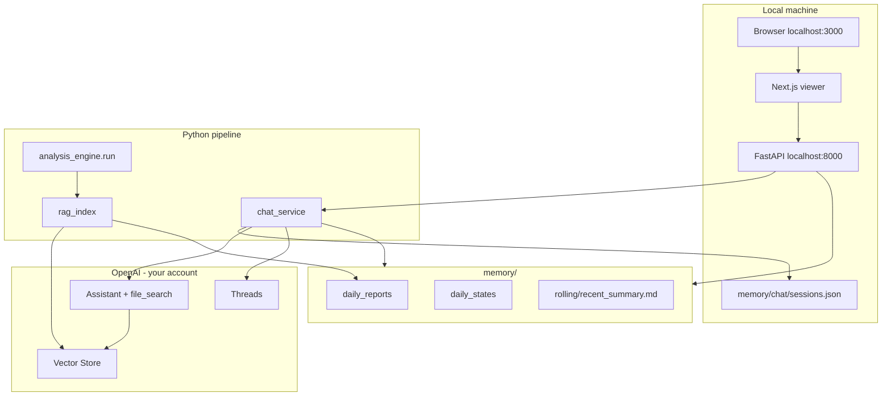

# Local research assistant (OpenAI Threads, personal use)

**Status:** **Phase 4 complete** — operator guide + E2E checklist. **Plan complete** for v1 local research assistant; open follow-up: `phase1.1-reindex-cleanup`.

**Open follow-up (not blocking Phase 2):** additive re-index cleanup — delete prior vector files from manifest before re-upload ([phase1.1-reindex-cleanup](#open-follow-up)).

**Builds on:** daily analysis engine (`memory/`, `DailyState`, Updated Decision Matrix), existing local Next.js viewer + FastAPI, [PR-10](../spx-analyst/docs/PR-10-research-assistant-phase1.md)

**Phase 1 first step:** Define `LatestRunState` / `ChatPreloadContext` in Pydantic with unambiguous matrix authority (see [Matrix source](#matrix-source-authoritative)). Then preload, RAG, hook, canary tests. **No UI until Phase 2 CLI REPL proves the authority model.**

**Out of scope:** Supabase, Stripe, subscription gating, marketing pages, Vercel production deploy, multi-user auth.

---

## Decision summary

| Area | Choice |
|------|--------|
| Audience | **Single operator (you)** — localhost only |
| LLM + RAG | OpenAI Assistants API: one Assistant + Vector Store + `file_search` |
| API key | Your `OPENAI_API_KEY` in `spx-analyst/.env` (never committed) |
| Conversation state | OpenAI **Threads** (messages on OpenAI) |
| Session index | **Local file store** — `memory/chat/sessions.json` maps `session_id` → `openai_thread_id`, title, timestamps |
| Chat runtime | **Python** — `chat_service.py` + [`spx-analyst/src/web/app.py`](spx-analyst/src/web/app.py) FastAPI routes |
| UI | **Next.js local dev** (`localhost:3000`) → FastAPI (`localhost:8000`) for chat + reports |
| Report data | FastAPI reads `memory/` (existing [`service.py`](spx-analyst/src/web/service.py)); no cloud deploy |
| Index failure | **`fail_run`** when `index-rag` fails — OpenAI keys always in `.env`; indexing runs after every successful analysis |
| Preload | Authority-ordered: instructions + latest-run state block + rolling summary |
| Historic retrieval | Vector `file_search` over report **sections** (~9/day); `state.json` not uploaded |
| Assistant role | Explain/compare published analyses — not a shadow analyst |



---

## Architecture

### What lives where

| Layer | Location | Role |
|-------|----------|------|
| Canonical analysis | `memory/daily_reports/`, `daily_states/`, `rolling/` | Source of truth; never mutated by chat |
| RAG index manifest | `memory/rag/{date}.json` | OpenAI file IDs per section |
| Chat session index | `memory/chat/sessions.json` | Local thread registry (not messages) |
| Messages | OpenAI Threads | Conversation history |
| Vector sections | OpenAI Vector Store | Historical retrieval only |

**No Supabase, no Stripe, no auth layer.** Security = bind servers to `127.0.0.1` only.

### Authority stack (unchanged)

| Priority | Source | Use for |
|----------|--------|---------|
| **1** | Latest `memory/daily_states/{latest}-state.json` (`DailyState`) | Current posture, bias, recommended action, **`decision_matrix.rows`**, Monte Carlo |
| **2** | Same-date report prose (via retrieval if needed) | Narrative nuance |
| **3** | `rolling/recent_summary.md` | Multi-day arc |
| **4** | Vector-retrieved **historical** sections | Cross-date comparison |

**Rule:** Present-tense posture answers come from **preload only**, never retrieval alone.

### Matrix source (authoritative)

**`decision_matrix.rows` and all current-state fields come from `DailyState` JSON only** — loaded from `memory/daily_states/{latest_run_date}-state.json`.

- `LatestRunState.decision_matrix` is a typed copy of `DailyState.decision_matrix` (same row model as engine).
- `recommended_action` is derived from the matrix row whose `signal_layer` is `"Recommended Action"` (same rule as [`DailyState.decision_matrix.recommended_action`](spx-analyst/src/schemas.py)).
- **Same-date report** (`daily_reports/{date}-analysis.md`) is **not** parsed for matrix content in preload. Optional **validation only:** after loading state, assert the report’s `Updated Decision Matrix` section exists; log/warn on mismatch — do not merge report markdown into preload.
- Preload serializes structured rows to the model (JSON or fixed table text generated from rows). **Never** inject rendered report markdown as the authoritative matrix.

### Current-state contract

Every Assistants run injects `LatestRunState` built by [`chat_preload.py`](spx-analyst/src/chat_preload.py):

- `latest_run_date`, `structural_bias`, `spx_close`, `signal_alignment`, **`decision_matrix.rows`** (from `DailyState`), Monte Carlo summary, `what_changed_today`, `recommended_action`

Assistant must:

1. **Name `latest_run_date` explicitly** for present-tense answers
2. **Cite the Updated Decision Matrix** — see [Citation rule](#citation-rule-updated-decision-matrix) below
3. **Distinguish** latest run vs historical retrieved context
4. **Refuse** to override the latest published recommended action

### Citation rule (Updated Decision Matrix)

When the assistant cites “the Updated Decision Matrix” for **current** posture:

- **Primary:** reference structured preload rows — e.g. “Recommended Action row: …”, “Structural Bias row: …”, with `latest_run_date`
- **Prose:** explain rows in natural language; **do not** quote long passages from the same-date report as if they were the authority
- **Historical dates:** may quote retrieved report section text, labeled “historically on {date}”

**Tests:** canary asserts preload contains matrix rows from fixture `DailyState`; manual check that current-posture replies name date + action row without requiring `file_search`.

### Local concurrency

**Single-process operator use only.** One analysis run or one chat session writer at a time. `memory/chat/sessions.json` uses atomic write (write temp + rename); no file locking. Do not run two `uvicorn` writers or parallel `index-rag` on the same date.

### Thread model

- Start **new threads freely** — no per-day binding
- **New thread:** OpenAI `threads.create` → append to `memory/chat/sessions.json`
- **Resume:** load `thread_id` from local store → fetch messages from OpenAI → stream next run
- **Delete:** remove local row + `threads.delete` on OpenAI

### Preload contract (every Assistants run)

Via `additional_instructions`:

1. Static instructions ([`chat-assistant-instructions.md`](spx-analyst/framework/chat-assistant-instructions.md))
2. Latest-run state block (`LatestRunState` serialized)
3. Rolling summary

### Vector indexing (Python, post-run)

[`rag_index.py`](spx-analyst/src/rag_index.py) — unchanged from prior plan:

- Split by `INVESTOR_REPORT_SECTIONS`; one file per section; preamble metadata for upload only
- Hook after `rebuild_rolling_summary()`; **`fail_run`** if `index-rag` fails
- **OpenAI always configured:** `OPENAI_API_KEY`, `OPENAI_ASSISTANT_ID`, and `OPENAI_VECTOR_STORE_ID` live in `spx-analyst/.env` for both chat and indexing — no skip-if-unset path
- CLI: `python -m src.cli index-rag --backfill`

### Indexing failure (simple operator recovery)

Index runs **last** in the daily pipeline (after `memory/` is saved). If upload fails, the run exits with an error — **`memory/` stays fresh**; only the vector store is behind.

**On failure — one terminal message (copy-paste retry):**

```text
ERROR: RAG indexing failed for 2026-06-25 (report saved to memory/).
Retry: python -m src.cli index-rag --date 2026-06-25
```

That’s the full v1 notification: non-zero exit + the line above on stderr. No email, no UI banner, no extra tooling.

**Document in README / PR doc:**

```bash
python -m src.cli index-rag --date YYYY-MM-DD   # re-upload one day
python -m src.cli index-rag --backfill            # upload all memory/daily_reports/
```

Optional: one line in `run_log.json` (`index_rag: failed`) for your own audit — not required for operator workflow.

**Manual recovery:** paste the retry command from the error — does not re-run analysis.

---

## Local session store

**File:** `memory/chat/sessions.json`

```json
{
  "sessions": [
    {
      "id": "550e8400-e29b-41d4-a716-446655440000",
      "openai_thread_id": "thread_abc123",
      "title": "Trim vs hold discussion",
      "created_at": "2026-06-25T10:00:00Z",
      "updated_at": "2026-06-25T10:15:00Z"
    }
  ]
}
```

- Single-user: no `user_id` field
- [`chat_sessions.py`](spx-analyst/src/chat_sessions.py) (new): CRUD + atomic write
- Add `memory/chat/` to `.gitignore` (session index is personal/ephemeral; optional: commit if you want thread list in git)

---

## FastAPI routes (extend existing app)

| Route | Purpose |
|-------|---------|
| `GET /api/chat/sessions` | List local sessions |
| `POST /api/chat/sessions` | New thread + local row |
| `GET /api/chat/sessions/{id}/messages` | Proxy OpenAI thread messages |
| `PATCH /api/chat/sessions/{id}` | Rename title |
| `DELETE /api/chat/sessions/{id}` | Delete local + OpenAI thread |
| `POST /api/chat/sessions/{id}/messages` | User message → stream Assistants run |

Existing report routes unchanged: `GET /api/runs`, `GET /api/runs/{date}`.

**Chat run flow:**

```text
POST /api/chat/sessions/{id}/messages  { "content": "..." }
→ chat_preload.build_additional_instructions()
→ threads.messages.create(user)
→ assistants.runs.stream(assistant_id, thread_id, additional_instructions=...)
→ SSE/stream to client
→ update session.updated_at; auto-title on first message
```

Implement OpenAI client in [`openai_assistant.py`](spx-analyst/src/openai_assistant.py); wire [`chat_service.py`](spx-analyst/src/chat_service.py).

---

## Local UI (Next.js)

**Run locally only:**

```bash
# terminal 1
cd spx-analyst && uvicorn src.web.app:app --reload --port 8000

# terminal 2
cd spx-analyst/web && npm run dev
```

| Route | Purpose |
|-------|---------|
| `/` | Redirect to latest run (unchanged) |
| `/runs/[date]`, `/archive` | Report reader (unchanged, no gate) |
| `/assistant` | Chat: conversation sidebar + message pane |
| `/assistant/[sessionId]` | Deep-link resume |

**Dependencies:** `ai`, `@ai-sdk/react` (optional), shadcn chat components — **no** Supabase/Stripe.

Header link via [`assistant-link.tsx`](spx-analyst/web/components/chat/assistant-link.tsx); placeholder removed. Chat helpers in [`web/lib/chat-api.ts`](spx-analyst/web/lib/chat-api.ts) (dev proxy to FastAPI).

---

## Python / engine files

| File | Change | Phase |
|------|--------|-------|
| [`schemas.py`](spx-analyst/src/schemas.py) | `LatestRunState`, `ChatPreloadContext`; `ChatSessionContext` kept for stub | 1 ✅ |
| [`chat_preload.py`](spx-analyst/src/chat_preload.py) | `build_latest_run_block()`, assemble `additional_instructions` | 1 ✅ |
| [`rag_index.py`](spx-analyst/src/rag_index.py) | Section split, OpenAI upload, manifest, `index_rag_or_fail()` | 1 ✅ |
| [`openai_assistant.py`](spx-analyst/src/openai_assistant.py) | Assistants client: threads, runs.stream, file_search | 2 |
| [`chat_sessions.py`](spx-analyst/src/chat_sessions.py) | Local JSON session store | 2 |
| [`chat_service.py`](spx-analyst/src/chat_service.py) | Orchestrate preload + thread + stream | 2 |
| [`chat_context.py`](spx-analyst/src/chat_context.py) | Thin wrapper → `chat_preload`; `load_chat_context()` deprecated | 1 ✅ |
| [`web/app.py`](spx-analyst/src/web/app.py) | Chat routes + SSE streaming | 2–3 |
| [`analysis_engine.py`](spx-analyst/src/analysis_engine.py) | `index_rag_or_fail` hook; fail on error | 1 ✅ |
| [`migrate_perplexity.py`](spx-analyst/src/migrate_perplexity.py) | Conditional RAG hook (investor sections only) | 1 ✅ |
| [`cli.py`](spx-analyst/src/cli.py) | `index-rag`, interactive `chat` REPL optional | 1 partial / 2 |
| [`config.py`](spx-analyst/src/config.py) | `OPENAI_*` env vars | 1 ✅ |
| [`framework/chat-assistant-instructions.md`](spx-analyst/framework/chat-assistant-instructions.md) | Authority stack + behavior rules | 1 ✅ |

---

## Implementation phases

### Phase 1 — RAG + preload (Python only) **← complete ([PR-10](../spx-analyst/docs/PR-10-research-assistant-phase1.md))**

1. **Spec in code first:** `LatestRunState`, `ChatPreloadContext` in [`schemas.py`](spx-analyst/src/schemas.py) — matrix from `DailyState` only (see [Matrix source](#matrix-source-authoritative))
2. [`chat_preload.py`](spx-analyst/src/chat_preload.py) — `build_latest_run_block()`, `build_additional_instructions()`; optional report-matrix validation warn
3. [`framework/chat-assistant-instructions.md`](spx-analyst/framework/chat-assistant-instructions.md) — authority stack + citation rule
4. [`rag_index.py`](spx-analyst/src/rag_index.py) — section split on `INVESTOR_REPORT_SECTIONS`, OpenAI upload, `memory/rag/{date}.json` manifest
5. [`analysis_engine.py`](spx-analyst/src/analysis_engine.py) hook after `rebuild_rolling_summary()`; **`fail_run`** on index failure + stderr retry hint
6. [`cli.py`](spx-analyst/src/cli.py) — `index-rag --date`, `--backfill`
7. Refactor [`chat_context.py`](spx-analyst/src/chat_context.py) → thin wrapper over preload (deprecate date-anchored full-report load)
8. [`config.py`](spx-analyst/src/config.py) — OpenAI env vars

**Exit gate:** `test_chat_preload.py` + `test_rag_index.py` pass; **preload-only posture canary** — "what is posture now?" answerable from `LatestRunState` without retrieval. **No UI, no Threads, no FastAPI chat routes.** ✅

#### Phase 1 deviations (final record)

| Plan | Shipped | Notes |
|------|---------|-------|
| Engine-only index hook | `index_rag_or_fail()` shared helper | Also used by `migrate_perplexity.py` when report has all 9 investor sections; legacy migration reports skip with warning |
| Deprecate `ChatSessionContext` | Deprecate `load_chat_context()` only | Schema kept for Phase 2 stub |
| — | OpenAI errors wrapped as `RagIndexError` | Review fix: stderr retry on API/network failures |
| — | `answer_posture_from_preload()` | Explicit canary helper for exit gate |
| Re-index replaces vector files | Additive re-index only | **Open follow-up** — delete stale vector files via manifest before re-upload (Phase 1.1) |
| Phase 4 README / `.env` | Shipped in PR-10 | Full OpenAI setup guide still Phase 4 |
| Optional `run_log.index_rag` | Not implemented | stderr retry is v1 operator notification |

#### Open follow-up

**Additive re-index cleanup (Phase 1.1 — not blocking Phase 2):** Re-running `index-rag --date` uploads new section files and overwrites `memory/rag/{date}.json`, but does **not** delete prior OpenAI file IDs from the vector store. Local manifest is latest truth; remote store can accumulate stale duplicates. Fix: before upload, read existing manifest and delete listed files from the vector store (best-effort). Tracked as plan todo `phase1.1-reindex-cleanup`.

### Phase 2 — Chat engine (Python) **← complete**

- `openai_assistant.py`, `chat_sessions.py`, implement `chat_service.py`
- FastAPI chat routes with SSE streaming
- **Phase 2 exit gate:** interactive CLI REPL (`python -m src.cli chat`) + FastAPI routes work; Next.js UI deferred to Phase 3 ✅

### Phase 3 — Local UI **← complete ([PR-12](../spx-analyst/docs/PR-12-research-assistant-phase3.md))**

- `/assistant` + `/assistant/[sessionId]` — session sidebar, streaming composer
- `AssistantLink` in layout header; placeholder removed
- `web/lib/chat-api.ts` — fetch + SSE parser (no `ai` SDK)

### Phase 4 — Docs **← complete ([PR-13](../spx-analyst/docs/PR-13-research-assistant-phase4.md))**

- [`research-assistant-operator-guide.md`](../spx-analyst/docs/research-assistant-operator-guide.md) — setup, E2E, troubleshooting
- `scripts/setup_openai_assistant.py` — one-time vector store + assistant
- `.env.example` + README cross-links

---

## OpenAI one-time setup (local `.env`)

1. Create Vector Store (`max_chunk_size_tokens: 1024`)
2. Create Assistant with `file_search` + vector store
3. Set in `spx-analyst/.env`:
   - `OPENAI_API_KEY`
   - `OPENAI_ASSISTANT_ID`
   - `OPENAI_VECTOR_STORE_ID`
4. `python -m src.cli index-rag --backfill`

---

## Testing strategy

| Layer | Tests |
|-------|-------|
| Python | `test_rag_index.py`, `test_chat_preload.py` — **mandatory preload-only posture canary** |
| Python | `test_chat_sessions.py` — local JSON CRUD |
| Python | `test_web_chat_api.py` — FastAPI routes with mocked OpenAI |
| Manual | Local UI: new thread → "what is posture now?" (no retrieval needed) → historic question → resume thread |

---

## Env vars

**`spx-analyst/.env` only:**

- `OPENAI_API_KEY`
- `OPENAI_ASSISTANT_ID`
- `OPENAI_VECTOR_STORE_ID`
- Existing engine vars unchanged

No Supabase, Stripe, or Vercel secrets.

---

## Acceptance criteria

### Local platform
- [x] `uvicorn` + `npm run dev` serve reports and assistant on localhost — PR-12
- [x] No auth prompts; no external services except OpenAI — PR-11/PR-12
- [x] Create/resume/rename/delete threads; sessions persist in `memory/chat/sessions.json` — PR-11
- [x] Index failure: stderr shows copy-paste `index-rag --date` retry; command documented in README — PR-10
- [x] Chat UI streams markdown replies — PR-12

### Authority (required — Phase 1 canary + Phase 2 behavior)
- [x] `LatestRunState.decision_matrix.rows` sourced **only** from `DailyState` JSON (tests enforce) — PR-10
- [x] Every run injects latest-run state block + rolling summary + instructions — PR-10 (preload API; Assistants wiring Phase 2)
- [ ] Current-view answers name `latest_run_date` and cite matrix via **structured preload rows** — Phase 2
- [ ] Distinguishes current vs historical context — Phase 2 (instructions ready)
- [ ] Refuses to override latest published recommended action — Phase 2 (instructions ready)
- [x] **Preload-only canary:** posture question answerable without retrieval — PR-10

---

## Domain vocabulary (CONTEXT.md)

| Term | Meaning |
|------|---------|
| **Research assistant** | Personal local chat explaining/comparing published analyses |
| **Authority stack** | deterministic latest state → report prose → rolling → vector history |
| **Latest-run state block** | Preload from `daily_states/{latest}` `DailyState` only; matrix = `decision_matrix.rows` |
| **Chat session** | Local JSON row + OpenAI `thread_id` |
| **Section index** | One OpenAI file per report section for historical retrieval |

---

## Risks and mitigations

| Risk | Mitigation |
|------|------------|
| OpenAI thread lock-in | Accept for personal tool; messages on OpenAI |
| Local session file corruption | Atomic write; **single-process use only** |
| Assistants API drift | Single `openai_assistant.py` wrapper |
| Parallel interpretation | Authority stack + explain/compare instructions |
| Index / memory drift | `fail_run` on every successful analysis; OpenAI env always required for operator workflow |
| Stale vector duplicates on re-index | Local manifest is truth; delete prior file IDs before re-upload — **open follow-up** (`phase1.1-reindex-cleanup`) |

---

## Sharpened decisions (local plan)

| Decision | Resolution |
|----------|------------|
| Local DB | **No** — `memory/chat/sessions.json` + OpenAI Threads + existing `memory/` files |
| Phase 2 verification | **CLI REPL + FastAPI SSE** before Next.js UI |
| OpenAI keys | **Always in `.env`** — chat and post-run indexing; index failure → `fail_run` + stderr retry |
| Matrix authority | **`DailyState.decision_matrix.rows` only** for preload; same-date report = optional validate/warn |
| Matrix citation | Current posture cites **structured preload rows** + `latest_run_date`; not report blockquotes |
| Concurrency | **Single-process** localhost operator; atomic write on `sessions.json`, no locking |

---

## Removed from prior plan

- Supabase Auth + RLS + `profiles`
- Stripe Checkout, webhooks, trials
- Subscription middleware + marketing landing
- Vercel deploy + git-commit redeploy workflow
- `web/lib/chat-preload.ts` (Python owns preload; FastAPI serves chat)
- Multi-user session isolation
