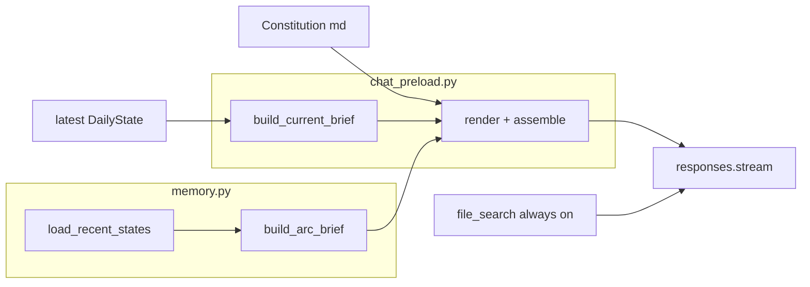

# PR-15: Deterministic compact chat preload

**Status:** Complete  
**Framework version:** `daily-2026-06`  
**Builds on:** [PR-10](PR-10-research-assistant-phase1.md) · [PR-3](PR-3-memory-rollup-overhaul.md) · [PR-14](PR-14-responses-api-chat.md) · [PR-16](PR-16-analyst-charter-preload-voice.md) (voice)  
**Plan:** [.cursor/plans/stratified_chat_preload_c6fd8222.plan.md](../../.cursor/plans/stratified_chat_preload_c6fd8222.plan.md)

## Summary

Replace the monolithic every-turn preload (~18,350 chars / ~4,837 tokens) with a fixed three-layer contract on every turn: **constitution + current brief + arc brief**, with `file_search` unchanged. Prompt compaction only — no routing, no new architecture.

Measured on 2026-06-25 live memory (post–PR-16 voice; [payload example](chat-api-payload-example-2026-06-25.md)): **4,016 chars** at prior layer caps. **Expanded caps (current):** **5,388 chars** on the same run — richer dialogue fields; all caps still pass under the 6,500 total budget.

## Problem / motivation

`build_additional_instructions()` previously assembled:

```text
constitution + full latest-run block + full recent_summary.md
```

That over-anchored the assistant to today's full dump and replayed PR-3 rolling summary verbatim every turn. PR-10 authority ordering is preserved; the fix is **serialization**, not a new architecture.

## Solution

```text
every turn (deterministic, identical shape) =
  constitution
  + current_brief      (authoritative present-tense house view)
  + arc_brief          (compressed regime continuity)
  + file_search        (always enabled — historical expansion at answer time)
```



### Authority stack (unchanged semantics)

| Priority | Source | Role |
|----------|--------|------|
| 1 | **Current brief** | Present-tense posture, five matrix rows, risks, trigger levels |
| 2 | Same-date report prose | Narrative nuance only (via retrieval, not injected) |
| 3 | **Arc brief** | Multi-day continuity; current brief wins on same-date conflict |
| 4 | Vector sections | Historical comparison; label "historically on {date}" |

**Rule:** Present-tense posture from preload only — not vector retrieval, not report prose.

## Schema migration

### Before

```python
class ChatPreloadContext(BaseModel):
    instructions: str
    latest_run: LatestRunState
    rolling_summary: str
    additional_instructions: str
```

### After

```python
class ChatPreloadContext(BaseModel):
    instructions: str
    current_brief: CurrentBrief
    arc_brief: ArcBrief
    additional_instructions: str
```

| Removed from context | Replacement |
|----------------------|-------------|
| `latest_run: LatestRunState` | `current_brief: CurrentBrief` |
| `rolling_summary: str` | `arc_brief: ArcBrief` (built from `load_recent_states()`, not `recent_summary.md`) |

`LatestRunState` and `MonteCarloSummary` removed from `schemas.py` in the PR-15 review follow-up (no remaining callers).

## Layer budgets

**Chars are the hard contract** (enforced via `*Caps.MAX_RENDERED_CHARS` and truncation). **Token figures are approx targets** for planning only — documented in markdown tables, not enforced at runtime and not stored as schema constants.

| Layer | Chars (cap) | Tokens (approx target) |
|-------|------------:|------------------------|
| Constitution | 2,000 | ~500 |
| Current house view | 2,100 | ~525 |
| Recent arc | 1,800 | ~450 |
| **Total `additional_instructions`** | **6,500** | **~1,500** |

Measured on 2026-06-25 live memory (expanded caps; [payload example](chat-api-payload-example-2026-06-25.md)): **5,388 chars** total (Constitution 1,655 · current house view 1,930 · recent arc 1,799). Prior PR-16 voice at tighter caps was 4,016 chars on the same run.

Overflow truncates with `…` at build/render/load time; never raises in production. Constitution is capped in `load_instructions()`; brief layers in their renderers.

### Current house view fields

Built from latest `DailyState` only:

- Opening house-view sentence (≤220 chars): date, `spx_close`, bias, action, signal balance
- Setup / tension sentence (≤260 chars): first sentence of `primary_tension`
- Max 4 risk bullets (≤160 chars): first `what_changed_today` headline, then top conflict `framework_rule` lines only (no divergence IDs)
- Max 5 trigger bullets (≤100 chars): MC upside/downside, cascade, leverage snippet
- Max 3 “what changes the view” bullets (≤110 chars): from `open_questions`
- Six authoritative table rows: Structural Bias, Overall Signal Balance, Trend Regime (`state.trend_regime` only), Recommended Action, Leverage Risk State, Monte Carlo Edge

**Never** matrix JSON in assembled prompt.

### Recent arc fields

Built in **`memory.py`** via `build_arc_brief(states)`:

- `regime_arc` from `_regime_arc(states)`
- Session snapshots: `{date} | {bias} | {action} | {fragment}` — max **8** sessions, **110** chars per fragment
- `still_open_bullets`: up to **3** eligible `open_questions` (≤140 chars each)
- `inflection_bullets`: up to **3** recent `{date}: {headline}` marginal-change lines (≤130 chars each)

**Forbidden** in rendered arc brief: `changed:`, `signals: F&G`, `conflicts:`, `decision_matrix.rows (JSON)`, full PR-3 per-day blocks, `recent_summary.md` replay.

`recent_summary.md` generation via `rebuild_rolling_summary()` is **unchanged** for engine Pass 1/2 and operator audit.

## Code changes

| Module | Change |
|--------|--------|
| `src/formatting.py` | **New** — `format_price()` shared by report + preload |
| `src/schemas.py` | `CurrentBrief`, `ArcBrief`, cap constants; migrate `ChatPreloadContext` |
| `src/memory.py` | **`build_arc_brief()`**, `_arc_session_fragment()`, public `first_sentence()`, `select_top_conflicts()` |
| `src/chat_preload.py` | `build_current_brief`, renderers, compact assembly; constitution cap; presentation formatting |
| `framework/chat-assistant-instructions.md` | Three-layer constitution |
| `tests/test_chat_preload.py` | Budget + authority + forbidden-content guards; fifth-row rule; trend_regime source; truncate fixtures |
| `tests/test_arc_brief.py` | **New** |
| `tests/test_web_chat_api.py` | Budget check |

**Unchanged:** `chat_service.py`, `openai_responses.py`, `rag_index.py`, `rebuild_rolling_summary()`, Next.js UI.

**Explicitly not added:** `chat_evidence.py`, `EvidenceMode`, keyword routing, `user_message` on builder.

## Verification

```bash
cd spx-analyst
pytest tests/test_chat_preload.py tests/test_arc_brief.py tests/test_web_chat_api.py -q
```

With seeded memory, confirm:

- Total `additional_instructions` ≤ 5,000 chars
- No `decision_matrix.rows (JSON)`, `changed:`, `signals: F&G`, or full rolling summary blocks
- Arc brief rendered size < 50% of `build_recent_summary(states)` on same states

Payload example: [chat-api-payload-example-2026-06-25.md](chat-api-payload-example-2026-06-25.md)

## Acceptance criteria

- [x] Deterministic three-layer preload every turn; no router/selector
- [x] `build_arc_brief()` lives in `memory.py` only
- [x] PR-10 authority: present-tense posture from `current_brief` without vector retrieval
- [x] PR-3 continuity: arc brief from rolling memory primitives; not `recent_summary.md` replay
- [x] Caps enforced on 2026-06-25 live memory
- [x] Schema migration: `current_brief` + `arc_brief`; `latest_run` + `rolling_summary` removed
- [x] No duplicate matrix JSON in assembled prompt
- [x] `file_search` unchanged — always enabled

## Polish pass (prompt voice)

- [x] Char caps enforced; token figures doc-table only as **approx target** (never "cap" in token column)
- [x] Prices rendered with `format_price()` (two decimals, thousands separator)
- [x] Risk bullets: marginal `what_changed_today` headline + `framework_rule` only (no divergence IDs)
- [x] Arc snapshots: first change bullet per day, not repeated tension skeleton

## Review follow-up (earlier PR-15 pass)

- Fifth risk row keyword check uses Leverage **`signal` only** (not `current_reading`)
- Constitution truncated at load when `chat-assistant-instructions.md` exceeds 2,000 chars
- Removed orphaned `LatestRunState` / `MonteCarloSummary` from `schemas.py`
- Shared `first_sentence()` / `select_top_conflicts()` exported from `memory.py`

## Future polish (not in PR-15 scope)

- **Docs:** keep [chat-api-payload-example-2026-06-25.md](chat-api-payload-example-2026-06-25.md) as the authoritative measured sample; update PR summary line if the example is regenerated.
- **Voice:** ~~soften all-caps `what_changed_today` headlines~~ — done in [PR-16](PR-16-analyst-charter-preload-voice.md) (`format_event_headline()` + analyst charter / house-view render voice).
